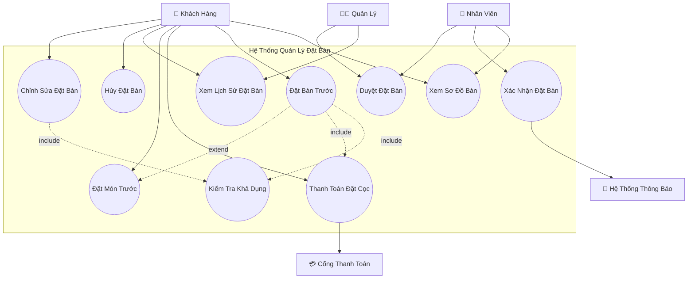
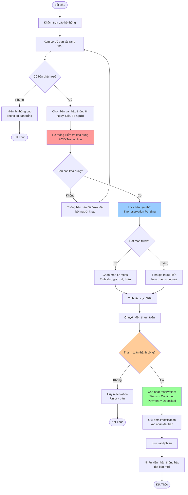
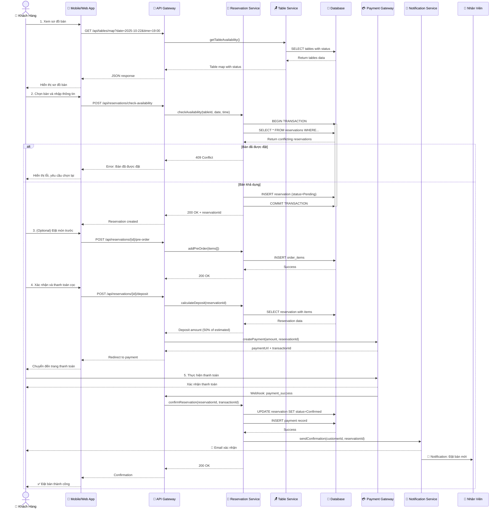
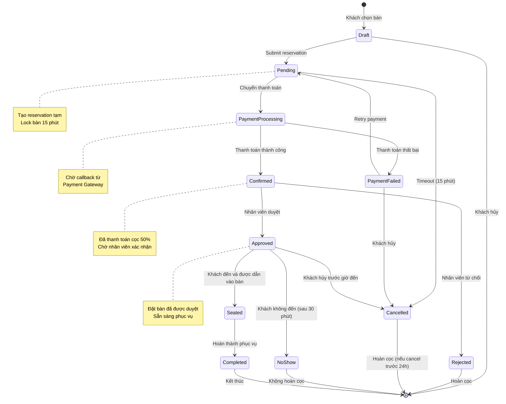
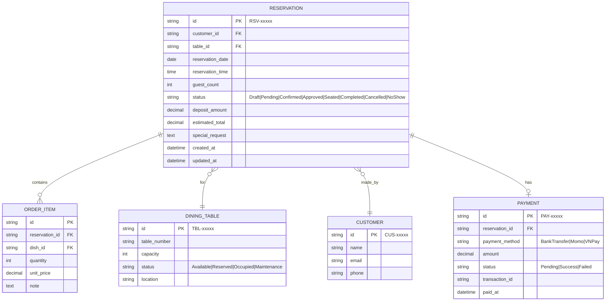

    # Sơ Đồ UML - Quản Lý Đặt Bàn (Reservation Management)

## 📋 Tổng Quan Module

Module quản lý đặt bàn hỗ trợ khách hàng và nhân viên trong toàn bộ quá trình đặt bàn, từ xem sơ đồ bàn, đặt trước, thanh toán đặt cọc đến xác nhận và đặt món trước.

### Yêu Cầu Chính
- ✅ Hiển thị sơ đồ bàn (Table Map) với trạng thái real-time
- ✅ Đặt bàn trước ít nhất 1 giờ
- ✅ Kiểm tra tính khả dụng với đảm bảo ACID
- ✅ Thanh toán đặt cọc 50% trực tuyến
- ✅ Gửi thông báo xác nhận qua email/app
- ✅ Lưu lịch sử đặt bàn
- ✅ Đặt món trước khi đến

---

## 1️⃣ Use Case Diagram - Sơ Đồ Ca Sử Dụng



### Giải Thích Use Case

| Use Case | Actor | Mô Tả |
|----------|-------|-------|
| **Xem Sơ Đồ Bàn** | Khách hàng, Nhân viên | Hiển thị sơ đồ bàn với trạng thái real-time (Trống/Đã đặt/Đang phục vụ) |
| **Đặt Bàn Trước** | Khách hàng | Đặt bàn trước ít nhất 1 giờ với thông tin: ngày, giờ, số lượng khách |
| **Kiểm Tra Khả Dụng** | System | Tự động kiểm tra tình trạng bàn, tránh trùng lặp (ACID) |
| **Thanh Toán Đặt Cọc** | Khách hàng | Thanh toán 50% giá trị dự kiến qua ngân hàng/Momo |
| **Xác Nhận Đặt Bàn** | Nhân viên | Xác nhận đặt bàn sau khi khách thanh toán cọc |
| **Đặt Món Trước** | Khách hàng | Chọn món ăn trước để nhà hàng chuẩn bị sẵn |
| **Xem Lịch Sử** | Khách hàng, Quản lý | Tra cứu các lần đặt bàn trước đó |
| **Hủy Đặt Bàn** | Khách hàng | Hủy đặt bàn và xử lý hoàn cọc |
| **Chỉnh Sửa** | Khách hàng | Thay đổi thông tin đặt bàn (giờ, số người) |
| **Duyệt Đặt Bàn** | Nhân viên, Quản lý | Phê duyệt hoặc từ chối yêu cầu đặt bàn |

---

## 2️⃣ Activity Diagram - Quy Trình Đặt Bàn Đầy Đủ



```
@startuml
left to right direction

actor "Khách Hàng" as Customer
actor "Nhân Viên" as Staff
actor "Quản Lý" as Manager
rectangle "Hệ Thống Quản Lý Đặt Bàn" {
    usecase "Xem Sơ Đồ Bàn" as UC1
    usecase "Đặt Bàn Trước" as UC2
    usecase "Kiểm Tra Khả Dụng" as UC3
    usecase "Thanh Toán Đặt Cọc" as UC4
    usecase "Xác Nhận Đặt Bàn" as UC5
    usecase "Đặt Món Trước" as UC6
    usecase "Xem Lịch Sử Đặt Bàn" as UC7
    usecase "Hủy Đặt Bàn" as UC8
    usecase "Chỉnh Sửa Đặt Bàn" as UC9
    usecase "Duyệt Đặt Bàn" as UC10
}

rectangle "💳 Cổng Thanh Toán" as PaymentGateway
rectangle "📧 Hệ Thống Thông Báo" as NotificationSys

'--- Liên kết Actor ---
Customer --> UC1
Customer --> UC2
Customer --> UC4
Customer --> UC6
Customer --> UC7

Staff --> UC1
Staff --> UC5
Staff --> UC10
Staff --> UC8

Manager --> UC7
Manager --> UC10
Manager --> UC8

'--- Quan hệ giữa các Use Case ---
UC2 .> UC3 : <<include>>
UC2 .> UC4 : <<include>>
UC2 .> UC6 : <<extend>>
UC9 .> UC3 : <<include>>

UC4 --> PaymentGateway
UC5 --> NotificationSys

@enduml
```

### Giải Thích Activity Diagram

#### **Swimlane: Khách Hàng**
1. Truy cập hệ thống và xem sơ đồ bàn real-time
2. Chọn bàn phù hợp với số lượng khách
3. Nhập thông tin: ngày, giờ, số người
4. (Tùy chọn) Chọn món ăn trước
5. Thanh toán đặt cọc 50%

#### **Swimlane: Hệ Thống**
1. Kiểm tra tính khả dụng của bàn (ACID)
2. Lock bàn tạm thời để tránh xung đột
3. Tạo reservation với status Pending
4. Tính giá trị dự kiến và tiền cọc
5. Xử lý thanh toán qua Payment Gateway
6. Cập nhật status = Confirmed khi thanh toán thành công
7. Gửi email/notification xác nhận

#### **Swimlane: Nhân Viên**
1. Nhận thông báo đặt bàn mới
2. Kiểm tra và chuẩn bị bàn
3. Xác nhận đặt bàn trong hệ thống

---

```
@startuml

start

:Khách xem sơ đồ bàn và trạng thái;
if (Có bàn phù hợp?) then (Không)
    :Hiển thị thông báo không có bàn trống;
    stop
else (Có)
    :Chọn bàn & nhập thông tin (ngày, giờ, số khách);
    :Kiểm tra khả dụng & khóa bàn;
    
    if (Đặt món trước?) then (Có)
        :Chọn món & tính tổng giá trị dự kiến;
        :Tính tiền đặt cọc 50%;
        :Thực hiện thanh toán;
        
        if (Thanh toán thành công?) then (Không)
            :Hủy đặt bàn & mở khóa bàn;
            stop
        else (Có)
            :Cập nhật trạng thái;
            :Lưu lịch sử;
            stop
        endif
        
    else (Không)
        :Cập nhật đặt bàn thành công (Chưa đặt món);
        :Lưu lịch sử;
        stop
    endif
endif

@enduml

```

## 3️⃣ Sequence Diagram - Quy Trình Đặt Bàn Chi Tiết



```
@startuml
title Quy trình Đặt Bàn - Sequence Diagram (Tối giản theo Activity)

actor C as "Khách Hàng"
participant App as "Ứng Dụng (Web/Mobile)"
participant API as "API Gateway"
participant ResSvc as "Reservation Service"
participant PayGW as "Payment Gateway"

== Xem và chọn bàn ==
C -> App: Xem sơ đồ bàn
App -> API: Yêu cầu dữ liệu bàn khả dụng
API -> ResSvc: Lấy thông tin bàn
ResSvc --> API: Danh sách bàn khả dụng
API --> App: Dữ liệu bàn
App --> C: Hiển thị sơ đồ bàn

C -> App: Chọn bàn & nhập thông tin
App -> API: Gửi yêu cầu đặt bàn
API -> ResSvc: Kiểm tra khả dụng & khóa bàn tạm
alt Bàn không khả dụng
    ResSvc --> API: Báo lỗi "Bàn đã được đặt"
    API --> App: Thông báo lỗi
    App --> C: Hiển thị thông báo
else Bàn khả dụng
    ResSvc --> API: Xác nhận tạo đặt bàn (Pending)
    API --> App: Thông tin đặt bàn tạm thời
end

== Đặt món (tuỳ chọn) ==
opt Khách chọn đặt món trước
    C -> App: Đặt món
    App -> API: Gửi danh sách món
    API -> ResSvc: Lưu đơn món tạm thời
end

== Thanh toán và xác nhận ==
C -> App: Thực hiện thanh toán đặt cọc
App -> API: Yêu cầu tính & khởi tạo thanh toán
API -> PayGW: Gửi yêu cầu thanh toán
PayGW --> C: Trang thanh toán
C -> PayGW: Xác nhận thanh toán thành công
PayGW -> API: Gửi webhook "payment_success"
API -> ResSvc: Cập nhật trạng thái & lưu thanh toán

API --> App: Xác nhận hoàn tất
App --> C: Đặt bàn thành công

@enduml

```

### Giải Thích Sequence Diagram

#### **Bước 1-2: Xem và Chọn Bàn**
- Khách hàng xem sơ đồ bàn với trạng thái real-time
- Hệ thống query database để lấy availability
- Response trả về danh sách bàn với status

#### **Bước 3: Kiểm Tra Khả Dụng (ACID Transaction)**
- Sử dụng database transaction để đảm bảo consistency
- Lock bàn bằng cách tạo reservation với status=Pending
- Tránh race condition khi nhiều người đặt cùng lúc

#### **Bước 4: Đặt Món Trước (Optional)**
- Khách hàng có thể chọn món trước
- Hệ thống tính toán tổng giá trị dự kiến
- Lưu order items vào database

#### **Bước 5-6: Thanh Toán Đặt Cọc**
- Tính tiền cọc = 50% giá trị dự kiến
- Redirect đến Payment Gateway (Momo/Bank)
- Nhận webhook callback khi thanh toán thành công
- Cập nhật reservation status = Confirmed

#### **Bước 7: Thông Báo**
- Gửi email xác nhận đến khách hàng
- Gửi notification đến nhân viên
- Lưu lịch sử đặt bàn

---

## 4️⃣ State Diagram - Vòng Đời Đơn Đặt Bàn



### Giải Thích State Diagram

| Trạng Thái | Mô Tả | Thời Gian |
|------------|-------|-----------|
| **Draft** | Khách đang chọn bàn, chưa submit | - |
| **Pending** | Đã tạo reservation, chờ thanh toán | Max 15 phút |
| **PaymentProcessing** | Đang xử lý thanh toán qua gateway | 1-5 phút |
| **PaymentFailed** | Thanh toán thất bại, có thể retry | - |
| **Confirmed** | Đã thanh toán cọc, chờ nhân viên duyệt | 1-24 giờ |
| **Approved** | Nhân viên đã duyệt, chờ khách đến | Đến giờ hẹn |
| **Rejected** | Nhân viên từ chối (không đủ bàn/nhân lực) | - |
| **Seated** | Khách đã đến và được phục vụ | Thời gian phục vụ |
| **NoShow** | Khách không đến trong 30 phút sau giờ hẹn | - |
| **Cancelled** | Khách hủy đặt bàn | - |
| **Completed** | Hoàn thành phục vụ | - |

### Chính Sách Hoàn Cọc
- ✅ **Cancel trước 24h**: Hoàn 100% tiền cọc
- ⚠️ **Cancel trong 24h**: Hoàn 50% tiền cọc
- ❌ **Cancel trong 2h**: Không hoàn cọc
- ❌ **No-show**: Không hoàn cọc

---

## 5️⃣ Business Rules - Quy Tắc Nghiệp Vụ

### 🕐 Quy Tắc Thời Gian
1. Đặt bàn trước **tối thiểu 1 giờ** so với giờ đến dự kiến
2. Đặt bàn tối đa **30 ngày** trước
3. Lock bàn tạm thời **15 phút** khi tạo Pending reservation
4. Timeout thanh toán: **10 phút**
5. No-show nếu khách chậm quá **30 phút** sau giờ hẹn

### 💰 Quy Tắc Thanh Toán
1. Đặt cọc bắt buộc **50%** giá trị dự kiến
2. Giá trị dự kiến:
   - Nếu có đặt món trước: Tổng giá trị món đã chọn
   - Nếu không: `số_người × 200,000 VNĐ` (giá trị trung bình)
3. Phương thức: Chuyển khoản ngân hàng, Momo, VNPay
4. Tiền cọc được trừ vào tổng hóa đơn khi thanh toán cuối

### 🪑 Quy Tắc Bàn Ăn
1. Số lượng khách phải phù hợp với sức chứa bàn (±2 người)
2. Một reservation chỉ được gắn với **1 bàn** (có thể gộp bàn sau)
3. Bàn có thể được đặt bởi nhiều khách trong các khung giờ khác nhau
4. Khoảng cách tối thiểu giữa 2 đặt bàn: **2 giờ**

### 🍽️ Quy Tắc Đặt Món Trước
1. Chỉ được đặt món từ **menu hiện tại**
2. Số lượng món không giới hạn
3. Có thể sửa/xóa món cho đến khi xác nhận thanh toán
4. Sau khi Confirmed: Chỉ Quản lý mới được phép sửa

### ✅ Quy Tắc Phê Duyệt
1. Reservation được **tự động duyệt** nếu:
   - Bàn khả dụng
   - Không có xung đột thời gian
   - Nhà hàng còn nhân lực
2. Yêu cầu **duyệt thủ công** nếu:
   - Đặt bàn cho >20 người (sự kiện lớn)
   - Đặt bàn trong giờ cao điểm
   - Yêu cầu đặc biệt (trang trí, menu riêng...)

---

## 6️⃣ Data Model - Mô Hình Dữ Liệu



---

## 7️⃣ API Endpoints - Danh Sách API

### Xem Sơ Đồ Bàn
```http
GET /api/tables/map?date=2025-10-22&time=19:00
Response: {
  "tables": [
    {
      "id": "TBL-001",
      "number": "A1",
      "capacity": 4,
      "status": "Available",
      "location": "Main Hall"
    }
  ]
}
```

### Kiểm Tra Khả Dụng
```http
POST /api/reservations/check-availability
Body: {
  "table_id": "TBL-001",
  "date": "2025-10-22",
  "time": "19:00",
  "guest_count": 4
}
Response: {
  "available": true,
  "message": "Table is available"
}
```

### Tạo Đặt Bàn
```http
POST /api/reservations
Body: {
  "table_id": "TBL-001",
  "reservation_date": "2025-10-22",
  "reservation_time": "19:00",
  "guest_count": 4,
  "special_request": "Khu vực yên tĩnh"
}
Response: {
  "id": "RSV-12345",
  "status": "Pending",
  "expires_at": "2025-10-21T15:15:00Z"
}
```

### Đặt Món Trước
```http
POST /api/reservations/{id}/pre-order
Body: {
  "items": [
    {"dish_id": "DSH-001", "quantity": 2},
    {"dish_id": "DSH-015", "quantity": 1}
  ]
}
```

### Thanh Toán Đặt Cọc
```http
POST /api/reservations/{id}/deposit
Response: {
  "deposit_amount": 500000,
  "payment_url": "https://payment.gateway.com/..."
}
```

### Xác Nhận Đặt Bàn (Webhook)
```http
POST /api/reservations/{id}/confirm
Body: {
  "transaction_id": "TXN-67890",
  "status": "Success"
}
```

### Xem Lịch Sử Đặt Bàn
```http
GET /api/customers/me/reservations
Response: {
  "data": [
    {
      "id": "RSV-12345",
      "table_number": "A1",
      "date": "2025-10-22",
      "time": "19:00",
      "status": "Approved",
      "deposit_amount": 500000
    }
  ]
}
```

---

## 📊 Metrics & KPIs

### Chỉ Số Quan Trọng
- **Tỷ lệ đặt bàn thành công**: > 90%
- **Tỷ lệ no-show**: < 5%
- **Thời gian xử lý đặt bàn**: < 2 phút
- **Tỷ lệ thanh toán cọc thành công**: > 95%
- **Tỷ lệ hủy đặt bàn**: < 10%

### Báo Cáo Cần Thiết
1. Số lượng đặt bàn theo ngày/tuần/tháng
2. Phân tích no-show rate
3. Tỷ lệ đặt bàn thành công theo kênh (web/mobile)
4. Khung giờ đặt bàn phổ biến
5. Bàn được đặt nhiều nhất

---

**[⬅️ Quay lại Index](./00-INDEX.md)** | **[➡️ Tiếp: Order & Payment Management](./02-ORDER-PAYMENT-MANAGEMENT.md)**
