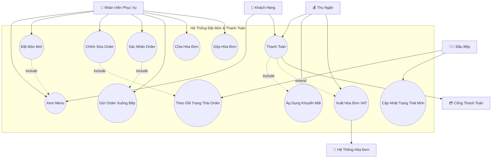
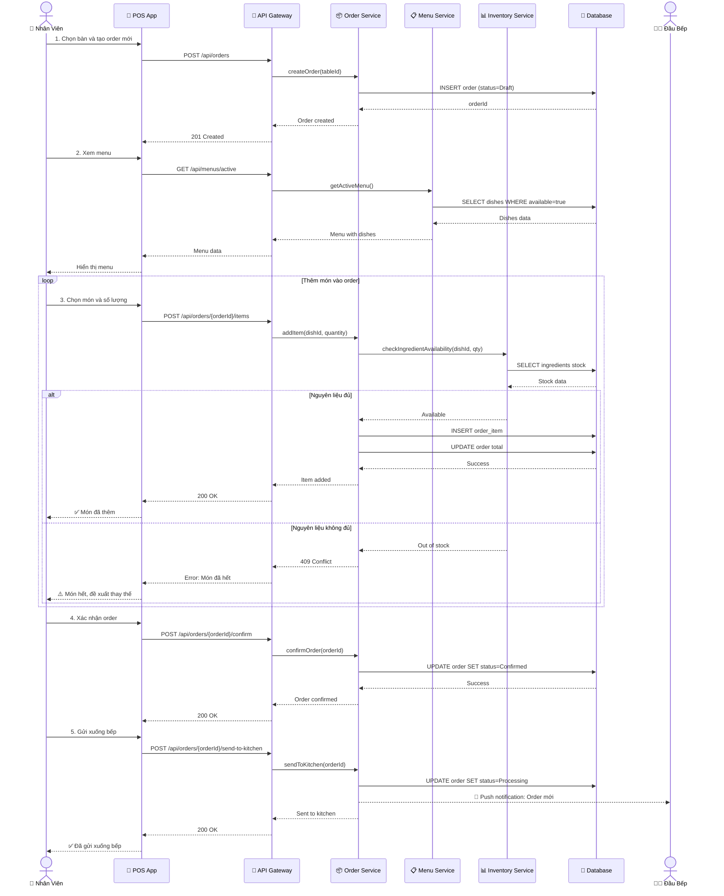
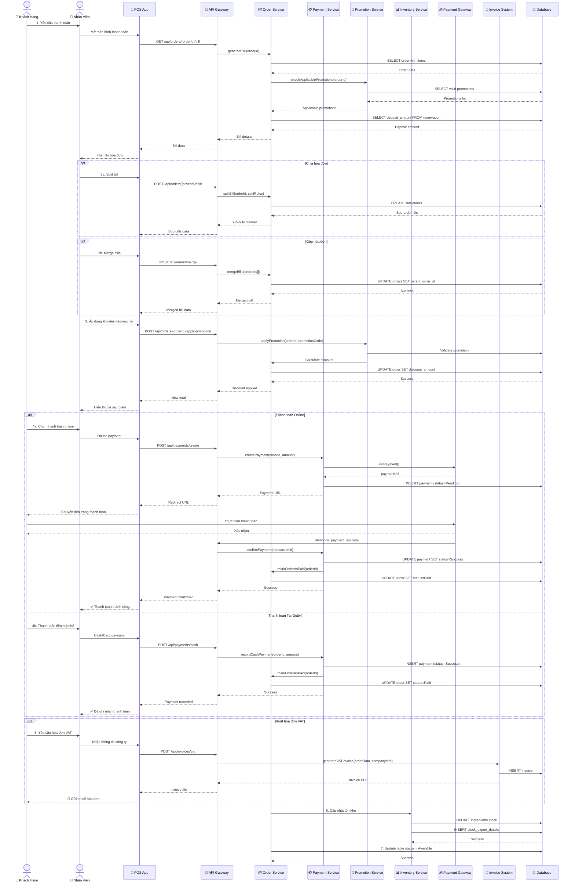
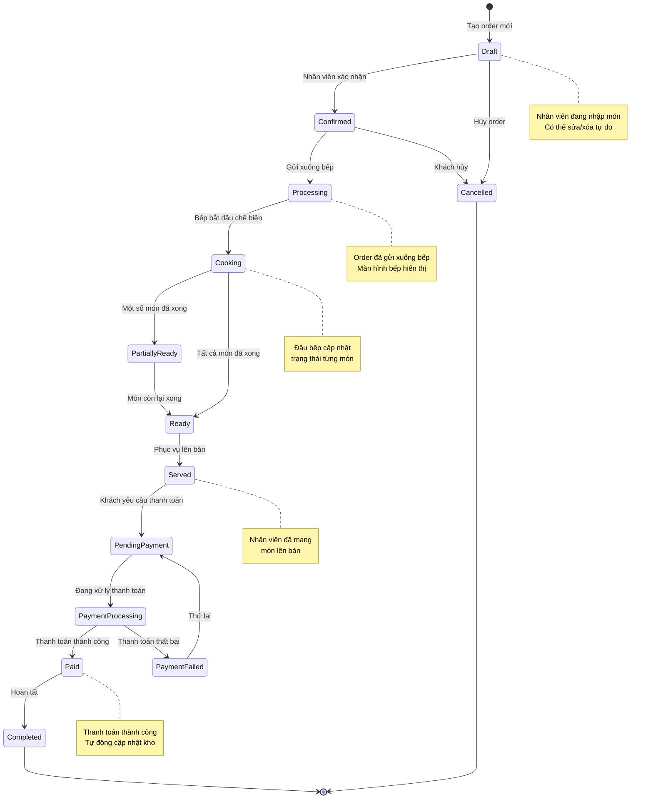
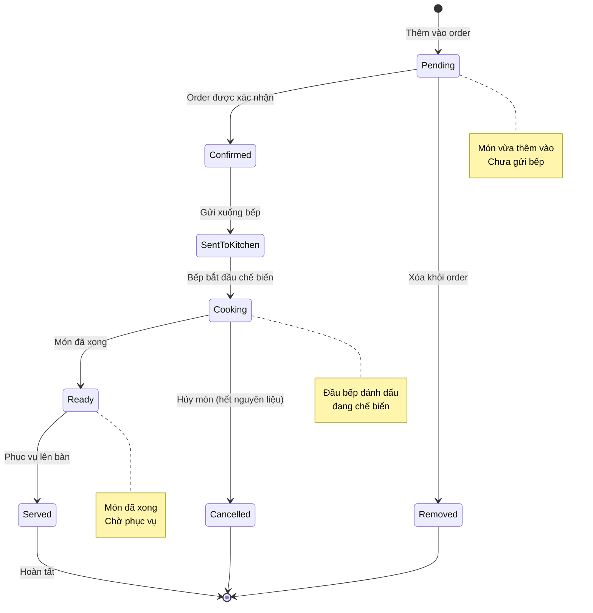
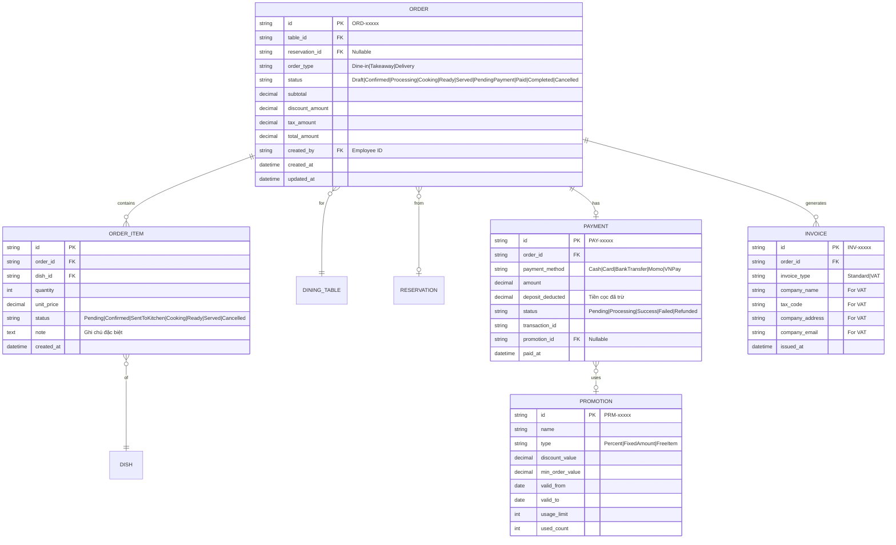

# Sơ Đồ UML - Quản Lý Đặt Món và Thanh Toán (Order & Payment Management)

## 📋 Tổng Quan Module

Module quản lý toàn bộ quy trình đặt món, xử lý đơn hàng và thanh toán, đảm bảo hiệu quả, minh bạch và thuận tiện cho cả khách hàng lẫn nhân viên phục vụ.

### Yêu Cầu Chính
- ✅ Đặt món tại quầy hoặc đặt trước (khi đặt bàn)
- ✅ Theo dõi trạng thái đơn hàng real-time
- ✅ Hỗ trợ nhiều hình thức thanh toán (Online/Tại quầy)
- ✅ Tự động khấu trừ tiền cọc vào hóa đơn
- ✅ Chia hóa đơn (Split Bill) và gộp hóa đơn (Merge Bill)
- ✅ Áp dụng khuyến mãi/voucher tự động
- ✅ Xuất hóa đơn VAT

---

## 1️⃣ Use Case Diagram - Sơ Đồ Ca Sử Dụng



### Giải Thích Use Case

| Use Case | Actor | Mô Tả |
|----------|-------|-------|
| **Xem Menu** | Khách hàng, Nhân viên | Xem danh sách món ăn với thông tin giá, trạng thái còn/hết |
| **Đặt Món Mới** | Nhân viên | Tạo order mới cho bàn, thêm món vào order |
| **Chỉnh Sửa Order** | Nhân viên | Thêm/xóa/sửa món trong order đang chờ |
| **Theo Dõi Trạng Thái** | Nhân viên, Bếp | Xem trạng thái order: Đang lên đơn/Chế biến/Phục vụ/Chờ thanh toán |
| **Xác Nhận Order** | Nhân viên | Xác nhận order sau khi khách đồng ý |
| **Gửi Order Xuống Bếp** | Nhân viên | Gửi order tới màn hình bếp để chế biến |
| **Cập Nhật Trạng Thái Món** | Đầu bếp | Đánh dấu món đang chế biến/hoàn tất |
| **Thanh Toán** | Khách hàng, Thu ngân | Thanh toán online hoặc tại quầy |
| **Chia Hóa Đơn** | Nhân viên | Tách hóa đơn cho nhóm khách thanh toán riêng |
| **Gộp Hóa Đơn** | Nhân viên | Gộp nhiều bàn thành một hóa đơn |
| **Áp Dụng Khuyến Mãi** | Thu ngân | Tự động áp dụng voucher/promotion hợp lệ |
| **Xuất Hóa Đơn VAT** | Thu ngân | Xuất hóa đơn VAT theo yêu cầu |

---

## 2️⃣ Activity Diagram - Quy Trình Đặt Món và Thanh Toán

```mermaid
flowchart TD
    Start([Bắt Đầu]) --> A1{Khách đã đặt bàn?}
    
    A1 -->|Có| A2[Nhân viên mở order<br/>từ reservation]
    A1 -->|Không| A3[Nhân viên tạo<br/>order mới cho bàn]
    
    A2 --> A4[Load món đã đặt trước<br/>từ reservation]
    A3 --> A5[Khởi tạo order trống]
    
    A4 --> A6[Nhân viên xem menu<br/>cùng khách]
    A5 --> A6
    
    A6 --> A7{Khách thêm/sửa món?}
    A7 -->|Có| A8[Thêm/Sửa món vào order<br/>Kiểm tra tồn kho]
    A8 --> A9{Món còn đủ?}
    
    A9 -->|Không| A10[Thông báo món hết<br/>Đề xuất món thay thế]
    A10 --> A6
    
    A9 -->|Có| A11[Cập nhật order items<br/>Tính tổng tạm thời]
    A11 --> A7
    
    A7 -->|Không| A12[Nhân viên xác nhận order<br/>Status = Confirmed]
    A12 --> A13[Gửi order xuống bếp<br/>Status = Processing]
    
    A13 --> A14[Đầu bếp nhận order<br/>trên màn hình]
    A14 --> A15[Chế biến từng món<br/>Cập nhật status món]
    
    A15 --> A16{Tất cả món xong?}
    A16 -->|Chưa| A15
    A16 -->|Rồi| A17[Order Status = Served<br/>Sẵn sàng thanh toán]
    
    A17 --> A18[Khách yêu cầu thanh toán]
    A18 --> A19{Chia hóa đơn?}
    
    A19 -->|Có| A20[Nhân viên split bill<br/>theo yêu cầu khách]
    A19 -->|Không| A21{Gộp bàn?}
    
    A21 -->|Có| A22[Gộp hóa đơn<br/>nhiều bàn]
    A21 -->|Không| A23[Giữ nguyên hóa đơn]
    
    A20 --> A24[Tính tổng cho<br/>từng sub-bill]
    A22 --> A25[Tính tổng cho<br/>merged bill]
    A23 --> A26[Tính tổng hóa đơn]
    
    A24 --> A27[Kiểm tra khuyến mãi/voucher]
    A25 --> A27
    A26 --> A27
    
    A27 --> A28[Áp dụng discount<br/>tự động]
    A28 --> A29{Đã đặt cọc?}
    
    A29 -->|Có| A30[Trừ tiền cọc<br/>vào tổng bill]
    A29 -->|Không| A31[Giữ nguyên tổng]
    
    A30 --> A32[Tính số tiền phải trả]
    A31 --> A32
    
    A32 --> A33{Phương thức thanh toán?}
    
    A33 -->|Online| A34[Redirect đến<br/>Payment Gateway]
    A33 -->|Tại quầy| A35[Thu ngân nhận tiền]
    
    A34 --> A36{Thanh toán thành công?}
    A36 -->|Không| A37[Thông báo lỗi<br/>Yêu cầu thử lại]
    A37 --> A33
    
    A36 -->|Có| A38[Lưu payment record<br/>Status = Paid]
    A35 --> A38
    
    A38 --> A39{Yêu cầu hóa đơn VAT?}
    A39 -->|Có| A40[Nhập thông tin công ty<br/>Xuất hóa đơn VAT]
    A39 -->|Không| A41[In hóa đơn thường]
    
    A40 --> A42[Gửi hóa đơn qua email]
    A41 --> A42
    
    A42 --> A43[Cập nhật trạng thái bàn<br/>Status = Available]
    A43 --> A44[Cập nhật tồn kho<br/>nguyên liệu]
    A44 --> End([Kết Thúc])

    style A9 fill:#ff9999
    style A27 fill:#99ccff
    style A36 fill:#ffcc99
    style A38 fill:#99ff99
```



### Giải Thích Activity Diagram

#### **Phase 1: Đặt Món (Create Order)**
1. Kiểm tra khách có đặt bàn trước không
2. Nếu có: Load món đã đặt trước từ reservation
3. Nếu không: Tạo order mới cho bàn walk-in
4. Nhân viên xem menu cùng khách, thêm/sửa món
5. Kiểm tra tồn kho real-time khi thêm món
6. Tính tổng tạm thời sau mỗi thay đổi

#### **Phase 2: Xử Lý Order (Process Order)**
1. Nhân viên xác nhận order sau khi khách đồng ý
2. Gửi order xuống bếp (hiển thị trên màn hình bếp)
3. Đầu bếp nhận order và bắt đầu chế biến
4. Cập nhật trạng thái từng món (Cooking → Ready)
5. Khi tất cả món xong → Order status = Served

#### **Phase 3: Thanh Toán (Payment)**
1. Khách yêu cầu thanh toán
2. Xử lý các trường hợp đặc biệt:
   - **Split Bill**: Chia hóa đơn cho nhóm khách
   - **Merge Bill**: Gộp nhiều bàn thành một
3. Áp dụng khuyến mãi/voucher tự động
4. Trừ tiền cọc nếu khách đã đặt bàn trước
5. Xử lý thanh toán (Online/Tại quầy)
6. Xuất hóa đơn (VAT hoặc thường)

#### **Phase 4: Hoàn Tất (Complete)**
1. Lưu payment record
2. Cập nhật trạng thái bàn = Available
3. Cập nhật tồn kho nguyên liệu tự động

---

## 3️⃣ Sequence Diagram - Quy Trình Chi Tiết

### 3.1. Sequence: Đặt Món Mới



### 3.2. Sequence: Thanh Toán và Xuất Hóa Đơn



---

## 4️⃣ State Diagram - Vòng Đời Order



### Giải Thích Trạng Thái Order

| Trạng Thái | Mô Tả | Có Thể Sửa? |
|------------|-------|-------------|
| **Draft** | Đang tạo order, chưa xác nhận | ✅ Có |
| **Confirmed** | Đã xác nhận, chưa gửi bếp | ✅ Có (với quyền) |
| **Processing** | Đã gửi xuống bếp | ⚠️ Hạn chế |
| **Cooking** | Đang chế biến | ❌ Không |
| **PartiallyReady** | Một số món đã xong | ❌ Không |
| **Ready** | Tất cả món đã xong | ❌ Không |
| **Served** | Đã phục vụ lên bàn | ❌ Không |
| **PendingPayment** | Chờ thanh toán | ❌ Không |
| **PaymentProcessing** | Đang xử lý thanh toán | ❌ Không |
| **PaymentFailed** | Thanh toán thất bại | ❌ Không |
| **Paid** | Đã thanh toán | ❌ Không |
| **Completed** | Hoàn tất | ❌ Không |
| **Cancelled** | Đã hủy | ❌ Không |

---

## 5️⃣ State Diagram - Trạng Thái Món Ăn (Order Item)



---

## 6️⃣ Business Rules - Quy Tắc Nghiệp Vụ

### 🍽️ Quy Tắc Đặt Món
1. Một bàn có thể có **nhiều order** (order riêng cho từng khách)
2. Có thể thêm món bất kỳ lúc nào khi order ở trạng thái **Draft** hoặc **Confirmed**
3. Sau khi **gửi xuống bếp**, chỉ có thể:
   - Thêm món mới (tạo order mới)
   - Hủy món (với quyền Manager)
4. Kiểm tra tồn kho **real-time** khi thêm món
5. Nếu món hết, hệ thống **đề xuất món thay thế** tương tự

### 💰 Quy Tắc Thanh Toán
1. **Tính tổng hóa đơn**:
   ```
   Subtotal = SUM(item.price × item.quantity)
   Discount = Subtotal × promotion.discount_percent
   Tax = (Subtotal - Discount) × 10%  (VAT)
   Deposit = reservation.deposit_amount (nếu có)
   Total = Subtotal - Discount + Tax - Deposit
   ```

2. **Phương thức thanh toán**:
   - **Online**: Momo, VNPay, Chuyển khoản ngân hàng
   - **Tại quầy**: Tiền mặt, Thẻ tín dụng/ghi nợ

3. **Khấu trừ tiền cọc**:
   - Tự động trừ vào tổng hóa đơn nếu khách đã đặt bàn trước
   - Hiển thị rõ trên hóa đơn

### 🔪 Quy Tắc Split Bill (Chia Hóa Đơn)
1. **Chia theo món**: Mỗi người thanh toán món mình gọi
2. **Chia đều**: Chia tổng hóa đơn cho N người
3. **Chia tùy chỉnh**: Nhân viên chỉ định món cho từng sub-bill
4. Khuyến mãi áp dụng **cho từng sub-bill** riêng biệt
5. Tiền cọc được chia theo tỷ lệ giá trị mỗi sub-bill

### 🔗 Quy Tắc Merge Bill (Gộp Hóa Đơn)
1. Chỉ gộp được các order của **cùng 1 nhóm khách**
2. Các order phải ở trạng thái **Served** trở lên
3. Khuyến mãi được **tính lại** trên tổng hóa đơn gộp
4. Tiền cọc (nếu có) được **cộng dồn**

### 🎁 Quy Tắc Khuyến Mãi
1. **Tự động áp dụng** các promotion/voucher hợp lệ
2. Điều kiện áp dụng:
   - Thời gian: Trong khung giờ áp dụng
   - Giá trị: Hóa đơn đạt mức tối thiểu
   - Món ăn: Áp dụng cho nhóm món cụ thể
3. **Không được cộng dồn** (chọn 1 promotion tốt nhất)
4. Voucher **chỉ dùng 1 lần**, đánh dấu đã sử dụng

### 📄 Quy Tắc Hóa Đơn VAT
1. Xuất **theo yêu cầu** của khách hàng
2. Yêu cầu thông tin công ty:
   - Tên công ty
   - Mã số thuế
   - Địa chỉ
   - Email nhận hóa đơn
3. Gửi qua email **trong vòng 24 giờ**
4. Lưu trữ hóa đơn tối thiểu **10 năm**

---

## 7️⃣ Data Model - Mô Hình Dữ Liệu



---

## 8️⃣ API Endpoints - Danh Sách API

### Order Management

#### Tạo Order Mới
```http
POST /api/orders
Body: {
  "table_id": "TBL-001",
  "reservation_id": "RSV-12345",  // Optional
  "order_type": "Dine-in"
}
Response: {
  "id": "ORD-67890",
  "status": "Draft",
  "table_number": "A1",
  "created_at": "2025-10-21T12:00:00Z"
}
```

#### Thêm Món Vào Order
```http
POST /api/orders/{orderId}/items
Body: {
  "dish_id": "DSH-001",
  "quantity": 2,
  "note": "Không hành"
}
Response: {
  "id": "ITEM-001",
  "dish_name": "Phở Bò",
  "quantity": 2,
  "unit_price": 75000,
  "total": 150000
}
```

#### Xác Nhận Order
```http
POST /api/orders/{orderId}/confirm
Response: {
  "id": "ORD-67890",
  "status": "Confirmed",
  "items_count": 5,
  "subtotal": 500000
}
```

#### Gửi Order Xuống Bếp
```http
POST /api/orders/{orderId}/send-to-kitchen
Response: {
  "id": "ORD-67890",
  "status": "Processing",
  "sent_at": "2025-10-21T12:15:00Z"
}
```

#### Cập Nhật Trạng Thái Món (Bếp)
```http
PATCH /api/order-items/{itemId}/status
Body: {
  "status": "Cooking"  // or "Ready"
}
```

### Payment Management

#### Tạo Hóa Đơn
```http
GET /api/orders/{orderId}/bill
Response: {
  "order_id": "ORD-67890",
  "subtotal": 500000,
  "discount": 50000,
  "tax": 45000,
  "deposit_deducted": 250000,
  "total": 245000,
  "applicable_promotions": [...]
}
```

#### Split Bill
```http
POST /api/orders/{orderId}/split
Body: {
  "split_type": "by_item",  // or "even", "custom"
  "split_rules": [
    {"person": 1, "items": ["ITEM-001", "ITEM-002"]},
    {"person": 2, "items": ["ITEM-003"]}
  ]
}
Response: {
  "sub_bills": [
    {"id": "ORD-67891", "amount": 150000},
    {"id": "ORD-67892", "amount": 95000}
  ]
}
```

#### Merge Bills
```http
POST /api/orders/merge
Body: {
  "order_ids": ["ORD-001", "ORD-002", "ORD-003"]
}
Response: {
  "merged_order_id": "ORD-67893",
  "total_amount": 1500000
}
```

#### Áp Dụng Khuyến Mãi
```http
POST /api/orders/{orderId}/apply-promotion
Body: {
  "promotion_code": "SUMMER2025"
}
Response: {
  "discount_amount": 100000,
  "new_total": 400000
}
```

#### Thanh Toán
```http
POST /api/payments
Body: {
  "order_id": "ORD-67890",
  "payment_method": "Momo",  // or "Cash", "Card", "BankTransfer", "VNPay"
  "amount": 245000
}
Response: {
  "id": "PAY-11111",
  "payment_url": "https://payment.momo.vn/...",  // For online
  "status": "Pending"
}
```

#### Xuất Hóa Đơn VAT
```http
POST /api/invoices/vat
Body: {
  "order_id": "ORD-67890",
  "company_name": "Công ty ABC",
  "tax_code": "0123456789",
  "company_address": "123 Đường XYZ",
  "company_email": "contact@abc.com"
}
Response: {
  "invoice_id": "INV-22222",
  "invoice_url": "https://storage.../invoice.pdf"
}
```

---

## 9️⃣ Screen Mockups - Giao Diện Tham Khảo

### 9.1. Màn Hình Đặt Món (POS)
```
┌─────────────────────────────────────────────────────────┐
│ 🏠 Bàn A1  │  👤 Nguyễn Văn A  │  📝 ORD-67890  │  ❌  │
├─────────────────────────────────────────────────────────┤
│                                                           │
│  📋 MENU                        🛒 ORDER ITEMS           │
│  ┌─────────────────────────┐   ┌───────────────────────┐│
│  │ 🍜 Phở Bò       75,000đ │   │ 1. Phở Bò × 2         ││
│  │ 🍲 Bún Bò       65,000đ │   │    150,000đ           ││
│  │ 🥗 Gỏi Cuốn     45,000đ │   │ 2. Bún Bò × 1         ││
│  │ 🍹 Trà Đá       10,000đ │   │    65,000đ            ││
│  │ ☕ Cà Phê      25,000đ │   │ 3. Trà Đá × 3         ││
│  └─────────────────────────┘   │    30,000đ            ││
│                                 │                        ││
│  🔍 Tìm kiếm món...            │ Subtotal: 245,000đ    ││
│                                 └───────────────────────┘│
│                                                           │
│  [ ➕ Thêm Món ]  [ ✏️ Sửa ]  [ ✅ Xác Nhận ]  [ 🍳 Gửi Bếp ]│
└─────────────────────────────────────────────────────────┘
```

### 9.2. Màn Hình Thanh Toán
```
┌─────────────────────────────────────────────────────────┐
│          💰 THANH TOÁN - Bàn A1 - ORD-67890            │
├─────────────────────────────────────────────────────────┤
│                                                           │
│  📄 CHI TIẾT HÓA ĐƠN                                    │
│  ┌─────────────────────────────────────────────────┐   │
│  │ Subtotal:                          500,000đ     │   │
│  │ Khuyến mãi (SUMMER2025):          -50,000đ     │   │
│  │ VAT (10%):                         45,000đ     │   │
│  │ ━━━━━━━━━━━━━━━━━━━━━━━━━━━━━━━━━━━━━━━       │   │
│  │ Tổng cộng:                         495,000đ     │   │
│  │ Tiền cọc đã trả:                  -250,000đ     │   │
│  │ ━━━━━━━━━━━━━━━━━━━━━━━━━━━━━━━━━━━━━━━       │   │
│  │ THANH TOÁN:                        245,000đ     │   │
│  └─────────────────────────────────────────────────┘   │
│                                                           │
│  💳 PHƯƠNG THỨC THANH TOÁN                              │
│  [ 💵 Tiền Mặt ]  [ 💳 Thẻ ]  [ 🏦 Chuyển Khoản ]     │
│  [ 📱 Momo ]  [ 🏪 VNPay ]                              │
│                                                           │
│  [ ✂️ Chia Hóa Đơn ]  [ 🔗 Gộp Hóa Đơn ]                │
│                                                           │
│  [ ✅ XÁC NHẬN THANH TOÁN ]  [ 📄 Xuất Hóa Đơn VAT ]   │
└─────────────────────────────────────────────────────────┘
```

### 9.3. Màn Hình Bếp (Kitchen Display)
```
┌─────────────────────────────────────────────────────────┐
│          🍳 BẾP - Kitchen Display System               │
├─────────────────────────────────────────────────────────┤
│                                                           │
│  🔴 ĐANG CHỜ (3)       🟡 ĐANG CHẾ BIẾN (2)            │
│  ┌──────────────────┐  ┌──────────────────┐           │
│  │ ORD-67890 | A1   │  │ ORD-67885 | B3   │           │
│  │ 12:15 (5 phút)   │  │ 12:10 (10 phút)  │           │
│  │ • Phở Bò × 2     │  │ • Bún Bò × 1     │           │
│  │ • Bún Bò × 1     │  │ • Cơm Tấm × 2    │           │
│  │ [✅ Bắt Đầu]     │  │ [✔️ Hoàn Thành]   │           │
│  └──────────────────┘  └──────────────────┘           │
│                                                           │
│  🟢 ĐÃ XONG (1)                                         │
│  ┌──────────────────┐                                   │
│  │ ORD-67880 | C2   │                                   │
│  │ • Gỏi Cuốn × 3   │                                   │
│  │ ✅ Sẵn sàng phục vụ│                                   │
│  └──────────────────┘                                   │
└─────────────────────────────────────────────────────────┘
```

---

## 🔟 Performance & Optimization

### Tối Ưu Hiệu Suất
1. **Caching**: Cache menu data, promotion rules
2. **Indexing**: Index trên `order.status`, `order.table_id`, `order.created_at`
3. **Real-time Updates**: Sử dụng WebSocket cho kitchen display
4. **Queue**: Xử lý payment callback, inventory update bất đồng bộ

### Xử Lý Đồng Thời
1. **Optimistic Locking**: Sử dụng `version` field cho order
2. **Transaction Isolation**: `REPEATABLE READ` cho payment
3. **Database Lock**: Lock row khi cập nhật inventory

---

**[⬅️ Quay lại: Reservation](./01-RESERVATION-MANAGEMENT.md)** | **[➡️ Tiếp: Table & Service](./03-TABLE-SERVICE-MANAGEMENT.md)**
