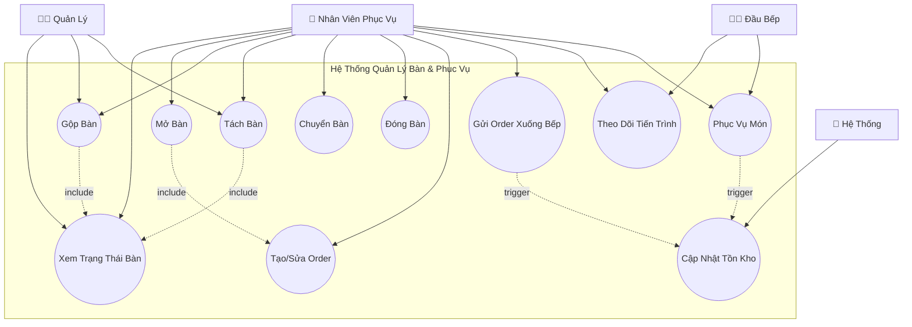
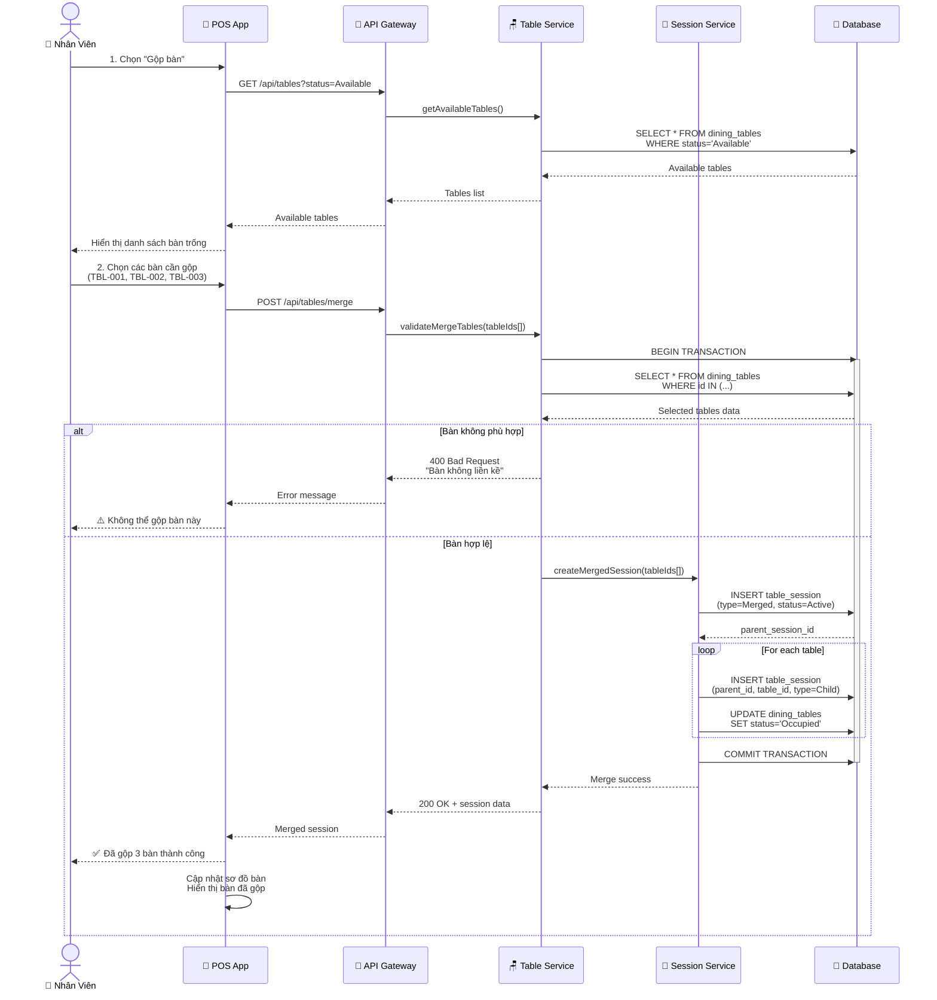
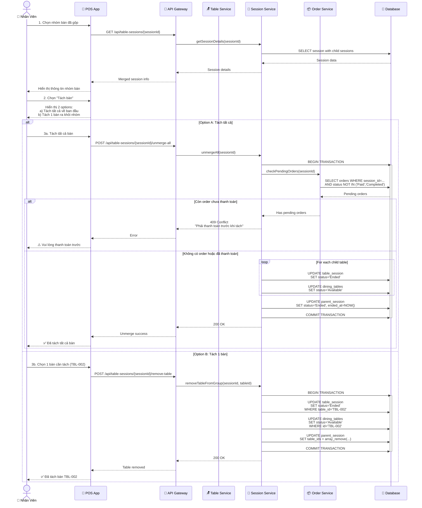
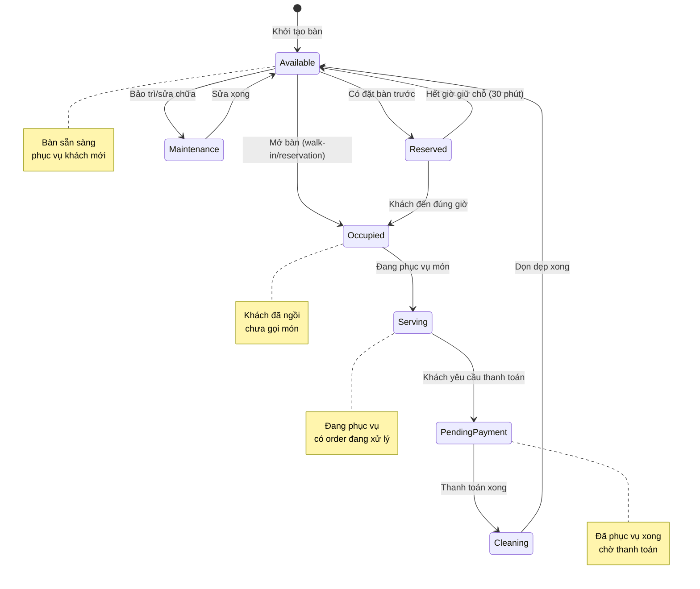
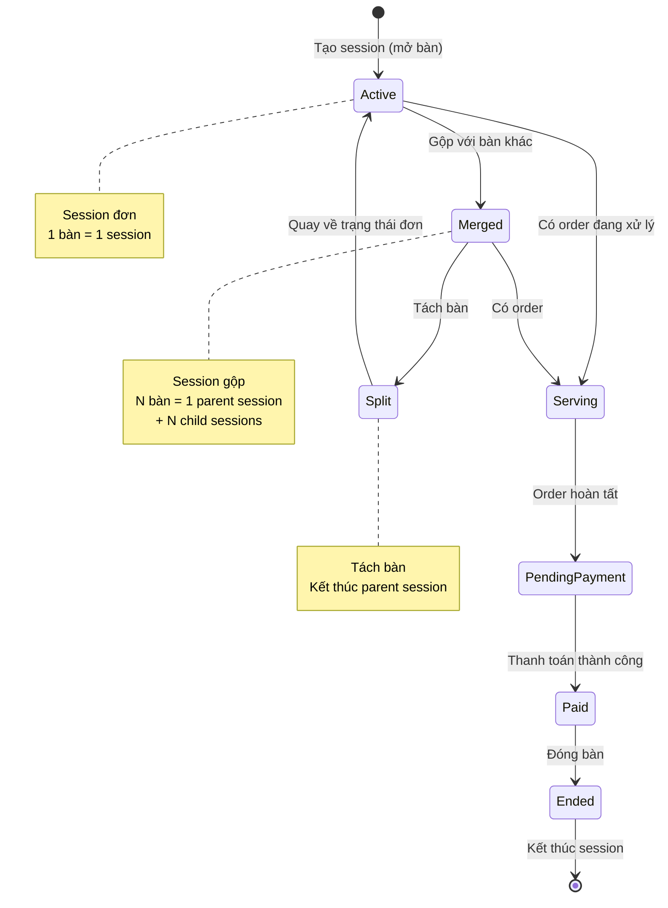
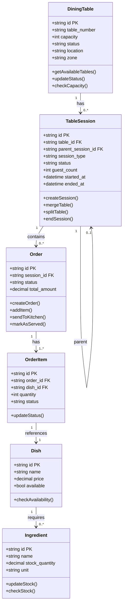
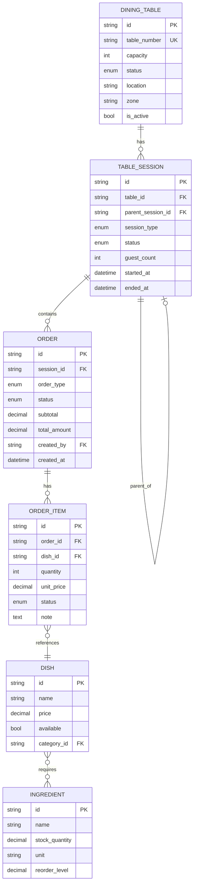

# Sơ Đồ UML - Quản Lý Bàn và Phục Vụ (Table & Service Management)

## 📋 Tổng Quan Module

Module quản lý bàn và phục vụ hỗ trợ nhân viên trong quá trình quản lý và vận hành bàn ăn, bao gồm gộp/tách bàn, theo dõi trạng thái phục vụ và đồng bộ với bếp.

### Yêu Cầu Chính
- ✅ Theo dõi trạng thái bàn real-time
- ✅ Gộp bàn (Merge Tables) linh hoạt
- ✅ Tách bàn (Split Tables) theo nhu cầu
- ✅ Tạo/sửa order cho từng bàn
- ✅ Gửi order xuống bếp tự động
- ✅ Theo dõi tiến trình chế biến
- ✅ Tự động cập nhật tồn kho khi món hoàn tất

---

## 1️⃣ Use Case Diagram - Sơ Đồ Ca Sử Dụng



```
@startuml

left to right direction

actor "Nhân Viên" as Waiter
actor "Đầu Bếp" as Kitchen
actor "Quản Lý" as Manager
actor "Hệ Thống" as System

rectangle "Hệ Thống Quản Lý Bàn & Phục Vụ" {
    usecase "Xem Trạng Thái Bàn" as UC1
    usecase "Mở Bàn" as UC2
    usecase "Gộp Bàn" as UC3
    usecase "Tách Bàn" as UC4
    usecase "Chuyển Bàn" as UC5
    usecase "Đóng Bàn" as UC6
    usecase "Tạo/Sửa Order" as UC7
    usecase "Gửi Order Xuống Bếp" as UC8
    usecase "Theo Dõi Tiến Trình" as UC9
    usecase "Phục Vụ Món" as UC10
    usecase "Cập Nhật Tồn Kho" as UC11
}

'--- Liên kết Actor ---
Waiter --> UC1
Waiter --> UC2
Waiter --> UC3
Waiter --> UC4
Waiter --> UC5
Waiter --> UC6
Waiter --> UC7
Waiter --> UC8
Waiter --> UC9
Waiter --> UC10

Kitchen --> UC9
Kitchen --> UC10

Manager --> UC1
Manager --> UC3
Manager --> UC4

System --> UC11

'--- Quan hệ giữa các Use Case ---
UC2 .right.> UC7 : <<include>>
UC3 .u.> UC1 : <<include>>
UC4 .right.> UC1 : <<include>>
UC8 .right.> UC11 : <<trigger>>
UC10 .down.> UC11 : <<trigger>>

@enduml

```

### Giải Thích Use Case

| Use Case | Actor | Mô Tả |
|----------|-------|-------|
| **Xem Trạng Thái Bàn** | Nhân viên, Quản lý | Xem sơ đồ bàn với trạng thái real-time |
| **Mở Bàn** | Nhân viên | Chuyển bàn từ Available → Occupied, tạo session |
| **Gộp Bàn** | Nhân viên, Quản lý | Gộp nhiều bàn thành 1 cho nhóm khách lớn |
| **Tách Bàn** | Nhân viên, Quản lý | Tách bàn đã gộp thành các bàn riêng |
| **Chuyển Bàn** | Nhân viên | Di chuyển khách sang bàn khác |
| **Đóng Bàn** | Nhân viên | Kết thúc phục vụ, chuyển bàn về Available |
| **Tạo/Sửa Order** | Nhân viên | Thêm/xóa/sửa món trong order |
| **Gửi Order Xuống Bếp** | Nhân viên | Gửi order tới màn hình bếp |
| **Theo Dõi Tiến Trình** | Nhân viên, Bếp | Xem trạng thái chế biến món |
| **Phục Vụ Món** | Nhân viên | Đánh dấu món đã phục vụ lên bàn |
| **Cập Nhật Tồn Kho** | Hệ thống | Tự động trừ nguyên liệu khi món hoàn tất |

---

## 2️⃣ Activity Diagram - Quy Trình Quản Lý Bàn

```mermaid
flowchart TD
    Start([Bắt Đầu]) --> A1[Nhân viên xem sơ đồ bàn]
    A1 --> A2{Khách đến}
    
    A2 -->|Walk-in| A3[Tìm bàn trống phù hợp]
    A2 -->|Đã đặt bàn| A4[Load reservation info]
    
    A3 --> A5{Có bàn trống?}
    A5 -->|Không| A6[Thông báo hết bàn<br/>Đề xuất đợi/đặt trước]
    A6 --> End1([Kết Thúc])
    
    A5 -->|Có| A7[Mở bàn<br/>Status = Occupied<br/>Tạo table_session]
    A4 --> A7
    
    A7 --> A8{Nhóm lớn cần gộp bàn?}
    A8 -->|Có| A9[Chọn các bàn cần gộp]
    A9 --> A10[Thực hiện gộp bàn<br/>Tạo parent_session]
    A10 --> A11[Cập nhật sơ đồ bàn<br/>Hiển thị bàn đã gộp]
    
    A8 -->|Không| A12[Giữ nguyên bàn đơn]
    A11 --> A13[Tạo order cho bàn/nhóm bàn]
    A12 --> A13
    
    A13 --> A14[Nhân viên nhận menu<br/>tư vấn cho khách]
    A14 --> A15[Khách chọn món]
    A15 --> A16[Nhân viên nhập vào POS<br/>Thêm món vào order]
    
    A16 --> A17{Khách thêm món?}
    A17 -->|Có| A15
    A17 -->|Không| A18[Xác nhận order<br/>Đọc lại cho khách nghe]
    
    A18 --> A19[Gửi order xuống bếp<br/>Order status = Processing]
    A19 --> A20[Bếp nhận order<br/>trên màn hình]
    
    A20 --> A21[Đầu bếp chế biến món<br/>Cập nhật status từng món]
    A21 --> A22{Món nào xong trước?}
    
    A22 --> A23[Đầu bếp đánh dấu<br/>Status = Ready]
    A23 --> A24[Nhân viên nhận<br/>thông báo món xong]
    A24 --> A25[Mang món ra phục vụ<br/>Cập nhật Status = Served]
    
    A25 --> A26[Hệ thống tự động<br/>trừ nguyên liệu trong kho]
    A26 --> A27{Tất cả món đã phục vụ?}
    
    A27 -->|Chưa| A22
    A27 -->|Rồi| A28[Order status = Served]
    
    A28 --> A29{Khách gọi thêm món?}
    A29 -->|Có| A30[Tạo order mới<br/>hoặc thêm vào order hiện tại]
    A30 --> A15
    
    A29 -->|Không| A31[Khách yêu cầu thanh toán]
    A31 --> A32[Xử lý thanh toán<br/>theo Module 02]
    
    A32 --> A33{Thanh toán thành công?}
    A33 -->|Không| A31
    A33 -->|Có| A34[Đóng bàn<br/>End table_session]
    
    A34 --> A35{Bàn đã gộp?}
    A35 -->|Có| A36[Tự động tách bàn<br/>về trạng thái ban đầu]
    A35 -->|Không| A37[Cập nhật status = Available]
    
    A36 --> A37
    A37 --> A38[Dọn bàn và chuẩn bị<br/>cho khách tiếp theo]
    A38 --> End2([Kết Thúc])

    style A10 fill:#ffcc99
    style A19 fill:#99ccff
    style A26 fill:#ff9999
    style A34 fill:#99ff99
```



```
@startuml
start

:Nhân viên xem sơ đồ bàn;
if (Khách đến?) then (Walk-in)
    :Chọn bàn trống phù hợp;
else (Đã đặt bàn)
    :Kiểm tra và xác nhận đặt bàn;
endif

:Mở bàn và tạo phiên phục vụ;
if (Nhóm lớn?) then (Có)
    :Gộp bàn và cập nhật sơ đồ;
endif

:Tạo order cho bàn;
:Khách chọn món;
:Gửi order xuống bếp;

:Chế biến và phục vụ món;
:Cập nhật tồn kho và trạng thái order;

if (Khách gọi thêm món?) then (Có)
    :Tạo order bổ sung;
endif

:Khách yêu cầu thanh toán;
if (Thanh toán thành công?) then (Có)
    :Đóng bàn và kết thúc phiên;
    if (Bàn gộp?) then (Có)
        :Tách bàn về trạng thái ban đầu;
    endif
    
else (Không)
    :Xử lý thanh toán lại;
endif

stop
@enduml
```

---

## 3️⃣ Sequence Diagram - Gộp Bàn (Merge Tables)



```
@startuml
actor "Nhân viên" as W
participant "POS App" as App
participant "API Gateway" as API
participant "Table Service" as TableSvc
participant "Session Service" as SessionSvc
database "Database" as DB

W -> App: Chọn chức năng "Gộp bàn"
App -> API: Yêu cầu danh sách bàn trống
API -> TableSvc: Lấy thông tin bàn trống
TableSvc -> DB: Truy vấn bàn khả dụng
DB --> TableSvc: Danh sách bàn trống
TableSvc --> API: Trả kết quả
API --> App: Danh sách bàn trống
App --> W: Hiển thị danh sách bàn trống

W -> App: Chọn các bàn cần gộp
App -> API: Gửi yêu cầu gộp bàn
API -> TableSvc: Xác thực danh sách bàn

alt Bàn không hợp lệ
    TableSvc --> API: Trả lỗi "Không thể gộp bàn"
    API --> App: Thông báo lỗi
    App --> W: Hiển thị lỗi
else Bàn hợp lệ
    TableSvc -> SessionSvc: Tạo phiên gộp bàn
    SessionSvc -> DB: Lưu thông tin phiên gộp và cập nhật trạng thái bàn
    DB --> SessionSvc: Xác nhận lưu thành công
    SessionSvc --> TableSvc: Kết quả gộp thành công
    TableSvc --> API: Trả dữ liệu phiên gộp
    API --> App: Trả kết quả
    App --> W: Thông báo gộp bàn thành công
    App -> App: Cập nhật sơ đồ bàn
end
@enduml

```

### Giải Thích Gộp Bàn

#### **Business Rules**
1. Chỉ gộp được các bàn **đang trống** (Available)
2. Các bàn nên **liền kề** hoặc trong cùng khu vực
3. Tổng sức chứa ≥ số lượng khách
4. Tạo **parent session** để quản lý nhóm bàn
5. Mỗi bàn con có **child session** link đến parent

#### **Data Structure**
```json
{
  "parent_session": {
    "id": "SES-001",
    "type": "Merged",
    "status": "Active",
    "table_ids": ["TBL-001", "TBL-002", "TBL-003"],
    "total_capacity": 12,
    "guest_count": 10
  },
  "child_sessions": [
    {
      "id": "SES-002",
      "parent_id": "SES-001",
      "table_id": "TBL-001",
      "type": "Child"
    },
    // ... more child sessions
  ]
}
```

---

## 4️⃣ Sequence Diagram - Tách Bàn (Split Tables)



### Giải Thích Tách Bàn

#### **2 Phương Thức Tách Bàn**

##### **1. Tách Tất Cả (Unmerge All)**
- Tách toàn bộ nhóm bàn về trạng thái ban đầu
- **Điều kiện**: Phải thanh toán hoặc không có order
- **Kết quả**: Tất cả bàn → Available

##### **2. Tách 1 Bàn (Remove Table)**
- Tách 1 bàn cụ thể ra khỏi nhóm
- Các bàn còn lại vẫn giữ nhóm
- **Use case**: Một số khách trong nhóm về trước

#### **Ràng Buộc**
- ❌ Không tách nếu còn order chưa thanh toán
- ⚠️ Cảnh báo nếu có order đang chế biến
- ✅ Tự động tách khi đóng bàn (sau thanh toán)

---

## 5️⃣ State Diagram - Vòng Đời Bàn (Table Lifecycle)



---

## 6️⃣ State Diagram - Vòng Đời Session (Table Session)



---

## 7️⃣ Class Diagram - Mô Hình Dữ Liệu



---

## 8️⃣ ER Diagram - Quan Hệ Dữ Liệu



---

## 9️⃣ Business Rules - Quy Tắc Nghiệp Vụ

### 🪑 Quy Tắc Quản Lý Bàn

#### **1. Trạng Thái Bàn**
| Trạng thái | Mô tả | Có thể mở bàn? |
|------------|-------|----------------|
| **Available** | Sẵn sàng phục vụ | ✅ Có |
| **Reserved** | Đã đặt trước | ⚠️ Chỉ cho reservation |
| **Occupied** | Có khách đang ngồi | ❌ Không |
| **Serving** | Đang phục vụ món | ❌ Không |
| **PendingPayment** | Chờ thanh toán | ❌ Không |
| **Cleaning** | Đang dọn dẹp | ❌ Không |
| **Maintenance** | Bảo trì | ❌ Không |

#### **2. Sức Chứa Bàn**
- Số khách = sức chứa: ✅ Lý tưởng
- Số khách < sức chứa: ✅ Chấp nhận (tối đa -2)
- Số khách > sức chứa: ⚠️ Cảnh báo (tối đa +2)
- Vượt quá +2: ❌ Đề xuất gộp bàn

### 🔗 Quy Tắc Gộp Bàn

#### **Điều Kiện Gộp**
1. ✅ Tất cả bàn phải ở trạng thái **Available**
2. ✅ Các bàn nên **liền kề** hoặc cùng khu vực
3. ✅ Tổng sức chứa ≥ số lượng khách
4. ✅ Tối đa gộp **5 bàn** (giới hạn hệ thống)

#### **Cách Thức Gộp**
- Tạo **1 parent session** (type = Merged)
- Tạo **N child sessions** (1 cho mỗi bàn)
- Tất cả order gắn với **parent session**
- Thanh toán qua **parent session**

#### **Hủy Gộp**
- Tự động khi **thanh toán xong**
- Thủ công nếu **chưa có order**
- ❌ Không cho phép nếu **có order chưa thanh toán**

### ✂️ Quy Tắc Tách Bàn

#### **Tách Toàn Bộ (Unmerge All)**
- Điều kiện: **Không có order** HOẶC **đã thanh toán hết**
- Kết quả: Tất cả bàn → Available
- Parent session → Ended

#### **Tách 1 Bàn (Remove Table)**
- Điều kiện: **Bàn đó không có order riêng**
- Bàn được tách → Available
- Các bàn còn lại giữ nhóm

### 📊 Quy Tắc Cập Nhật Tồn Kho

#### **Thời Điểm Trừ Kho**
- ❌ **Không trừ** khi order được tạo
- ❌ **Không trừ** khi gửi xuống bếp
- ✅ **Trừ kho** khi món được đánh dấu **Ready** (đầu bếp hoàn tất)
- ✅ **Rollback** nếu món bị hủy

#### **Công Thức Trừ Kho**
```
Với mỗi món trong order_item:
  Với mỗi nguyên liệu của món:
    new_stock = current_stock - (required_amount × quantity)
    IF new_stock < 0:
      RAISE ERROR "Không đủ nguyên liệu"
    ELSE:
      UPDATE stock
      INSERT stock_export_detail
```

---

## 🔟 API Endpoints - Danh Sách API

### Table Management

#### Xem Sơ Đồ Bàn
```http
GET /api/tables/map?date=2025-10-22&session=dinner
Response: {
  "tables": [
    {
      "id": "TBL-001",
      "number": "A1",
      "capacity": 4,
      "status": "Available",
      "location": "Main Hall",
      "zone": "VIP"
    }
  ]
}
```

#### Mở Bàn
```http
POST /api/table-sessions
Body: {
  "table_id": "TBL-001",
  "guest_count": 4,
  "reservation_id": "RSV-123"  // Optional
}
Response: {
  "id": "SES-001",
  "table_number": "A1",
  "status": "Active",
  "started_at": "2025-10-21T12:00:00Z"
}
```

#### Gộp Bàn
```http
POST /api/table-sessions/merge
Body: {
  "table_ids": ["TBL-001", "TBL-002", "TBL-003"],
  "guest_count": 10
}
Response: {
  "parent_session_id": "SES-100",
  "child_sessions": ["SES-101", "SES-102", "SES-103"],
  "total_capacity": 12,
  "status": "Active"
}
```

#### Tách Bàn
```http
POST /api/table-sessions/{sessionId}/unmerge
Body: {
  "unmerge_type": "all"  // or "single"
  "table_id": "TBL-002"  // Required if type=single
}
Response: {
  "unmerged_tables": ["TBL-001", "TBL-002", "TBL-003"],
  "status": "Success"
}
```

#### Chuyển Bàn
```http
POST /api/table-sessions/{sessionId}/transfer
Body: {
  "from_table_id": "TBL-001",
  "to_table_id": "TBL-005"
}
```

#### Đóng Bàn
```http
POST /api/table-sessions/{sessionId}/close
Response: {
  "id": "SES-001",
  "status": "Ended",
  "ended_at": "2025-10-21T14:30:00Z"
}
```

### Service Management

#### Theo Dõi Tiến Trình Order
```http
GET /api/orders/{orderId}/progress
Response: {
  "order_id": "ORD-001",
  "status": "Cooking",
  "items": [
    {
      "dish_name": "Phở Bò",
      "quantity": 2,
      "status": "Ready",
      "cook_time": "15 minutes"
    },
    {
      "dish_name": "Bún Bò",
      "quantity": 1,
      "status": "Cooking",
      "estimated_time": "5 minutes"
    }
  ]
}
```

#### Cập Nhật Trạng Thái Món (Bếp)
```http
PATCH /api/order-items/{itemId}/status
Body: {
  "status": "Ready"
}
```

#### Đánh Dấu Đã Phục Vụ
```http
POST /api/order-items/{itemId}/served
Response: {
  "item_id": "ITEM-001",
  "status": "Served",
  "served_at": "2025-10-21T12:45:00Z"
}
```

---

## 1️⃣1️⃣ Screen Mockups - Giao Diện Tham Khảo

### Sơ Đồ Bàn (Table Map)
```
┌─────────────────────────────────────────────────────────┐
│          🏠 SƠ ĐỒ BÀN - MAIN HALL                      │
├─────────────────────────────────────────────────────────┤
│                                                           │
│  🟢 Trống: 5  🔴 Đang phục vụ: 8  🟡 Đặt trước: 2     │
│                                                           │
│  ┌──────┐  ┌──────┐  ┌──────┐  ┌──────┐              │
│  │  A1  │  │  A2  │  │  A3  │  │  A4  │              │
│  │  🟢  │  │  🔴  │  │  🔴  │  │  🟡  │              │
│  │  4p  │  │  4p  │  │  4p  │  │  4p  │              │
│  └──────┘  └──────┘  └──────┘  └──────┘              │
│                                                           │
│  ┌────────────┐  ┌──────┐  ┌──────┐                   │
│  │  B1+B2+B3  │  │  B4  │  │  B5  │                   │
│  │     🔴     │  │  🟢  │  │  🟢  │                   │
│  │    12p     │  │  6p  │  │  6p  │                   │
│  └────────────┘  └──────┘  └──────┘                   │
│                                                           │
│  [ 🔄 Refresh ]  [ ➕ Mở Bàn ]  [ 🔗 Gộp Bàn ]         │
└─────────────────────────────────────────────────────────┘
```

### Màn Hình Gộp Bàn
```
┌─────────────────────────────────────────────────────────┐
│          🔗 GỘP BÀN                                     │
├─────────────────────────────────────────────────────────┤
│                                                           │
│  Chọn các bàn cần gộp:                                   │
│  ☑️ Bàn A1 (4 chỗ) - Trống                              │
│  ☑️ Bàn A2 (4 chỗ) - Trống                              │
│  ☑️ Bàn A3 (4 chỗ) - Trống                              │
│  ☐ Bàn A4 (4 chỗ) - Đã đặt                              │
│                                                           │
│  ━━━━━━━━━━━━━━━━━━━━━━━━━━━━━━━━━━━━━━━━━━━━━         │
│  Tổng sức chứa: 12 người                                │
│  Số khách dự kiến: [___10___]                           │
│                                                           │
│  [ ✅ XÁC NHẬN GỘP BÀN ]  [ ❌ Hủy ]                    │
└─────────────────────────────────────────────────────────┘
```

---

**[⬅️ Quay lại: Order & Payment](./02-ORDER-PAYMENT-MANAGEMENT.md)** | **[➡️ Tiếp: Inventory & Supply](./04-INVENTORY-SUPPLY-MANAGEMENT.md)**
