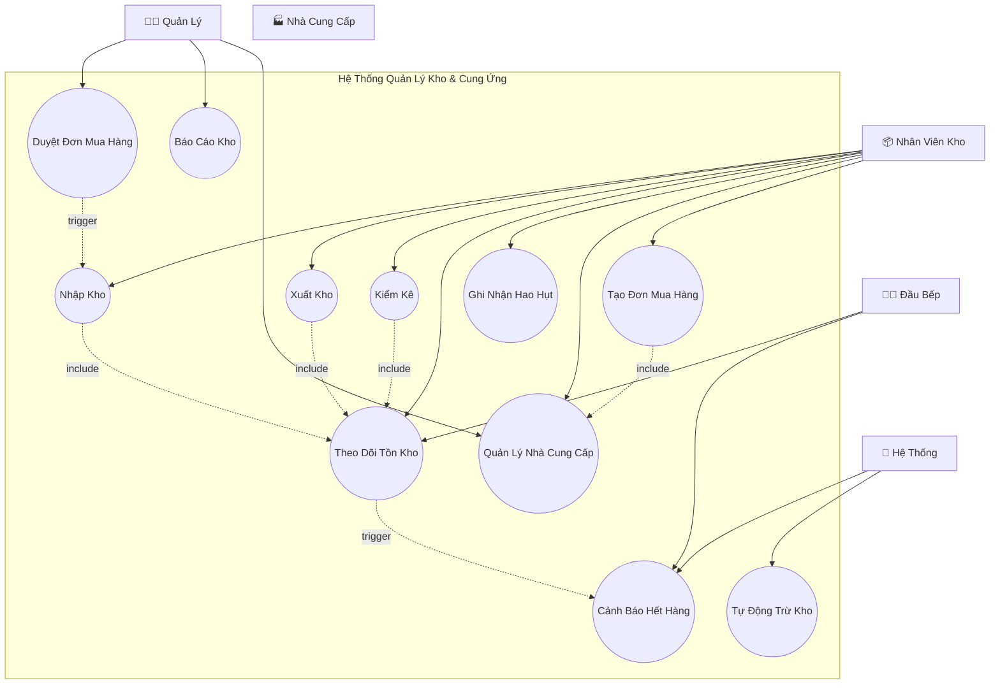
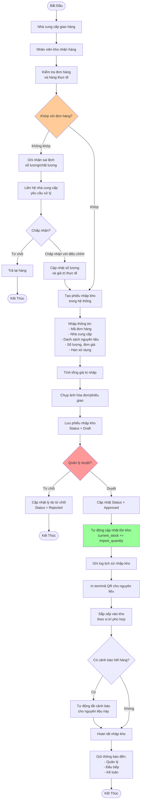
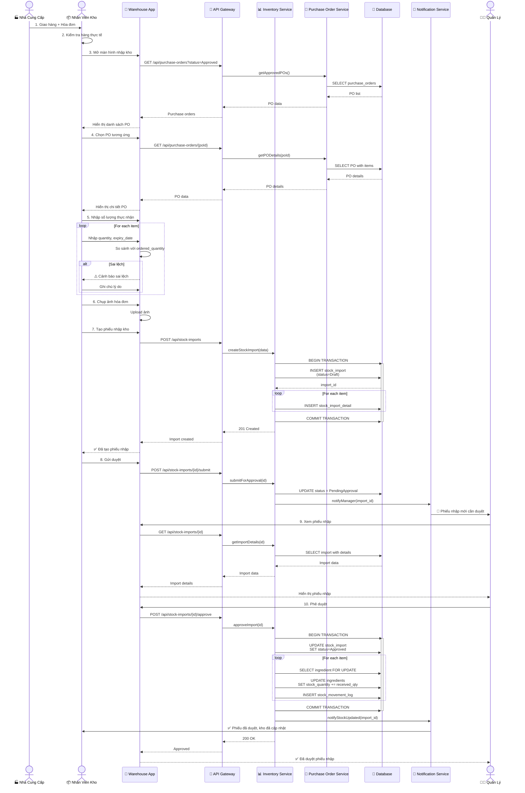
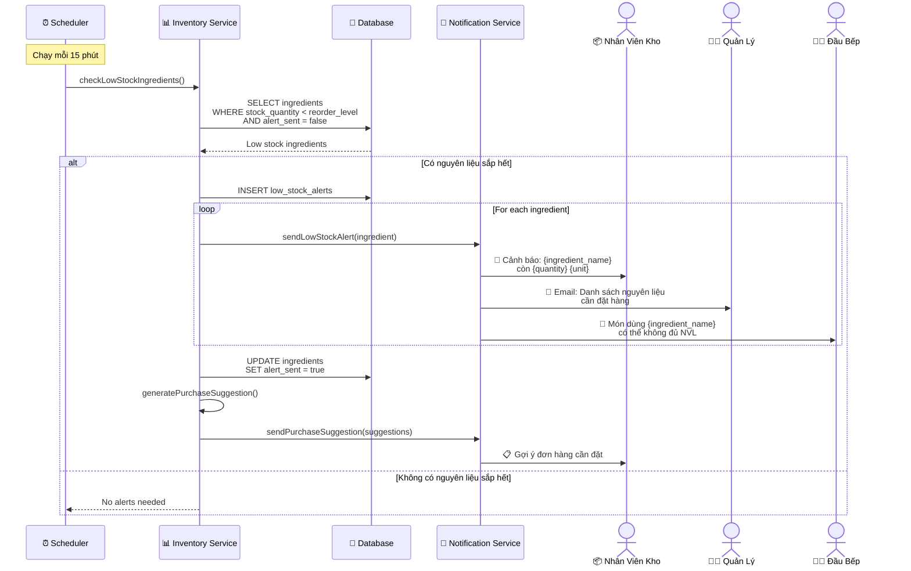
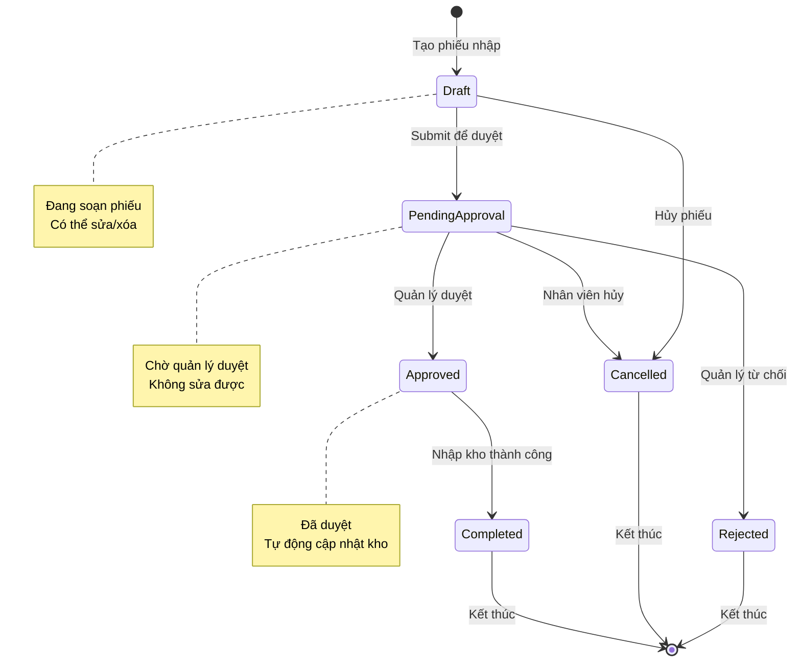
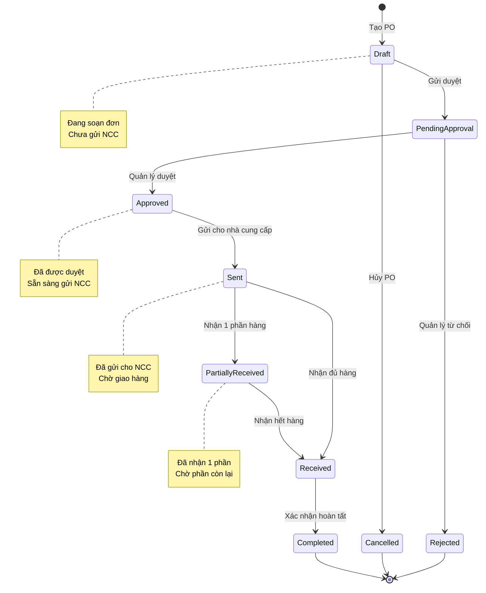

# Sơ Đồ UML - Quản Lý Kho và Cung Ứng (Inventory & Supply Management)

## 📋 Tổng Quan Module

Module quản lý kho và cung ứng hỗ trợ nhân viên kho và bộ phận quản lý trong việc theo dõi, kiểm soát và tối ưu hóa quy trình quản lý nguyên liệu, nhập xuất kho và làm việc với nhà cung cấp.

### Yêu Cầu Chính
- ✅ Quản lý nhập kho, xuất kho, kiểm kê định kỳ
- ✅ Theo dõi tồn kho bếp theo thời gian thực
- ✅ Cảnh báo nguyên liệu sắp hết
- ✅ Ghi nhận và quản lý hao hụt nguyên liệu
- ✅ Quản lý thông tin nhà cung cấp (Supplier)
- ✅ Tạo và duyệt đơn mua hàng (Purchase Order)
- ✅ Báo cáo nhập-xuất-tồn-hao hụt

---

## 1️⃣ Use Case Diagram - Sơ Đồ Ca Sử Dụng



```
@startuml
left to right direction

actor "Đầu bếp" as Kitchen
actor "Quản lý" as Manager
actor "Nhà cung cấp" as Supplier
actor "Hệ thống" as System

rectangle "Hệ Thống Quản Lý Kho & Cung Ứng" {
    usecase "Nhập kho" as UC1
    usecase "Xuất kho" as UC2
    usecase "Kiểm kê" as UC3
    usecase "Theo dõi tồn kho" as UC4
    usecase "Cảnh báo hết hàng" as UC5
    usecase "Ghi nhận hao hụt" as UC6
    usecase "Quản lý nhà cung cấp" as UC7
    usecase "Tạo đơn mua hàng" as UC8
    usecase "Duyệt đơn mua hàng" as UC9
    usecase "Báo cáo kho" as UC10
    usecase "Tự động trừ kho" as UC11
}

Manager--> UC1
Manager--> UC2
Manager--> UC3
Manager--> UC4
Manager --> UC6
Manager--> UC7
Manager--> UC8

Kitchen --> UC4
Kitchen --> UC5

Manager --> UC9
Manager --> UC10
Manager --> UC7

Supplier --> UC1

System --> UC5
System --> UC11

UC1 .up.> UC4 : <<include>>
UC2 .right.> UC4 : <<include>>
UC3 .right.> UC4 : <<include>>
UC8 .up.> UC7 : <<include>>

@enduml
```

### Giải Thích Use Case

| Use Case | Actor | Mô Tả |
|----------|-------|-------|
| **Nhập Kho** | Nhân viên kho | Ghi nhận nguyên liệu nhập từ nhà cung cấp |
| **Xuất Kho** | Nhân viên kho | Xuất nguyên liệu ra bếp để sử dụng |
| **Kiểm Kê** | Nhân viên kho | Kiểm đếm số lượng thực tế, đối chiếu với hệ thống |
| **Theo Dõi Tồn Kho** | Nhân viên kho, Bếp | Xem số lượng tồn kho real-time |
| **Cảnh Báo Hết Hàng** | Hệ thống | Tự động thông báo khi nguyên liệu < mức tối thiểu |
| **Ghi Nhận Hao Hụt** | Nhân viên kho | Ghi lại nguyên liệu hỏng, hết hạn, mất mát |
| **Quản Lý Nhà Cung Cấp** | Nhân viên kho, Quản lý | CRUD thông tin nhà cung cấp |
| **Tạo Đơn Mua Hàng** | Nhân viên kho | Tạo purchase order gửi nhà cung cấp |
| **Duyệt Đơn Mua Hàng** | Quản lý | Phê duyệt hoặc từ chối đơn mua hàng |
| **Báo Cáo Kho** | Quản lý | Xem báo cáo nhập-xuất-tồn-hao hụt |
| **Tự Động Trừ Kho** | Hệ thống | Trừ nguyên liệu khi món ăn hoàn tất |

---

## 2️⃣ Activity Diagram - Quy Trình Nhập Kho



```
@startuml
start

:Nhà cung cấp giao hàng;
:Nhân viên kho nhận hàng;
:Kiểm tra đơn hàng và hàng thực tế;

if (Khớp với đơn hàng?) then (Không khớp)
    :Ghi nhận sai lệch số lượng/chất lượng;
    :Liên hệ nhà cung cấp yêu cầu xử lý;
    if (Chấp nhận?) then (Từ chối)
        :Trả lại hàng;
        stop
    else (Chấp nhận với điều chỉnh)
        :Cập nhật số lượng và giá trị thực tế;
    endif
endif

:Khớp đơn hàng / Đã cập nhật số lượng -> Tạo phiếu nhập kho trong hệ thống;
:Nhập thông tin phiếu nhập;
:Tính tổng giá trị nhập;
:Chụp ảnh hóa đơn/phiếu giao;
:Lưu phiếu nhập kho (Status = Draft);

if (Quản lý duyệt?) then (Từ chối)
    :Cập nhật lý do từ chối (Status = Rejected);
    stop
else (Duyệt)
    :Cập nhật Status = Approved;
    :Tự động cập nhật tồn kho (current_stock += import_quantity);

:Hoàn tất nhập kho;;

stop
@enduml

```

---

## 3️⃣ Activity Diagram - Quy Trình Xuất Kho

```mermaid
flowchart TD
    Start([Bắt Đầu]) --> A1{Loại xuất kho?}
    
    A1 -->|Tự động<br/>Khi món xong| A2[Hệ thống tính<br/>nguyên liệu cần thiết]
    A1 -->|Thủ công<br/>Bếp yêu cầu| A3[Đầu bếp tạo<br/>phiếu yêu cầu xuất]
    
    A2 --> A4[Lấy recipe của món<br/>từ database]
    A4 --> A5[Tính toán:<br/>required_qty = recipe_qty × dish_qty]
    
    A3 --> A6[Nhập danh sách<br/>nguyên liệu cần xuất]
    
    A5 --> A7[Kiểm tra tồn kho]
    A6 --> A7
    
    A7 --> A8{Đủ nguyên liệu?}
    
    A8 -->|Không đủ| A9[Thông báo lỗi:<br/>"Không đủ nguyên liệu"]
    A9 --> A10[Gợi ý nguyên liệu thay thế<br/>hoặc điều chỉnh số lượng]
    A10 --> A11{Xử lý?}
    
    A11 -->|Hủy| End1([Kết Thúc])
    A11 -->|Điều chỉnh| A6
    
    A8 -->|Đủ| A12[Tạo phiếu xuất kho<br/>Status = Pending]
    A12 --> A13[Lock nguyên liệu<br/>để tránh xung đột]
    
    A13 --> A14{Cần duyệt?}
    A14 -->|Có<br/>Xuất số lượng lớn| A15[Quản lý kiểm tra<br/>và phê duyệt]
    A15 --> A16{Duyệt?}
    
    A16 -->|Từ chối| A17[Unlock nguyên liệu<br/>Status = Rejected]
    A17 --> End2([Kết Thúc])
    
    A14 -->|Không<br/>Xuất thường| A18[Tự động duyệt]
    A16 -->|Duyệt| A18
    
    A18 --> A19[Cập nhật tồn kho:<br/>current_stock -= export_quantity]
    A19 --> A20[Ghi log xuất kho<br/>với thông tin chi tiết]
    
    A20 --> A21[In phiếu xuất kho]
    A21 --> A22[Nhân viên kho chuẩn bị<br/>nguyên liệu theo phiếu]
    
    A22 --> A23[Bàn giao cho bếp]
    A23 --> A24[Đầu bếp ký nhận]
    A24 --> A25[Cập nhật Status = Completed]
    
    A25 --> A26{Stock < reorder_level?}
    A26 -->|Có| A27[Kích hoạt cảnh báo<br/>hết hàng]
    A26 -->|Không| A28[Hoàn tất xuất kho]
    A27 --> A28
    
    A28 --> End3([Kết Thúc])

    style A8 fill:#ffcc99
    style A16 fill:#ff9999
    style A19 fill:#99ff99
    style A26 fill:#ff9999
```

---

## 4️⃣ Sequence Diagram - Nhập Kho Chi Tiết



```
@startuml
actor "Nhà cung cấp" as S
actor "Nhân viên kho" as WS
actor "Quản lý" as M
participant "Website" as App
participant "API Gateway" as API
participant "Inventory Service" as InvSvc
participant "Purchase Order Service" as POSvc
participant "Database" as DB
participant "Notification Service" as NotifSvc

S -> WS: Giao hàng + hóa đơn
WS -> WS: Kiểm tra hàng thực tế

WS -> App: Mở màn hình nhập kho và chọn PO
App -> API: Lấy thông tin PO đã duyệt
API -> POSvc: Truy vấn PO
POSvc -> DB: Lấy dữ liệu
DB --> POSvc
POSvc --> API
API --> App
App --> WS: Hiển thị PO

WS -> App: Nhập số lượng thực nhận và kiểm tra
App --> WS: Cảnh báo nếu sai lệch

WS -> App: Tạo phiếu nhập kho
App -> API: Gửi yêu cầu tạo phiếu
API -> InvSvc: Tạo phiếu
InvSvc -> DB: Lưu phiếu và chi tiết
InvSvc --> API: Phiếu đã tạo
API --> App
App --> WS: Thông báo phiếu đã tạo

WS -> App: Gửi duyệt phiếu
App -> API: Submit for approval
API -> InvSvc: Cập nhật trạng thái
InvSvc -> NotifSvc: Thông báo quản lý
NotifSvc --> M: Phiếu cần duyệt

M -> App: Xem phiếu nhập và phê duyệt
App -> API: Approve import
API -> InvSvc: Phê duyệt và cập nhật tồn kho
InvSvc -> NotifSvc: Thông báo kho cập nhật
NotifSvc --> WS: Phiếu đã duyệt, kho đã cập nhật
InvSvc --> API
API --> App
App --> M: Hiển thị phiếu đã duyệt

@enduml

```

---

## 5️⃣ Sequence Diagram - Cảnh Báo Hết Hàng



---

## 6️⃣ State Diagram - Vòng Đời Phiếu Nhập Kho



---

## 7️⃣ State Diagram - Vòng Đời Đơn Mua Hàng (Purchase Order)



---

## 8️⃣ ER Diagram - Mô Hình Dữ Liệu

```mermaid
erDiagram
    INGREDIENT ||--o{ STOCK_IMPORT_DETAIL : includes
    INGREDIENT ||--o{ STOCK_EXPORT_DETAIL : includes
    INGREDIENT ||--o{ STOCK_LOSS : has
    INGREDIENT }o--|| INGREDIENT_CATEGORY : belongs_to
    INGREDIENT }o--o| SUPPLIER : supplied_by
    
    STOCK_IMPORT ||--o{ STOCK_IMPORT_DETAIL : contains
    STOCK_IMPORT }o--|| SUPPLIER : from
    STOCK_IMPORT }o--o| PURCHASE_ORDER : fulfills
    
    STOCK_EXPORT ||--o{ STOCK_EXPORT_DETAIL : contains
    STOCK_EXPORT }o--o| ORDER : for
    
    PURCHASE_ORDER ||--o{ PURCHASE_ORDER_ITEM : contains
    PURCHASE_ORDER }o--|| SUPPLIER : to
    
    SUPPLIER ||--o{ PURCHASE_ORDER : receives
    SUPPLIER ||--o{ STOCK_IMPORT : provides
    
    INGREDIENT {
        string id PK
        string name
        string category_id FK
        decimal stock_quantity
        string unit
        decimal unit_price
        decimal reorder_level
        bool alert_sent
        string supplier_id FK
        date last_import_date
    }
    
    STOCK_IMPORT {
        string id PK
        string supplier_id FK
        string purchase_order_id FK
        date import_date
        enum status
        decimal total_amount
        text notes
        string invoice_image
        string created_by FK
        datetime created_at
    }
    
    STOCK_IMPORT_DETAIL {
        string id PK
        string import_id FK
        string ingredient_id FK
        decimal ordered_quantity
        decimal received_quantity
        decimal unit_price
        date expiry_date
        text notes
    }
    
    STOCK_EXPORT {
        string id PK
        string order_id FK
        enum export_type
        date export_date
        enum status
        string created_by FK
        datetime created_at
    }
    
    STOCK_EXPORT_DETAIL {
        string id PK
        string export_id FK
        string ingredient_id FK
        decimal quantity
        text notes
    }
    
    STOCK_LOSS {
        string id PK
        string ingredient_id FK
        decimal quantity
        enum loss_reason
        text description
        date loss_date
        string reported_by FK
    }
    
    PURCHASE_ORDER {
        string id PK
        string supplier_id FK
        date order_date
        date expected_delivery_date
        enum status
        decimal total_amount
        string created_by FK
        string approved_by FK
        datetime created_at
    }
    
    PURCHASE_ORDER_ITEM {
        string id PK
        string purchase_order_id FK
        string ingredient_id FK
        decimal quantity
        decimal unit_price
        decimal total_price
    }
    
    SUPPLIER {
        string id PK
        string name
        string contact_person
        string phone
        string email
        string address
        text payment_terms
        enum status
        int reliability_score
    }
    
    INGREDIENT_CATEGORY {
        string id PK
        string name
        string description
    }
```

---

## 9️⃣ Business Rules - Quy Tắc Nghiệp Vụ

### 📦 Quy Tắc Nhập Kho

#### **Validation**
1. ✅ Phải có **Purchase Order** đã được duyệt
2. ✅ Nhà cung cấp phải khớp với PO
3. ⚠️ Cảnh báo nếu số lượng nhận ≠ số lượng đặt
4. ❌ Từ chối nếu hàng quá hạn sử dụng
5. ✅ Bắt buộc nhập **expiry_date** cho thực phẩm

#### **Quy Trình Duyệt**
- **Giá trị < 5 triệu**: Tự động duyệt
- **Giá trị ≥ 5 triệu**: Cần quản lý duyệt
- **Sai lệch > 10%**: Cần quản lý duyệt

### 📤 Quy Tắc Xuất Kho

#### **Loại Xuất Kho**
1. **Tự động**: Khi món ăn hoàn tất
   - Dựa trên recipe (công thức)
   - Trừ kho ngay lập tức
   - Không cần duyệt

2. **Thủ công**: Bếp yêu cầu xuất
   - Xuất cho sản xuất, test món mới
   - Cần tạo phiếu xuất
   - Cần duyệt nếu số lượng lớn

#### **Điều Kiện Xuất**
- ✅ Tồn kho ≥ số lượng xuất
- ⚠️ Ưu tiên xuất hàng gần hết hạn (FEFO)
- ✅ Lock nguyên liệu khi tạo phiếu xuất
- ✅ Unlock nếu phiếu bị hủy

### ⚠️ Quy Tắc Cảnh Báo

#### **Mức Cảnh Báo**
```
reorder_level = average_daily_usage × lead_time × 1.5
```
- `average_daily_usage`: Mức tiêu thụ trung bình/ngày
- `lead_time`: Thời gian giao hàng (ngày)
- `1.5`: Safety factor

#### **Tần Suất Kiểm Tra**
- **Nguyên liệu quan trọng**: Mỗi 15 phút
- **Nguyên liệu thường**: Mỗi 1 giờ
- **Nguyên liệu ít dùng**: Mỗi 4 giờ

### 🛒 Quy Tắc Purchase Order

#### **Tạo PO**
1. Dựa trên danh sách cảnh báo hết hàng
2. Hệ thống gợi ý số lượng đặt:
   ```
   suggested_quantity = reorder_level - current_stock + buffer
   buffer = average_daily_usage × 7
   ```
3. Chọn nhà cung cấp có:
   - Reliability score cao
   - Giá cạnh tranh
   - Thời gian giao hàng ngắn

#### **Duyệt PO**
- **Giá trị < 10 triệu**: Quản lý kho duyệt
- **Giá trị ≥ 10 triệu**: Giám đốc duyệt

### 📉 Quy Tắc Hao Hụt

#### **Loại Hao Hụt**
| Loại | Mô Tả | Xử Lý |
|------|-------|-------|
| **Expired** | Hết hạn sử dụng | Tiêu hủy, ghi nhận chi phí |
| **Damaged** | Hư hỏng trong vận chuyển | Yêu cầu NCC đổi/bồi thường |
| **Spoiled** | Bảo quản không đúng cách | Truy trách nhiệm, ghi nhận chi phí |
| **Theft** | Mất mát do trộm cắp | Báo cáo bảo vệ, điều tra |
| **Other** | Lý do khác | Ghi nhận và phân tích |

#### **Xử Lý**
- Ghi nhận hao hụt vào hệ thống
- Trừ tồn kho tương ứng
- Báo cáo định kỳ cho quản lý
- Phân tích nguyên nhân và đề xuất cải tiến

---

## 🔟 API Endpoints - Danh Sách API

### Inventory Management

#### Xem Tồn Kho
```http
GET /api/ingredients?category=Meat&sort=stock_asc
Response: {
  "data": [
    {
      "id": "ING-001",
      "name": "Thịt Bò",
      "stock_quantity": 25.5,
      "unit": "kg",
      "reorder_level": 30,
      "status": "Low Stock",
      "last_import_date": "2025-10-15"
    }
  ]
}
```

#### Cảnh Báo Hết Hàng
```http
GET /api/inventory/alerts
Response: {
  "alerts": [
    {
      "ingredient_id": "ING-001",
      "ingredient_name": "Thịt Bò",
      "current_stock": 25.5,
      "reorder_level": 30,
      "suggested_order_quantity": 50,
      "alert_level": "Warning"
    }
  ]
}
```

### Stock Import

#### Tạo Phiếu Nhập Kho
```http
POST /api/stock-imports
Body: {
  "supplier_id": "SUP-001",
  "purchase_order_id": "PO-123",
  "import_date": "2025-10-21",
  "items": [
    {
      "ingredient_id": "ING-001",
      "ordered_quantity": 50,
      "received_quantity": 48,
      "unit_price": 200000,
      "expiry_date": "2025-12-31",
      "notes": "Thiếu 2kg do hỏng trong vận chuyển"
    }
  ],
  "invoice_image": "base64_string"
}
```

#### Duyệt Phiếu Nhập
```http
POST /api/stock-imports/{id}/approve
Response: {
  "id": "SIM-001",
  "status": "Approved",
  "stock_updated": true,
  "approved_by": "EMP-001",
  "approved_at": "2025-10-21T14:00:00Z"
}
```

### Stock Export

#### Tạo Phiếu Xuất Kho
```http
POST /api/stock-exports
Body: {
  "export_type": "Manual",
  "order_id": "ORD-123",  // Optional
  "items": [
    {
      "ingredient_id": "ING-001",
      "quantity": 5.5,
      "notes": "Xuất cho test món mới"
    }
  ]
}
```

#### Tự Động Xuất Kho (Khi Món Xong)
```http
POST /api/stock-exports/auto
Body: {
  "order_id": "ORD-123",
  "dish_id": "DSH-001",
  "quantity": 2
}
Response: {
  "export_id": "SEX-001",
  "items_exported": 5,
  "total_cost": 150000
}
```

### Purchase Order

#### Tạo Đơn Mua Hàng
```http
POST /api/purchase-orders
Body: {
  "supplier_id": "SUP-001",
  "expected_delivery_date": "2025-10-25",
  "items": [
    {
      "ingredient_id": "ING-001",
      "quantity": 50,
      "unit_price": 200000
    }
  ]
}
```

#### Gợi Ý Đơn Hàng Dựa Trên Cảnh Báo
```http
GET /api/purchase-orders/suggestions
Response: {
  "suggested_orders": [
    {
      "supplier_id": "SUP-001",
      "supplier_name": "Công ty Thịt Sạch ABC",
      "items": [
        {
          "ingredient_id": "ING-001",
          "ingredient_name": "Thịt Bò",
          "suggested_quantity": 50,
          "unit_price": 200000,
          "total": 10000000
        }
      ],
      "total_amount": 10000000
    }
  ]
}
```

### Supplier Management

#### Quản Lý Nhà Cung Cấp
```http
GET /api/suppliers
POST /api/suppliers
PUT /api/suppliers/{id}
DELETE /api/suppliers/{id}
```

### Stock Loss

#### Ghi Nhận Hao Hụt
```http
POST /api/stock-losses
Body: {
  "ingredient_id": "ING-001",
  "quantity": 2.5,
  "loss_reason": "Expired",
  "description": "Hết hạn sử dụng",
  "loss_date": "2025-10-21"
}
```

### Reports

#### Báo Cáo Nhập-Xuất-Tồn
```http
GET /api/reports/inventory?from=2025-10-01&to=2025-10-31
Response: {
  "summary": {
    "total_imports": 50000000,
    "total_exports": 35000000,
    "total_losses": 500000,
    "current_stock_value": 25000000
  },
  "details": [...]
}
```

---

## 1️⃣1️⃣ Screen Mockups - Giao Diện Tham Khảo

### Màn Hình Tồn Kho
```
┌─────────────────────────────────────────────────────────┐
│          📊 TỒN KHO NGUYÊN LIỆU                        │
├─────────────────────────────────────────────────────────┤
│ 🔍 Tìm kiếm: [___________]  📁 Danh mục: [Tất cả ▼]   │
│ ⚠️ Cảnh báo: 8 nguyên liệu sắp hết                     │
├─────────────────────────────────────────────────────────┤
│                                                           │
│ Mã      │ Tên NVL      │ Tồn kho │ ĐVT │ Min │ Trạng thái│
│─────────┼──────────────┼─────────┼─────┼─────┼──────────│
│ ING-001 │ 🥩 Thịt Bò   │  25.5   │ kg  │ 30  │ 🟡 Thấp  │
│ ING-002 │ 🐔 Thịt Gà   │  15.0   │ kg  │ 20  │ 🔴 Rất thấp│
│ ING-003 │ 🥕 Cà Rốt    │  50.0   │ kg  │ 30  │ 🟢 Đủ    │
│ ING-004 │ 🧅 Hành Tây  │   5.0   │ kg  │ 10  │ 🔴 Rất thấp│
│                                                           │
│ [ ➕ Nhập Kho ]  [ 📤 Xuất Kho ]  [ 📋 Kiểm Kê ]       │
│ [ 🛒 Tạo Đơn Hàng ]  [ 📊 Báo Cáo ]                    │
└─────────────────────────────────────────────────────────┘
```

### Màn Hình Nhập Kho
```
┌─────────────────────────────────────────────────────────┐
│          📦 NHẬP KHO                                    │
├─────────────────────────────────────────────────────────┤
│ Đơn hàng: [PO-123 ▼]                                    │
│ Nhà cung cấp: Công ty Thịt Sạch ABC                     │
│ Ngày nhập: 21/10/2025                                    │
│                                                           │
│ ┌─────────────────────────────────────────────────┐    │
│ │ Nguyên liệu │ Đặt │ Nhận │ Đ.Giá │ HSD    │ Ghi chú│    │
│ ├─────────────┼─────┼──────┼───────┼────────┼────────┤    │
│ │ Thịt Bò     │ 50  │ [48] │200k   │31/12/25│ Thiếu 2│    │
│ │ Thịt Gà     │ 30  │ [30] │150k   │30/11/25│        │    │
│ └─────────────────────────────────────────────────────┘    │
│                                                           │
│ 📸 Hóa đơn: [Chụp ảnh] [xóa]                            │
│                                                           │
│ Tổng giá trị: 14,100,000 đ                              │
│                                                           │
│ [ ✅ LƯU NHÁP ]  [ 📤 GỬI DUYỆT ]  [ ❌ Hủy ]          │
└─────────────────────────────────────────────────────────┘
```

---

**[⬅️ Quay lại: Table & Service](./03-TABLE-SERVICE-MANAGEMENT.md)** | **[➡️ Tiếp: Menu & Promotion](./05-MENU-PROMOTION-MANAGEMENT.md)**
