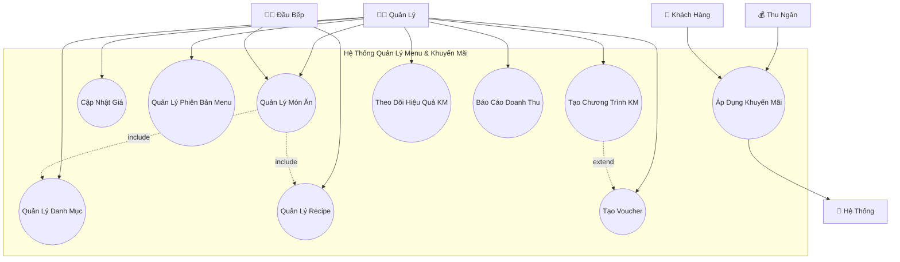
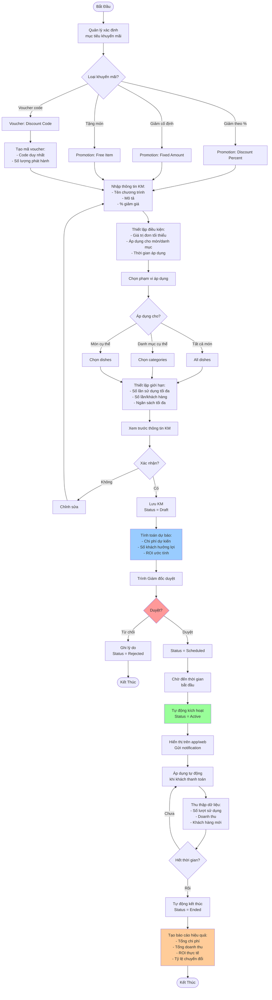
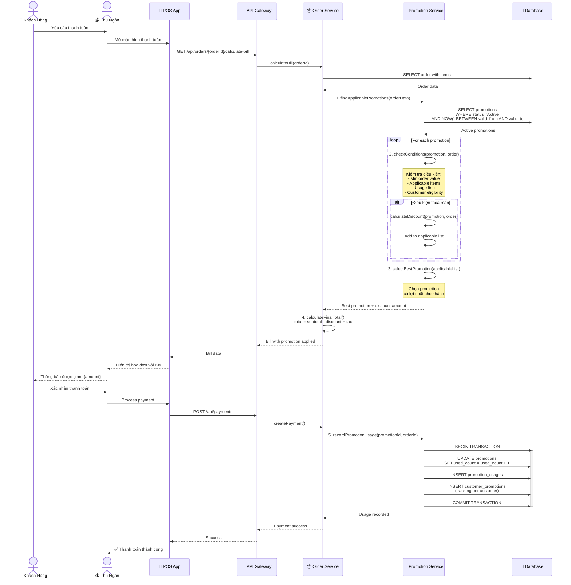
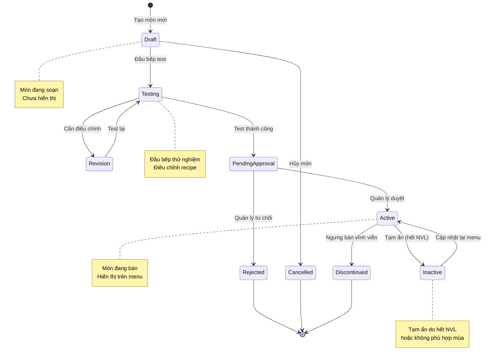
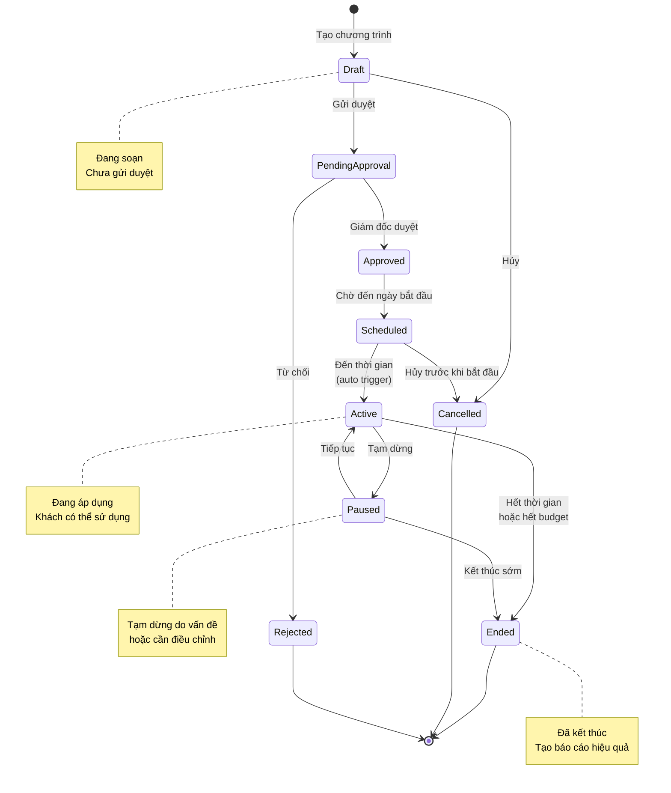
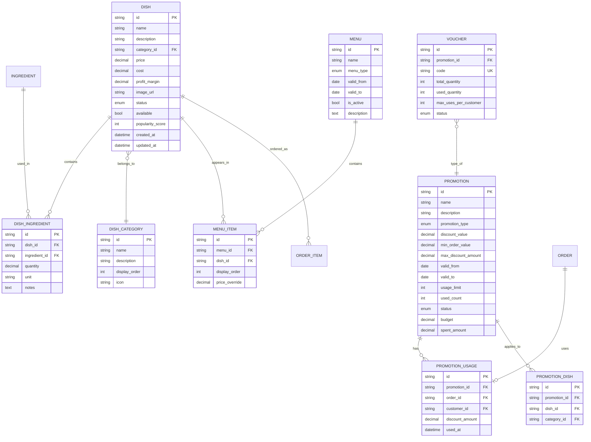

# Sơ Đồ UML - Quản Lý Menu và Khuyến Mãi (Menu & Promotion Management)

## 📋 Tổng Quan Module

Module quản lý menu và khuyến mãi đảm bảo tính linh hoạt cao trong việc quản lý và cập nhật menu, điều chỉnh giá bán và triển khai các chương trình khuyến mãi phù hợp với từng giai đoạn hoạt động của nhà hàng.

### Yêu Cầu Chính
- ✅ Tạo mới, chỉnh sửa, ẩn/hiện món ăn
- ✅ Phân loại món theo danh mục
- ✅ Cập nhật giá bán và định mức nguyên liệu
- ✅ Quản lý phiên bản menu (theo mùa/sự kiện)
- ✅ Xây dựng và triển khai chương trình khuyến mãi/voucher
- ✅ Theo dõi và đánh giá hiệu quả khuyến mãi
- ✅ Báo cáo doanh thu theo món/chương trình KM

---

## 1️⃣ Use Case Diagram - Sơ Đồ Ca Sử Dụng



```
@startuml
left to right direction

actor "Quản lý" as Manager
actor "Đầu bếp" as Chef
actor "Thu ngân" as Cashier
actor "Khách hàng" as Customer
actor "Hệ thống" as System

rectangle "Hệ Thống Quản Lý Menu & Khuyến Mãi" {
    usecase "Quản Lý Món Ăn" as UC1
    usecase "Quản Lý Danh Mục" as UC2
    usecase "Cập Nhật Giá" as UC3
    usecase "Quản Lý Recipe" as UC4
    usecase "Quản Lý Phiên Bản Menu" as UC5
    usecase "Tạo Chương Trình KM" as UC6
    usecase "Tạo Voucher" as UC7
    usecase "Áp Dụng Khuyến Mãi" as UC8
    usecase "Theo Dõi Hiệu Quả KM" as UC9
    usecase "Báo Cáo Doanh Thu" as UC10
}

' --- Quan hệ giữa actor và use case ---
Manager --> UC1
Manager --> UC2
Manager --> UC3
Manager --> UC5
Manager --> UC6
Manager --> UC7
Manager --> UC9
Manager --> UC10

Chef --> UC1
Chef --> UC4

Cashier --> UC8
Customer --> UC8

' --- Quan hệ giữa các use case ---
UC1 .> UC2 : <<include>>
UC1 .> UC4 : <<include>>
UC6 .> UC7 : <<extend>>
UC8 --> System

@enduml

```

### Giải Thích Use Case

| Use Case | Actor | Mô Tả |
|----------|-------|-------|
| **Quản Lý Món Ăn** | Quản lý, Đầu bếp | CRUD món ăn, cập nhật thông tin, ảnh |
| **Quản Lý Danh Mục** | Quản lý | Tạo/sửa danh mục món (Khai vị, Món chính...) |
| **Cập Nhật Giá** | Quản lý | Thay đổi giá bán, lưu lịch sử thay đổi |
| **Quản Lý Recipe** | Đầu bếp | Định nghĩa nguyên liệu và định mức cho món |
| **Quản Lý Phiên Bản Menu** | Quản lý | Tạo menu theo mùa, sự kiện, dịp lễ |
| **Tạo Chương Trình KM** | Quản lý | Thiết lập promotion, điều kiện áp dụng |
| **Tạo Voucher** | Quản lý | Tạo mã giảm giá, giới hạn sử dụng |
| **Áp Dụng Khuyến Mãi** | Thu ngân, Khách hàng | Tự động/thủ công áp dụng promotion/voucher |
| **Theo Dõi Hiệu Quả KM** | Quản lý | Xem số lượt dùng, tỷ lệ chuyển đổi |
| **Báo Cáo Doanh Thu** | Quản lý | Báo cáo theo món, danh mục, KM |

---

## 2️⃣ Activity Diagram - Quy Trình Quản Lý Món Ăn

```mermaid
flowchart TD
    Start([Bắt Đầu]) --> A1{Hành động?}
    
    A1 -->|Tạo món mới| A2[Đầu bếp/Quản lý<br/>khởi tạo món mới]
    A1 -->|Chỉnh sửa món| A3[Chọn món cần sửa]
    A1 -->|Ẩn/hiện món| A4[Chọn món và<br/>toggle visibility]
    
    A2 --> A5[Nhập thông tin cơ bản:<br/>- Tên món<br/>- Mô tả<br/>- Giá bán<br/>- Danh mục]
    A3 --> A5
    
    A5 --> A6[Upload ảnh món ăn]
    A6 --> A7[Định nghĩa Recipe:<br/>Danh sách nguyên liệu<br/>+ Định mức]
    
    A7 --> A8[Nhập từng nguyên liệu]
    
    loop For each ingredient
        A8 --> A9[Chọn nguyên liệu<br/>từ danh sách]
        A9 --> A10[Nhập định mức<br/>quantity + unit]
        A10 --> A11{Thêm NVL khác?}
        A11 -->|Có| A8
    end
    
    A11 -->|Không| A12[Tính giá vốn món:<br/>cost = SUM ingredient_cost]
    A12 --> A13[Kiểm tra tỷ lệ lợi nhuận:<br/>profit_margin = gross_profit / price]
    
    A13 --> A14{Lợi nhuận hợp lý?}
    A14 -->|< 30%| A15[⚠️ Cảnh báo lợi nhuận thấp<br/>Đề xuất tăng giá]
    A15 --> A16{Điều chỉnh giá?}
    A16 -->|Có| A5
    A16 -->|Không| A17[Ghi chú lý do<br/>chấp nhận lợi nhuận thấp]
    
    A14 -->|≥ 30%| A18[Lưu món vào database]
    A17 --> A18
    
    A18 --> A19{Món mới?}
    A19 -->|Có| A20[Status = Draft<br/>Chưa hiển thị trên menu]
    A19 -->|Không| A21[Lưu lịch sử thay đổi]
    
    A20 --> A22[Đầu bếp test món]
    A22 --> A23{Test thành công?}
    A23 -->|Không| A24[Điều chỉnh recipe<br/>hoặc cách chế biến]
    A24 --> A7
    
    A23 -->|Có| A25[Chụp ảnh món thật]
    A25 --> A26[Quản lý duyệt món]
    A26 --> A27{Duyệt?}
    
    A27 -->|Từ chối| A28[Ghi lý do từ chối]
    A28 --> End1([Kết Thúc])
    
    A27 -->|Duyệt| A29[Cập nhật Status = Active]
    A21 --> A29
    
    A29 --> A30[Đồng bộ lên menu<br/>hiển thị cho khách]
    A30 --> A31[Thông báo món mới<br/>đến nhân viên]
    A31 --> A32[Tự động tạo marketing<br/>trên app/website]
    
    A4 --> A33[Toggle available flag]
    A33 --> A34[Cập nhật menu real-time]
    
    A32 --> End2([Kết Thúc])
    A34 --> End2

    style A13 fill:#ffcc99
    style A14 fill:#ff9999
    style A27 fill:#ff9999
    style A29 fill:#99ff99
```

```
@startuml
start

:Chọn hành động: Tạo / Chỉnh sửa / Ẩn/hiện món;

if (Tạo hoặc chỉnh sửa món?) then (Có)
    :Nhập thông tin món và Recipe;
    :Kiểm tra lợi nhuận và lưu vào hệ thống;

    if (Món mới?) then (Có)
        :Đầu bếp test món;
        :Chụp ảnh món thật;
    endif

    :Quản lý duyệt món;
    if (Từ chối?) then (Có)
        :Ghi lý do và kết thúc;
        stop
    endif

    :Cập nhật Status = Active;
    :Đồng bộ lên menu và marketing;
endif

if (Ẩn/hiện món?) then (Có)
    :Cập nhật trạng thái hiển thị;
endif

stop
@enduml

```

---

## 3️⃣ Activity Diagram - Quy Trình Tạo Chương Trình Khuyến Mãi



---

## 4️⃣ Sequence Diagram - Áp Dụng Khuyến Mãi Tự Động




---

## 5️⃣ State Diagram - Vòng Đời Món Ăn (Dish)



---

## 6️⃣ State Diagram - Vòng Đời Chương Trình Khuyến Mãi



---

## 7️⃣ ER Diagram - Mô Hình Dữ Liệu



---

## 8️⃣ Business Rules - Quy Tắc Nghiệp Vụ

### 🍽️ Quy Tắc Món Ăn

#### **Giá Cả**
1. **Giá vốn (Cost)**: Tổng giá trị nguyên liệu
   ```
   cost = SUM(ingredient.unit_price × dish_ingredient.quantity)
   ```

2. **Giá bán (Price)**: Phải > giá vốn
   ```
   price > cost
   ```

3. **Tỷ lệ lợi nhuận (Profit Margin)**:
   ```
   profit_margin = (price - cost) / price × 100%
   Khuyến nghị: ≥ 30%
   ```

4. **Lịch sử giá**: Lưu mọi thay đổi giá với timestamp

#### **Trạng Thái**
| Trạng thái | Hiển thị Menu? | Có thể đặt? |
|------------|----------------|-------------|
| **Draft** | ❌ Không | ❌ Không |
| **Testing** | ❌ Không | ❌ Không |
| **PendingApproval** | ❌ Không | ❌ Không |
| **Active** | ✅ Có | ✅ Có |
| **Inactive** | ⚠️ Xám | ❌ Không |
| **Discontinued** | ❌ Không | ❌ Không |

#### **Recipe (Công Thức)**
- Mỗi món phải có **ít nhất 1 nguyên liệu**
- Định mức phải **chính xác** để trừ kho đúng
- Có thể có **recipe thay thế** cho nguyên liệu hết

### 📋 Quy Tắc Menu

#### **Loại Menu**
| Menu Type | Mô Tả | Ví Dụ |
|-----------|-------|-------|
| **Standard** | Menu thường xuyên | Menu hàng ngày |
| **Seasonal** | Menu theo mùa | Menu hè, đông |
| **Special** | Menu sự kiện | Menu Tết, Giáng Sinh |
| **Lunch** | Menu buổi trưa | Set lunch |
| **Dinner** | Menu buổi tối | Set dinner |

#### **Quản Lý Phiên Bản**
- Có thể có **nhiều menu active** cùng lúc
- Menu có **thời gian hiệu lực** (valid_from, valid_to)
- Món có thể xuất hiện trong **nhiều menu** với giá khác nhau
- Tự động **switch menu** theo thời gian

### 🎁 Quy Tắc Khuyến Mãi

#### **Loại Khuyến Mãi**

##### **1. Discount Percent**
- Giảm theo % giá trị đơn hàng
- Có thể giới hạn **max_discount_amount**
- Ví dụ: Giảm 20%, tối đa 100,000đ

##### **2. Fixed Amount**
- Giảm số tiền cố định
- Ví dụ: Giảm 50,000đ cho đơn từ 200,000đ

##### **3. Free Item**
- Tặng món khi đạt điều kiện
- Ví dụ: Mua 2 tặng 1

##### **4. Voucher Code**
- Nhập mã để được giảm
- Giới hạn số lượng sử dụng
- Có thể giới hạn số lần/khách

#### **Điều Kiện Áp Dụng**
```javascript
function isPromotionApplicable(promotion, order) {
  // 1. Kiểm tra thời gian
  if (NOW() < promotion.valid_from || NOW() > promotion.valid_to) {
    return false;
  }
  
  // 2. Kiểm tra giá trị đơn tối thiểu
  if (order.subtotal < promotion.min_order_value) {
    return false;
  }
  
  // 3. Kiểm tra giới hạn sử dụng
  if (promotion.used_count >= promotion.usage_limit) {
    return false;
  }
  
  // 4. Kiểm tra ngân sách
  if (promotion.spent_amount >= promotion.budget) {
    return false;
  }
  
  // 5. Kiểm tra món áp dụng
  if (promotion.applicable_dishes.length > 0) {
    const hasApplicableDish = order.items.some(item =>
      promotion.applicable_dishes.includes(item.dish_id)
    );
    if (!hasApplicableDish) {
      return false;
    }
  }
  
  return true;
}
```

#### **Ưu Tiên Khuyến Mãi**
Khi có nhiều promotion áp dụng được, chọn theo thứ tự:
1. **Voucher code** (nếu khách nhập)
2. Promotion có **discount_amount cao nhất**
3. Promotion có **priority** cao hơn

#### **Không Cộng Dồn**
- Mỗi order chỉ được áp dụng **1 promotion**
- Trừ trường hợp đặc biệt được cấu hình

---

## 9️⃣ API Endpoints - Danh Sách API

### Dish Management

#### CRUD Món Ăn
```http
# Danh sách món
GET /api/dishes?category=Appetizer&status=Active

# Chi tiết món
GET /api/dishes/{dishId}

# Tạo món mới
POST /api/dishes
Body: {
  "name": "Phở Bò Đặc Biệt",
  "description": "Phở bò với đầy đủ topping",
  "category_id": "CAT-001",
  "price": 85000,
  "image": "base64_string",
  "ingredients": [
    {"ingredient_id": "ING-001", "quantity": 0.3, "unit": "kg"},
    {"ingredient_id": "ING-015", "quantity": 0.5, "unit": "kg"}
  ]
}

# Cập nhật món
PUT /api/dishes/{dishId}

# Ẩn/hiện món
PATCH /api/dishes/{dishId}/toggle-availability
```

#### Cập Nhật Giá
```http
POST /api/dishes/{dishId}/update-price
Body: {
  "new_price": 90000,
  "reason": "Tăng giá nguyên liệu"
}
Response: {
  "old_price": 85000,
  "new_price": 90000,
  "effective_from": "2025-10-22T00:00:00Z"
}
```

### Menu Management

#### Quản Lý Menu
```http
# Danh sách menu
GET /api/menus?type=Standard&active=true

# Tạo menu mới
POST /api/menus
Body: {
  "name": "Menu Hè 2025",
  "menu_type": "Seasonal",
  "valid_from": "2025-06-01",
  "valid_to": "2025-08-31",
  "dish_ids": ["DSH-001", "DSH-002", "DSH-003"]
}

# Kích hoạt menu
POST /api/menus/{menuId}/activate
```

### Promotion Management

#### CRUD Khuyến Mãi
```http
# Tạo promotion
POST /api/promotions
Body: {
  "name": "Giảm 20% Món Khai Vị",
  "promotion_type": "Percent",
  "discount_value": 20,
  "min_order_value": 200000,
  "max_discount_amount": 100000,
  "valid_from": "2025-10-22",
  "valid_to": "2025-10-31",
  "applicable_categories": ["CAT-001"],
  "usage_limit": 1000,
  "budget": 50000000
}

# Danh sách promotion
GET /api/promotions?status=Active

# Duyệt promotion
POST /api/promotions/{id}/approve

# Tạm dừng promotion
POST /api/promotions/{id}/pause
```

#### Voucher
```http
# Tạo voucher
POST /api/vouchers
Body: {
  "promotion_id": "PRM-001",
  "code": "SUMMER2025",
  "total_quantity": 100,
  "max_uses_per_customer": 1
}

# Validate voucher
GET /api/vouchers/validate?code=SUMMER2025&customer_id=CUS-001
Response: {
  "valid": true,
  "discount_amount": 50000,
  "conditions": {
    "min_order_value": 200000
  }
}
```

### Reports

#### Báo Cáo Doanh Thu Theo Món
```http
GET /api/reports/dishes/revenue?from=2025-10-01&to=2025-10-31
Response: {
  "summary": {
    "total_revenue": 150000000,
    "total_orders": 1250,
    "avg_order_value": 120000
  },
  "top_dishes": [
    {
      "dish_id": "DSH-001",
      "dish_name": "Phở Bò",
      "orders_count": 450,
      "revenue": 33750000,
      "profit": 10125000
    }
  ]
}
```

#### Báo Cáo Hiệu Quả Khuyến Mãi
```http
GET /api/reports/promotions/{promotionId}/performance
Response: {
  "promotion_name": "Giảm 20% Món Khai Vị",
  "period": "2025-10-22 to 2025-10-31",
  "usage_count": 350,
  "total_discount": 8500000,
  "revenue_with_promotion": 42500000,
  "new_customers": 75,
  "roi": 150,
  "conversion_rate": 35
}
```

---

## 🔟 Screen Mockups - Giao Diện Tham Khảo

### Màn Hình Quản Lý Món
```
┌─────────────────────────────────────────────────────────┐
│          🍽️ QUẢN LÝ MÓN ĂN                             │
├─────────────────────────────────────────────────────────┤
│ 🔍 [_________]  📁 [Tất cả ▼]  🏷️ [Active ▼]          │
│ [ ➕ Thêm Món Mới ]                                     │
├─────────────────────────────────────────────────────────┤
│                                                           │
│ ┌──────────┬────────────────────────────────────────┐  │
│ │ 🍜       │ PHỞ BÒ                                 │  │
│ │          │ Món chính • 75,000đ                    │  │
│ │  [Ảnh]   │ Giá vốn: 45,000đ • Lãi: 40%           │  │
│ │          │ 🟢 Active • 156 đơn/tháng             │  │
│ │          │ [✏️ Sửa] [👁️ Ẩn] [📊 Thống kê]       │  │
│ └──────────┴────────────────────────────────────────┘  │
│                                                           │
│ ┌──────────┬────────────────────────────────────────┐  │
│ │ 🍲       │ BÚN BÒ HUẾ                             │  │
│ │          │ Món chính • 65,000đ                    │  │
│ │  [Ảnh]   │ Giá vốn: 38,000đ • Lãi: 42%           │  │
│ │          │ 🟡 Inactive • Hết hành                │  │
│ │          │ [✏️ Sửa] [👁️ Hiện] [📊 Thống kê]      │  │
│ └──────────┴────────────────────────────────────────┘  │
└─────────────────────────────────────────────────────────┘
```

### Màn Hình Tạo Khuyến Mãi
```
┌─────────────────────────────────────────────────────────┐
│          🎁 TẠO CHƯƠNG TRÌNH KHUYẾN MÃI                │
├─────────────────────────────────────────────────────────┤
│                                                           │
│ Tên CT: [_______________________________________]        │
│ Loại:   [Giảm theo % ▼]                                 │
│                                                           │
│ 💰 CHIẾT KHẤU                                            │
│ Giảm:        [__20__] %                                  │
│ Giảm tối đa: [_100,000_] đ                              │
│                                                           │
│ 📅 THỜI GIAN                                             │
│ Từ:  [22/10/2025]  [00:00]                              │
│ Đến: [31/10/2025]  [23:59]                              │
│                                                           │
│ 🎯 ĐIỀU KIỆN                                             │
│ Đơn tối thiểu:  [_200,000_] đ                           │
│ Áp dụng cho:    [☑ Món khai vị]                         │
│                 [☐ Món chính]                            │
│                 [☐ Đồ uống]                              │
│                                                           │
│ 🔢 GIỚI HẠN                                              │
│ Số lượt dùng:   [_1,000_]                               │
│ Lượt/khách:     [_1_]                                    │
│ Ngân sách:      [_50,000,000_] đ                        │
│                                                           │
│ [ 💾 LƯU NHÁP ]  [ 📤 GỬI DUYỆT ]  [ ❌ Hủy ]          │
└─────────────────────────────────────────────────────────┘
```

---

## 1️⃣1️⃣ Performance Metrics - Chỉ Số Đánh Giá

### KPIs Món Ăn
- **Popularity Score**: Số lượt đặt/tháng
- **Revenue Contribution**: % đóng góp vào tổng doanh thu
- **Profit Margin**: Tỷ lệ lợi nhuận
- **Customer Rating**: Đánh giá trung bình từ khách
- **Waste Rate**: Tỷ lệ hao hụt nguyên liệu

### KPIs Khuyến Mãi
- **Usage Rate**: Tỷ lệ sử dụng so với phát hành
- **ROI**: Return on Investment
- **Customer Acquisition**: Số khách mới thu hút
- **Average Order Value**: Giá trị đơn trung bình khi dùng KM
- **Conversion Rate**: Tỷ lệ chuyển đổi

---

**[⬅️ Quay lại: Inventory & Supply](./04-INVENTORY-SUPPLY-MANAGEMENT.md)** | **[➡️ Tiếp: System & HR](./06-SYSTEM-HR-MANAGEMENT.md)**
