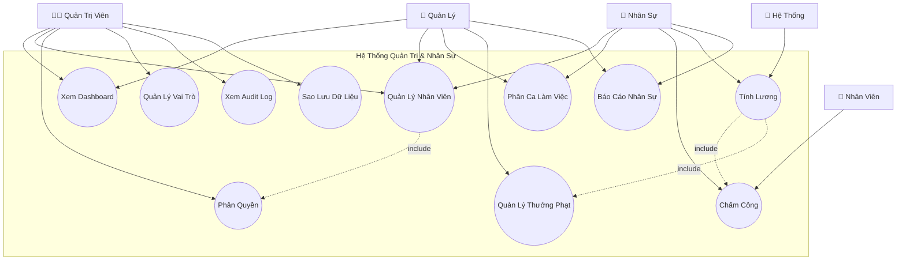
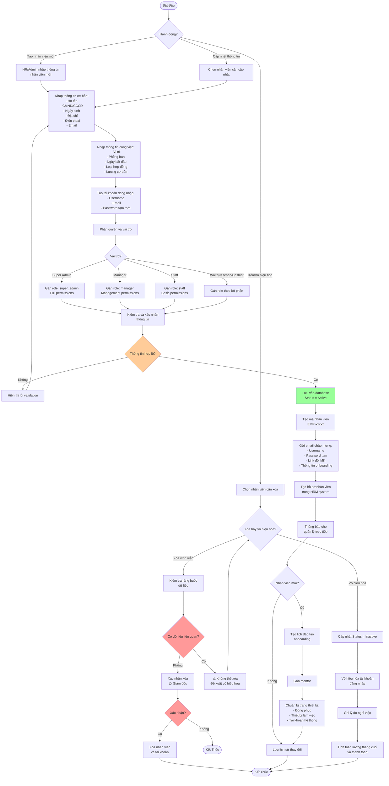
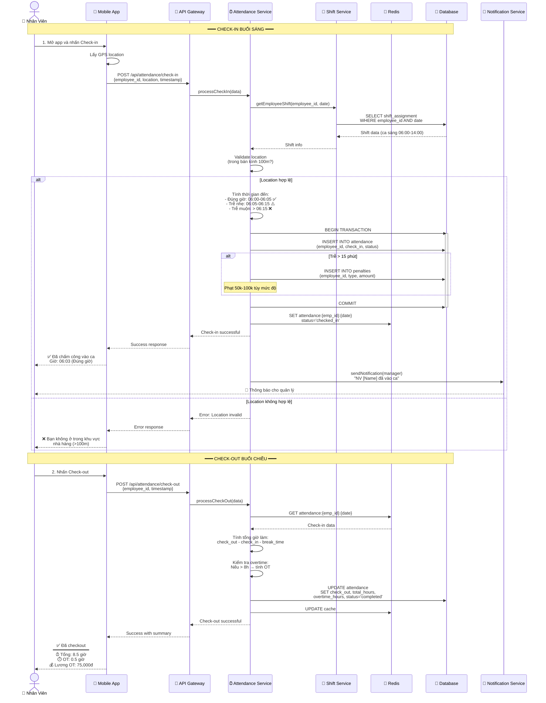
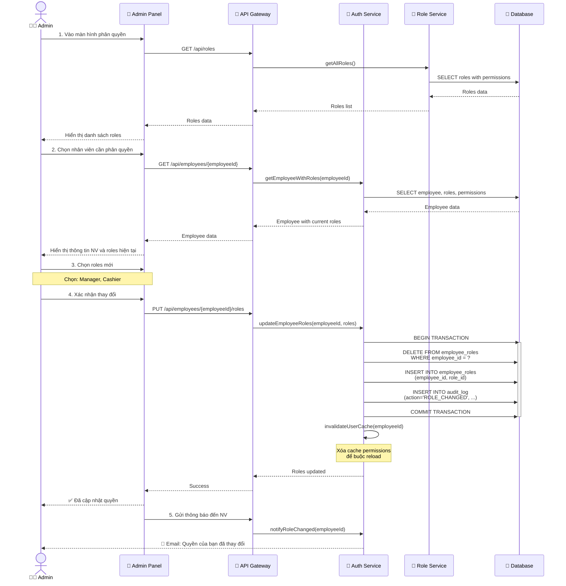
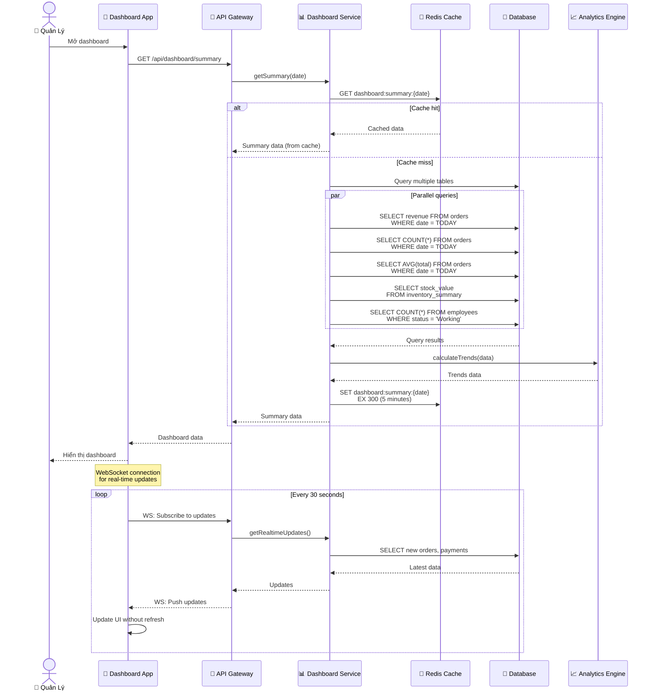
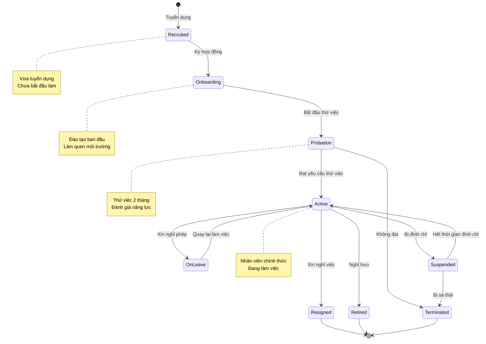
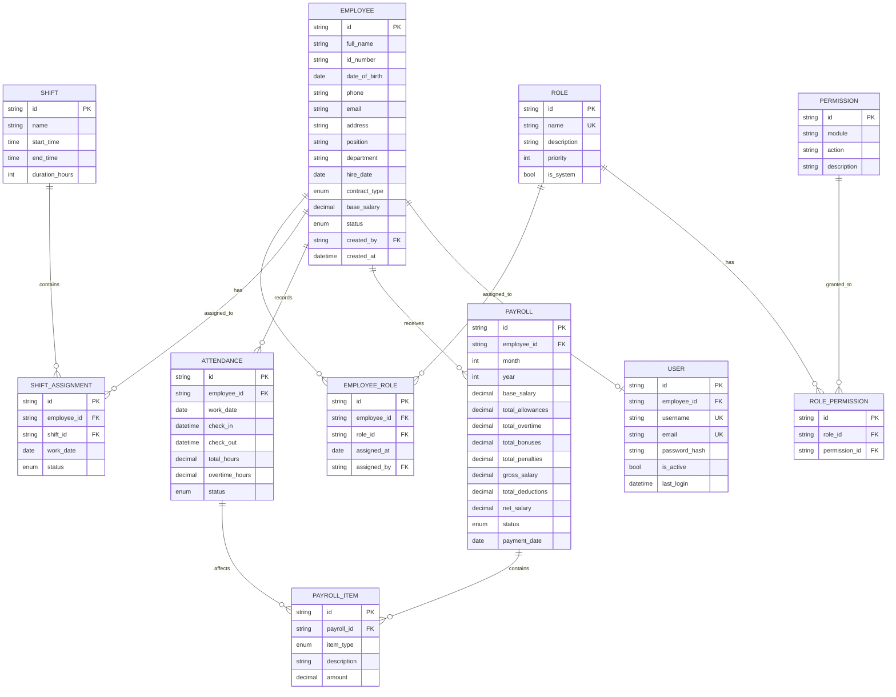

# Sơ Đồ UML - Quản Trị Hệ Thống và Nhân Sự (System & HR Management)

## 📋 Tổng Quan Module

Module quản trị hệ thống và nhân sự cung cấp công cụ quản lý toàn diện cho quản trị viên và cấp quản lý, hỗ trợ giám sát, phân tích và điều hành hoạt động của nhà hàng một cách hiệu quả, minh bạch và có tính hệ thống.

### Yêu Cầu Chính
- ✅ Dashboard tổng quan với các chỉ số hoạt động
- ✅ Quản lý nhân viên (CRUD, phân quyền, vai trò)
- ✅ Phân ca làm việc và chấm công
- ✅ Tính lương tự động (lương, thưởng, phạt, phụ cấp)
- ✅ Báo cáo nhân sự định kỳ
- ✅ Phân quyền truy cập chi tiết (RBAC)
- ✅ Audit log và theo dõi hoạt động

---

## 1️⃣ Use Case Diagram - Sơ Đồ Ca Sử Dụng



### Giải Thích Use Case

| Use Case | Actor | Mô Tả |
|----------|-------|-------|
| **Xem Dashboard** | Admin, Quản lý | Xem tổng quan hoạt động, KPIs, biểu đồ |
| **Quản Lý Nhân Viên** | Admin, Quản lý, HR | CRUD thông tin nhân viên |
| **Phân Quyền** | Admin | Gán quyền truy cập cho từng nhân viên |
| **Phân Ca Làm Việc** | Quản lý, HR | Sắp xếp lịch làm việc cho nhân viên |
| **Chấm Công** | HR, Nhân viên | Ghi nhận giờ vào/ra, nghỉ phép |
| **Tính Lương** | HR, Hệ thống | Tự động tính lương theo công, thưởng, phạt |
| **Quản Lý Thưởng Phạt** | Quản lý | Ghi nhận khen thưởng/kỷ luật |
| **Báo Cáo Nhân Sự** | Quản lý, HR | Báo cáo chấm công, lương, hiệu suất |
| **Quản Lý Vai Trò** | Admin | Tạo/sửa role với permissions |
| **Xem Audit Log** | Admin | Theo dõi mọi thao tác trong hệ thống |
| **Sao Lưu Dữ Liệu** | Admin | Backup/restore database |

---

## 2️⃣ Activity Diagram - Quy Trình Quản Lý Nhân Viên



```
@startuml
start

:Xác định hành động nhân sự;

if (Tạo nhân viên mới?) then (Có)
    :Nhập thông tin cơ bản & công việc;
    :Tạo tài khoản và phân quyền;
    if (Thông tin hợp lệ?) then (Có)
        :Lưu vào hệ thống;
        :Onboarding nhân viên mới;
    else (Không)
        :Hiển thị lỗi và nhập lại;
    endif

elseif (Cập nhật thông tin?) then (Có)
    :Chọn nhân viên và cập nhật;
    :Lưu lịch sử thay đổi;

elseif (Xóa/Vô hiệu hóa?) then (Có)
    if (Xóa vĩnh viễn?) then (Có)
        :Kiểm tra ràng buộc dữ liệu;
        if (Có dữ liệu liên quan?) then (Có)
            :Đề xuất vô hiệu hóa;
        else (Không)
            :Xác nhận và xóa nhân viên;
        endif
    else (Vô hiệu hóa)
        :Cập nhật trạng thái Inactive;
        :Ghi lý do nghỉ việc và thanh toán cuối;
    endif
endif

stop
@enduml

```

---

## 3️⃣ Activity Diagram - Quy Trình Chấm Công và Tính Lương

```mermaid
flowchart TD
    Start([Bắt Đầu Tháng]) --> A1[Nhân viên check-in<br/>hàng ngày]
    A1 --> A2[Hệ thống ghi nhận:<br/>- Thời gian vào<br/>- Thời gian ra<br/>- GPS location]
    
    A2 --> A3{Ca làm việc?}
    A3 -->|Đúng ca| A4[Đánh dấu: Đúng giờ ✅]
    A3 -->|Trễ < 15 phút| A5[Đánh dấu: Trễ ⚠️<br/>Không phạt]
    A3 -->|Trễ > 15 phút| A6[Đánh dấu: Trễ muộn ❌<br/>Phạt theo quy định]
    
    A4 --> A7[Tính giờ công trong ngày]
    A5 --> A7
    A6 --> A7
    
    A7 --> A8{Làm thêm giờ?}
    A8 -->|Có| A9[Tính overtime:<br/>- Giờ thường: 150%<br/>- Cuối tuần: 200%<br/>- Lễ: 300%]
    A8 -->|Không| A10[Ghi nhận công chuẩn]
    
    A9 --> A11[Lưu vào bảng timesheet]
    A10 --> A11
    
    A11 --> A12{Hết tháng?}
    A12 -->|Chưa| A1
    
    A12 -->|Rồi| A13[HR khóa bảng chấm công<br/>của tháng]
    A13 --> A14[Tổng hợp:<br/>- Tổng ngày công<br/>- Tổng giờ OT<br/>- Số ngày nghỉ<br/>- Số lần đi muộn]
    
    A14 --> A15[Hệ thống tự động tính lương]
    A15 --> A16[Lương cơ bản<br/>= base_salary × (working_days / standard_days)]
    
    A16 --> A17[Phụ cấp<br/>= allowances]
    A17 --> A18[Lương OT<br/>= hourly_rate × OT_hours × rate]
    
    A18 --> A19[Thưởng<br/>= bonuses trong tháng]
    A19 --> A20[Phạt<br/>= penalties trong tháng]
    
    A20 --> A21[Tổng lương<br/>= base + allowances + OT + bonuses - penalties]
    A21 --> A22[Khấu trừ:<br/>- BHXH (8%)<br/>- BHYT (1.5%)<br/>- BHTN (1%)<br/>- Thuế TNCN]
    
    A22 --> A23[Lương thực nhận<br/>= total - deductions]
    
    A23 --> A24[Tạo payslip<br/>cho từng nhân viên]
    A24 --> A25[Gửi email payslip]
    A25 --> A26[Quản lý duyệt<br/>bảng lương]
    
    A26 --> A27{Duyệt?}
    A27 -->|Không| A28[Ghi chú lý do<br/>Yêu cầu chỉnh sửa]
    A28 --> A15
    
    A27 -->|Có| A29[Chuyển khoản lương<br/>vào ngày 5 tháng sau]
    A29 --> A30[Cập nhật trạng thái<br/>Payroll = Paid]
    
    A30 --> A31[Lưu báo cáo lương]
    A31 --> A32[Gửi cho kế toán]
    A32 --> End([Kết Thúc])

    style A27 fill:#ff9999
    style A23 fill:#99ff99
    style A29 fill:#99ccff
```

---

## 4️⃣ Sequence Diagram - Quy Trình Chấm Công Hàng Ngày



```
@startuml
actor Employee as E
participant App as "Website"
participant API as "API Gateway"
participant AttendanceSvc as "Attendance Service"
participant ShiftSvc as "Shift Service"
participant DB as "Database"

== Check-in ==
E -> App: Mở app và nhấn Check-in
App -> App: Lấy location
App -> API: Gửi check-in (employee_id, location, timestamp)
API -> AttendanceSvc: Xử lý check-in
AttendanceSvc -> ShiftSvc: Lấy ca làm việc của nhân viên
ShiftSvc -> DB: Truy vấn ca
DB --> ShiftSvc: Ca làm việc
ShiftSvc --> AttendanceSvc: Trả ca
AttendanceSvc -> AttendanceSvc: Validate location & check-in time
alt Location hợp lệ
    AttendanceSvc -> DB: Ghi nhận check-in
    AttendanceSvc --> API: Check-in thành công
    API --> App: Phản hồi thành công
    App --> E: Hiển thị thông báo 
else Location không hợp lệ
    AttendanceSvc --> API: Lỗi location
    API --> App: Phản hồi lỗi
    App --> E: Hiển thị cảnh báo
end

== Check-out ==
E -> App: Nhấn Check-out
App -> API: Gửi check-out
API -> AttendanceSvc: Xử lý check-out
AttendanceSvc -> AttendanceSvc: Tính tổng giờ làm & OT
AttendanceSvc -> DB: Cập nhật check-out & giờ làm
AttendanceSvc --> API: Check-out thành công
API --> App: Phản hồi thành công
App --> E: Hiển thị tổng giờ & OT
@enduml

```

---

## 5️⃣ Sequence Diagram - Quy Trình Tính Lương Cuối Tháng

```mermaid
sequenceDiagram
    actor HR as 👥 HR Manager
    participant App as 📱 HR Portal
    participant API as 🔧 API Gateway
    participant PaySvc as 💰 Payroll Service
    participant AttSvc as ⏰ Attendance Service
    participant BonusSvc as 🎁 Bonus Service
    participant DB as 💾 Database
    participant Mail as 📧 Email Service
    participant Bank as 🏦 Banking API

    Note over HR,Bank: ━━━ NGÀY 1: KHÓA CHẤM CÔNG ━━━
    
    HR->>App: 1. Khóa bảng chấm công tháng 10
    App->>API: POST /api/attendance/lock<br/>{month: 10, year: 2025}
    API->>AttSvc: lockAttendance(month, year)
    
    AttSvc->>DB: UPDATE attendance<br/>SET locked=true<br/>WHERE month=10 AND year=2025
    
    AttSvc->>DB: INSERT INTO audit_log<br/>(action='ATTENDANCE_LOCKED')
    
    AttSvc-->>API: Locked successfully
    API-->>App: Success
    App-->>HR: ✅ Đã khóa chấm công tháng 10<br/>Không thể chỉnh sửa

    Note over HR,Bank: ━━━ NGÀY 2-3: TÍNH LƯƠNG TỰ ĐỘNG ━━━
    
    HR->>App: 2. Chạy tính lương tự động
    App->>API: POST /api/payroll/calculate<br/>{month: 10, year: 2025}
    API->>PaySvc: calculatePayrollForMonth(10, 2025)
    
    PaySvc->>DB: SELECT employees<br/>WHERE status IN ('Active','OnLeave')
    DB-->>PaySvc: List of employees (45 người)
    
    loop Từng nhân viên
        PaySvc->>AttSvc: getMonthlyAttendance(emp_id, 10, 2025)
        AttSvc->>DB: SELECT attendance summary
        DB-->>AttSvc: Attendance data
        AttSvc-->>PaySvc: {<br/>  working_days: 24,<br/>  total_hours: 192,<br/>  overtime_hours: 12,<br/>  late_count: 2<br/>}
        
        PaySvc->>BonusSvc: getBonusAndPenalties(emp_id, 10, 2025)
        BonusSvc->>DB: SELECT bonuses, penalties
        DB-->>BonusSvc: Bonus/Penalty data
        BonusSvc-->>PaySvc: {<br/>  bonuses: 1,000,000đ,<br/>  penalties: -100,000đ<br/>}
        
        Note over PaySvc: ━━━ TÍNH TOÁN LƯƠNG ━━━
        
        PaySvc->>PaySvc: 1. Base Salary<br/>= 8,000,000 × (24/26)<br/>= 7,384,615đ
        
        PaySvc->>PaySvc: 2. Allowances<br/>= Meal: 30k × 24 = 720k<br/>+ Gas: 500k<br/>= 1,220,000đ
        
        PaySvc->>PaySvc: 3. Overtime Pay<br/>= (8M/160) × 12h × 1.5<br/>= 900,000đ
        
        PaySvc->>PaySvc: 4. Gross Salary<br/>= 7,384,615 + 1,220,000<br/>+ 900,000 + 1,000,000<br/>- 100,000<br/>= 10,404,615đ
        
        PaySvc->>PaySvc: 5. Deductions<br/>• BHXH (8%): 832,369đ<br/>• BHYT (1.5%): 156,069đ<br/>• BHTN (1%): 104,046đ<br/>• TNCN: 500,000đ<br/>Total: 1,592,484đ
        
        PaySvc->>PaySvc: 6. Net Salary<br/>= 10,404,615 - 1,592,484<br/>= 8,812,131đ
        
        PaySvc->>DB: BEGIN TRANSACTION
        activate DB
        
        PaySvc->>DB: INSERT INTO payroll<br/>(employee_id, month, year,<br/>base, allowances, overtime,<br/>bonuses, penalties,<br/>gross, deductions, net,<br/>status='pending_approval')
        
        PaySvc->>DB: INSERT INTO payroll_items<br/>(type, description, amount)
        Note over PaySvc,DB: Chi tiết từng khoản:<br/>Base, Meal, Gas, OT,<br/>Bonus, Penalty, BHXH...
        
        PaySvc->>DB: COMMIT
        deactivate DB
        
        PaySvc->>Mail: generatePayslip(emp_id)
        Mail->>Mail: Create PDF payslip
        Mail-->>PaySvc: Payslip PDF
    end
    
    PaySvc-->>API: Payroll calculated for 45 employees
    API-->>App: Calculation complete
    App-->>HR: ✅ Đã tính lương 45 nhân viên<br/>Tổng chi: 396,546,000đ

    Note over HR,Bank: ━━━ NGÀY 4: DUYỆT LƯƠNG ━━━
    
    HR->>App: 3. Xem và kiểm tra bảng lương
    App->>API: GET /api/payroll?month=10&year=2025
    API->>PaySvc: getPayrollList(10, 2025)
    PaySvc->>DB: SELECT payroll with details
    DB-->>PaySvc: Payroll data
    PaySvc-->>API: Payroll list
    API-->>App: Display payroll
    App-->>HR: Hiển thị bảng lương chi tiết
    
    HR->>App: 4. Duyệt bảng lương
    App->>API: POST /api/payroll/batch-approve<br/>{payroll_ids: [...]}
    API->>PaySvc: approvePayroll(payroll_ids)
    
    PaySvc->>DB: UPDATE payroll<br/>SET status='approved',<br/>approved_by='HR-001',<br/>approved_at=NOW()
    
    PaySvc-->>API: Approved
    API-->>App: Success
    App-->>HR: ✅ Đã duyệt lương
    
    par Gửi payslip cho nhân viên
        PaySvc->>Mail: sendPayslipToAllEmployees()
        loop 45 nhân viên
            Mail->>Mail: Attach PDF payslip
            Mail-->>E: 📧 [Payslip Tháng 10/2025]<br/>Kính gửi anh/chị...<br/>Lương tháng 10: 8,812,131đ
        end
    end

    Note over HR,Bank: ━━━ NGÀY 5: CHUYỂN LƯƠNG ━━━
    
    HR->>App: 5. Chuyển lương qua ngân hàng
    App->>API: POST /api/payroll/transfer<br/>{month: 10, year: 2025}
    API->>PaySvc: initiatePayment(10, 2025)
    
    PaySvc->>DB: SELECT payroll<br/>WHERE status='approved'
    DB-->>PaySvc: Payroll data with bank info
    
    PaySvc->>Bank: POST /banking/batch-transfer
    Note over PaySvc,Bank: Gửi file batch transfer<br/>với 45 giao dịch
    
    Bank-->>PaySvc: Transfer initiated<br/>Transaction ID: TXN-12345
    
    PaySvc->>DB: UPDATE payroll<br/>SET status='paid',<br/>payment_date=NOW(),<br/>transaction_id='TXN-12345'
    
    PaySvc-->>API: Payment successful
    API-->>App: Success
    App-->>HR: ✅ Đã chuyển lương thành công<br/>━━━━━━━━━━━━━<br/>Số giao dịch: 45<br/>Tổng tiền: 396,546,000đ<br/>Mã GD: TXN-12345
    
    Bank->>Mail: sendBankNotification()
    Mail-->>E: 📧 [Ngân hàng] Bạn nhận được<br/>chuyển khoản 8,812,131đ<br/>từ [Nhà Hàng ABC]
```



---

## 6️⃣ Sequence Diagram - Phân Quyền RBAC



---

## 5️⃣ Sequence Diagram - Xem Dashboard Real-time



---

## 6️⃣ State Diagram - Vòng Đời Nhân Viên



---

## 7️⃣ ER Diagram - Mô Hình Dữ Liệu



---

## 8️⃣ Business Rules - Quy Tắc Nghiệp Vụ

### 👥 Quy Tắc Nhân Viên

#### **Mã Nhân Viên**
- Format: `EMP-xxxxx` (5 chữ số)
- Tự động tạo khi thêm NV mới
- Không thay đổi, duy nhất

#### **Trạng Thái**
| Status | Mô Tả | Có thể đăng nhập? |
|--------|-------|-------------------|
| **Recruited** | Vừa tuyển | ❌ Không |
| **Onboarding** | Đào tạo | ✅ Có (hạn chế) |
| **Probation** | Thử việc | ✅ Có |
| **Active** | Chính thức | ✅ Có |
| **OnLeave** | Nghỉ phép | ⚠️ Hạn chế |
| **Suspended** | Đình chỉ | ❌ Không |
| **Resigned** | Đã nghỉ | ❌ Không |
| **Terminated** | Bị sa thải | ❌ Không |

### 🔐 Quy Tắc Phân Quyền (RBAC)

#### **Cấu Trúc**
```
User → Roles → Permissions → Resources
```

#### **7 Roles Chính**
| Role | Priority | Mô Tả |
|------|----------|-------|
| **super_admin** | 1 | Toàn quyền hệ thống |
| **admin** | 2 | Quản trị hệ thống |
| **manager** | 3 | Quản lý nhà hàng |
| **staff** | 4 | Nhân viên văn phòng |
| **cashier** | 5 | Thu ngân |
| **kitchen** | 6 | Bếp |
| **waiter** | 7 | Phục vụ |

#### **Permission Format**
```
{module}:{action}
```
Ví dụ:
- `users:view` - Xem danh sách user
- `orders:create` - Tạo order
- `invoices:delete` - Xóa hóa đơn

#### **Kiểm Tra Quyền**
```javascript
function hasPermission(user, permission) {
  // 1. Lấy tất cả roles của user
  const userRoles = getUserRoles(user.id);
  
  // 2. Lấy tất cả permissions của các roles
  const permissions = [];
  for (const role of userRoles) {
    permissions.push(...getRolePermissions(role.id));
  }
  
  // 3. Kiểm tra permission có trong danh sách không
  return permissions.includes(permission);
}
```

### ⏰ Quy Tắc Chấm Công

#### **Ca Làm Việc**
| Ca | Giờ | Thời gian nghỉ |
|----|-----|----------------|
| **Sáng** | 06:00 - 14:00 | 11:00-11:30 |
| **Chiều** | 14:00 - 22:00 | 17:00-17:30 |
| **Tối** | 22:00 - 06:00 | 01:00-01:30 |

#### **Quy Định Đi Muộn**
- **< 5 phút**: Không phạt
- **5-15 phút**: Cảnh cáo, không phạt tiền
- **15-30 phút**: Phạt 50,000đ
- **> 30 phút**: Phạt 100,000đ + cảnh cáo
- **> 3 lần/tháng**: Đình chỉ 1 ngày

#### **Tính Overtime**
```
overtime_rate = {
  weekday: 1.5,      // 150% lương
  weekend: 2.0,      // 200% lương
  holiday: 3.0       // 300% lương
}

overtime_pay = (base_salary / 160) × overtime_hours × rate
```
- 160 = số giờ chuẩn/tháng (8h × 20 ngày)

### 💰 Quy Tắc Tính Lương

#### **Công Thức**
```
gross_salary = base_salary + allowances + overtime_pay + bonuses - penalties

deductions = {
  BHXH: gross_salary × 0.08,    // 8%
  BHYT: gross_salary × 0.015,   // 1.5%
  BHTN: gross_salary × 0.01,    // 1%
  TNCN: calculateTax(gross_salary)
}

net_salary = gross_salary - SUM(deductions)
```

#### **Phụ Cấp**
| Loại | Số Tiền | Điều Kiện |
|------|---------|-----------|
| **Ăn ca** | 30,000đ/ngày | Làm full ca |
| **Xăng xe** | 500,000đ/tháng | Có xe đi làm |
| **Điện thoại** | 200,000đ/tháng | Quản lý trở lên |
| **Trách nhiệm** | 1,000,000đ/tháng | Manager |

#### **Thưởng**
- **Tháng 13**: 1 tháng lương (cuối năm)
- **KPI**: 10-30% lương (theo performance)
- **Lễ Tết**: 500,000đ - 2,000,000đ

#### **Phạt**
- Đi muộn: 50,000đ - 100,000đ
- Nghỉ không phép: 200,000đ/ngày
- Vi phạm quy định: 500,000đ - 2,000,000đ

---

## 9️⃣ API Endpoints - Danh Sách API

### Employee Management

#### CRUD Nhân Viên
```http
# Danh sách nhân viên
GET /api/employees?status=Active&department=Kitchen

# Chi tiết nhân viên
GET /api/employees/{employeeId}

# Tạo nhân viên mới
POST /api/employees
Body: {
  "full_name": "Nguyễn Văn A",
  "id_number": "001234567890",
  "date_of_birth": "1990-01-01",
  "phone": "0901234567",
  "email": "nva@restaurant.com",
  "position": "Waiter",
  "department": "Service",
  "base_salary": 8000000,
  "hire_date": "2025-10-22"
}

# Cập nhật nhân viên
PUT /api/employees/{employeeId}

# Vô hiệu hóa nhân viên
POST /api/employees/{employeeId}/deactivate
Body: {
  "reason": "Resigned",
  "last_working_date": "2025-10-31"
}
```

### Role & Permission Management

#### Phân Quyền
```http
# Danh sách roles
GET /api/roles

# Chi tiết role với permissions
GET /api/roles/{roleId}

# Gán roles cho nhân viên
PUT /api/employees/{employeeId}/roles
Body: {
  "role_ids": ["ROLE-001", "ROLE-002"]
}

# Kiểm tra quyền
POST /api/auth/check-permission
Body: {
  "user_id": "USR-001",
  "permission": "orders:create"
}
Response: {
  "has_permission": true
}
```

### Attendance Management

#### Chấm Công
```http
# Check-in
POST /api/attendance/check-in
Body: {
  "employee_id": "EMP-001",
  "location": {
    "lat": 10.762622,
    "lng": 106.660172
  }
}

# Check-out
POST /api/attendance/check-out
Body: {
  "employee_id": "EMP-001"
}

# Bảng chấm công tháng
GET /api/attendance?employee_id=EMP-001&month=10&year=2025
Response: {
  "employee_id": "EMP-001",
  "month": 10,
  "year": 2025,
  "total_working_days": 24,
  "total_hours": 192,
  "overtime_hours": 12,
  "late_count": 2,
  "absent_count": 0,
  "records": [...]
}
```

### Payroll Management

#### Tính Lương
```http
# Tạo bảng lương tháng
POST /api/payroll/calculate
Body: {
  "month": 10,
  "year": 2025,
  "employee_ids": ["EMP-001", "EMP-002"]
}

# Xem payslip
GET /api/payroll/{payrollId}
Response: {
  "payroll_id": "PAY-001",
  "employee_name": "Nguyễn Văn A",
  "month": "10/2025",
  "base_salary": 8000000,
  "allowances": 600000,
  "overtime": 450000,
  "bonuses": 1000000,
  "penalties": -100000,
  "gross_salary": 9950000,
  "deductions": {
    "BHXH": 796000,
    "BHYT": 149250,
    "BHTN": 99500,
    "TNCN": 500000
  },
  "net_salary": 8405250
}

# Duyệt bảng lương
POST /api/payroll/{payrollId}/approve
```

### Dashboard

#### Dashboard Tổng Quan
```http
GET /api/dashboard/summary?date=2025-10-21
Response: {
  "revenue": {
    "today": 15000000,
    "yesterday": 12000000,
    "change_percent": 25
  },
  "orders": {
    "today": 125,
    "yesterday": 98,
    "change_percent": 27.55
  },
  "customers": {
    "today": 280,
    "yesterday": 245
  },
  "inventory_value": 25000000,
  "staff_working": 18,
  "tables_occupied": 12
}
```

---

## 🔟 Screen Mockups - Giao Diện Tham Khảo

### Dashboard Tổng Quan
```
┌─────────────────────────────────────────────────────────┐
│          📊 DASHBOARD - Tổng Quan Hệ Thống             │
├─────────────────────────────────────────────────────────┤
│ 📅 Ngày: 21/10/2025                    👤 Admin: Hùng  │
├─────────────────────────────────────────────────────────┤
│                                                           │
│ 💰 DOANH THU HÔM NAY         📦 ĐƠN HÀNG               │
│ ┌──────────────────┐         ┌──────────────────┐      │
│ │   15,000,000đ    │         │       125        │      │
│ │   ▲ +25% so hôm qua│         │   ▲ +27.55%      │      │
│ └──────────────────┘         └──────────────────┘      │
│                                                           │
│ 👥 KHÁCH HÀNG                📊 TỒN KHO                │
│ ┌──────────────────┐         ┌──────────────────┐      │
│ │       280        │         │  25,000,000đ     │      │
│ │   ▲ +14.29%      │         │   🟢 Ổn định     │      │
│ └──────────────────┘         └──────────────────┘      │
│                                                           │
│ ━━━━━━━━━━━━━━━━━━━━━━━━━━━━━━━━━━━━━━━━━━━━━━━━      │
│                                                           │
│ 📈 BIỂU ĐỒ DOANH THU 7 NGÀY QUA                        │
│ ┌─────────────────────────────────────────────────┐    │
│ │ 15M │         ╱╲                            ▲   │    │
│ │ 12M │      ╱╲╱  ╲      ╱╲                  ╱│   │    │
│ │  9M │    ╱╲      ╲╱╲╱╲╱  ╲              ╱╲╱ │   │    │
│ │  6M │  ╱╲                  ╲╱╲        ╱╲    │   │    │
│ │  3M │╱╲                        ╲╱╲╱╲╱      │   │    │
│ │     └────────────────────────────────────────│   │    │
│ │      15  16  17  18  19  20  21            │   │    │
│ └─────────────────────────────────────────────────┘    │
│                                                           │
│ 🔥 TOP 5 MÓN BÁN CHẠY       ⚠️ CẢNH BÁO                │
│ 1. Phở Bò (45 đơn)          • 8 NVL sắp hết             │
│ 2. Bún Bò (32 đơn)          • 2 thiết bị cần bảo trì   │
│ 3. Cơm Tấm (28 đơn)         • 3 NV cần đào tạo         │
│                                                           │
└─────────────────────────────────────────────────────────┘
```

### Màn Hình Quản Lý Nhân Viên
```
┌─────────────────────────────────────────────────────────┐
│          👥 QUẢN LÝ NHÂN VIÊN                           │
├─────────────────────────────────────────────────────────┤
│ 🔍 [_________]  📁 [Tất cả ▼]  🏢 [Bộ phận ▼]         │
│ [ ➕ Thêm Nhân Viên ]  [ 📊 Báo Cáo ]                  │
├─────────────────────────────────────────────────────────┤
│                                                           │
│ Mã      │ Họ Tên       │ Vị trí  │ Ca    │ Trạng thái  │
│─────────┼──────────────┼─────────┼───────┼─────────────│
│ EMP-001 │ Nguyễn Văn A │ Waiter  │ Sáng  │ 🟢 Active   │
│ EMP-002 │ Trần Thị B   │ Cashier │ Chiều │ 🟢 Active   │
│ EMP-003 │ Lê Văn C     │ Chef    │ Chiều │ 🟡 OnLeave  │
│ EMP-004 │ Phạm Thị D   │ Manager │ Full  │ 🟢 Active   │
│                                                           │
│ [ 👁️ Xem ] [ ✏️ Sửa ] [ 🔐 Phân Quyền ] [ ⏰ Chấm Công ]│
└─────────────────────────────────────────────────────────┘
```

---

## 1️⃣1️⃣ Security Best Practices - Thực Hành Bảo Mật

### 🔐 Authentication & Authorization
1. **JWT Token**: Access token 60 phút, Refresh token 30 ngày
2. **Password Policy**: 
   - Tối thiểu 8 ký tự
   - Bao gồm chữ hoa, chữ thường, số, ký tự đặc biệt
   - Hash bằng bcrypt (cost factor 12)
3. **MFA**: Bắt buộc cho Admin và Manager
4. **Session Management**: Logout tự động sau 30 phút không hoạt động

### 📝 Audit Log
Ghi lại mọi thao tác quan trọng:
- User login/logout
- Thay đổi quyền
- Tạo/sửa/xóa dữ liệu quan trọng
- Thanh toán, nhập/xuất kho

Format:
```json
{
  "timestamp": "2025-10-21T12:00:00Z",
  "user_id": "USR-001",
  "action": "UPDATE",
  "resource": "employees",
  "resource_id": "EMP-001",
  "changes": {
    "base_salary": {"old": 8000000, "new": 9000000}
  },
  "ip_address": "192.168.1.100",
  "user_agent": "Mozilla/5.0..."
}
```

---

**[⬅️ Quay lại: Menu & Promotion](./05-MENU-PROMOTION-MANAGEMENT.md)** | **[🏠 Về Index](./00-INDEX.md)**
