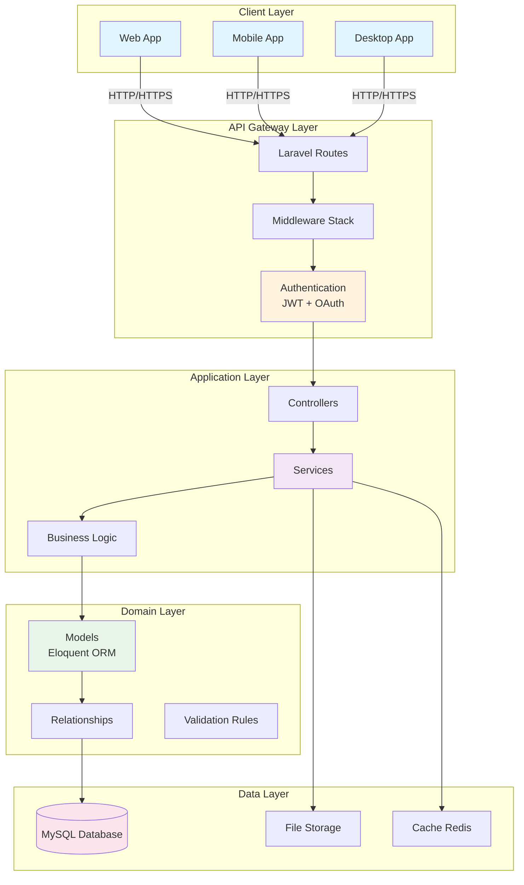
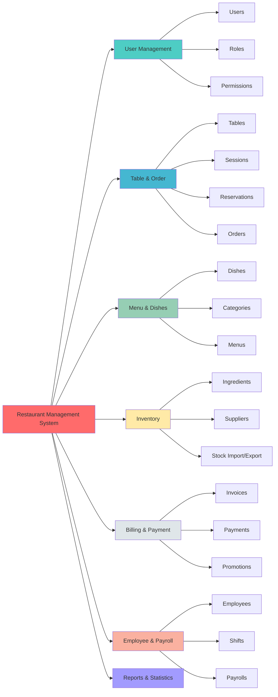
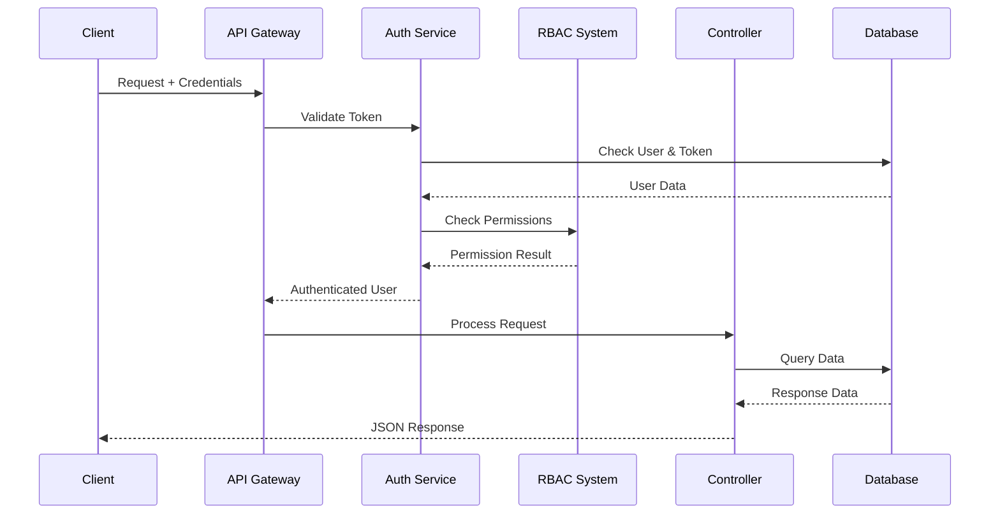
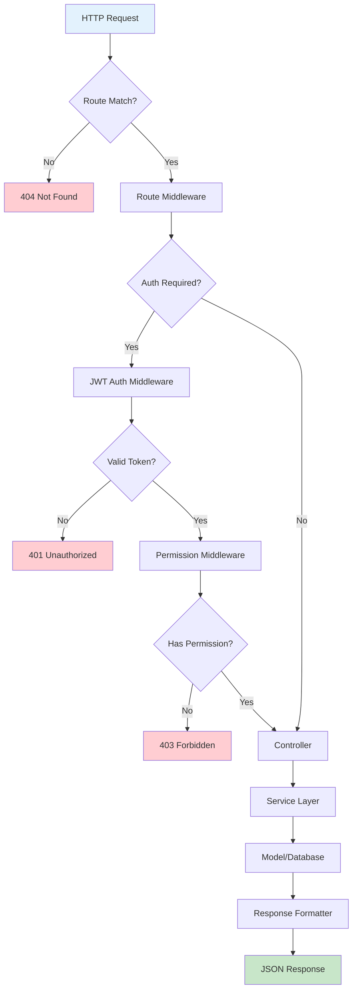

# 01 - Tổng Quan Hệ Thống

> **Version:** 1.0.0 | **Last Updated:** October 21, 2025

## 📖 Giới Thiệu

Hệ thống **Restaurant Management System** là một ứng dụng Backend RESTful API được xây dựng bằng Laravel 12, cung cấp đầy đủ chức năng quản lý nhà hàng từ đặt bàn, order, menu, kho, thanh toán đến quản lý nhân sự.

## 🎯 Mục Tiêu Hệ Thống

- ✅ **Quản lý toàn diện**: Tất cả nghiệp vụ nhà hàng trong một hệ thống
- ✅ **Bảo mật cao**: JWT Authentication + RBAC authorization
- ✅ **Scalable**: Kiến trúc modular, dễ mở rộng
- ✅ **RESTful API**: Chuẩn REST, hỗ trợ đa nền tảng (Web, Mobile, Desktop)
- ✅ **Real-time**: Hỗ trợ cập nhật trạng thái real-time

## 🏗 Kiến Trúc Tổng Thể



## 💻 Tech Stack

### Backend Framework
- **Laravel 12** - PHP Framework
- **PHP 8.2+** - Programming Language

### Database & Storage
- **MySQL 8.0+** - Primary Database
- **Redis** - Cache & Session (Optional)
- **File System** - Image & Document Storage

### Authentication & Security
- **JWT (tymon/jwt-auth)** - Stateless Authentication
- **Laravel Socialite** - OAuth (Google Login)
- **RBAC** - Role-Based Access Control

### API Documentation
- **Swagger/OpenAPI** - Auto-generated API docs
- **L5-Swagger** - Swagger integration

### Development Tools
- **Composer** - Dependency Management
- **Laravel Pint** - Code Style Fixer
- **PHPUnit** - Testing Framework

## 📦 Core Modules



## 🔐 Security Architecture



### Security Layers

1. **Network Layer**
   - HTTPS/TLS encryption
   - CORS configuration
   - Rate limiting

2. **Authentication Layer**
   - JWT Access Tokens (60 min)
   - Refresh Tokens (30 days)
   - Device fingerprinting
   - Session management

3. **Authorization Layer**
   - Role-Based Access Control (RBAC)
   - 16 permission modules
   - 7 predefined roles
   - Dynamic permission checking

4. **Application Layer**
   - Input validation
   - XSS protection
   - SQL injection prevention
   - CSRF protection

## 🎨 Design Patterns

### 1. **MVC Pattern** (Model-View-Controller)
- **Models**: Eloquent ORM entities
- **Views**: JSON API responses
- **Controllers**: HTTP request handlers

### 2. **Service Layer Pattern**
- Tách business logic ra khỏi controllers
- Reusable services
- Easy testing

### 3. **Repository Pattern** (Implicit via Eloquent)
- Data access abstraction
- Query builder
- Relationship management

### 4. **Middleware Pattern**
- Request/Response filtering
- Authentication checks
- Permission validation

### 5. **Observer Pattern** (Laravel Events)
- Model events (creating, updating, etc.)
- Audit trail logging
- Custom ID generation

## 📊 System Flow

### Request Lifecycle



## 🔄 Data Flow Patterns

### 1. **Write Operations**
```
Client → Controller → Validation → Service → Model → Database
```

### 2. **Read Operations**
```
Client → Controller → Service → Model → Query Builder → Database → JSON
```

### 3. **File Upload**
```
Client → Controller → File Validation → Storage → Database (path)
```

## 📈 Scalability Considerations

### Horizontal Scaling
- **Stateless API**: No server-side sessions
- **Load Balancer Ready**: Multiple app instances
- **Database Replication**: Master-Slave setup

### Performance Optimization
- **Query Optimization**: Eager loading relationships
- **Caching**: Redis for frequently accessed data
- **API Response Caching**: HTTP cache headers
- **Database Indexing**: Primary keys, foreign keys, search fields

### Future Enhancements
- 🔮 **Queue System**: Laravel Queue for async tasks
- 🔮 **Microservices**: Split modules into services
- 🔮 **GraphQL**: Alternative API approach
- 🔮 **WebSocket**: Real-time updates
- 🔮 **Docker**: Containerization

## 🌐 API Principles

### RESTful Standards
- **Resource-Based URLs**: `/api/users`, `/api/dishes`
- **HTTP Methods**: GET, POST, PUT, DELETE
- **Status Codes**: 200, 201, 400, 401, 403, 404, 500
- **JSON Format**: Consistent response structure

### Response Format
```json
{
  "success": true,
  "message": "Operation successful",
  "data": {
    // Response data here
  },
  "meta": {
    "pagination": {},
    "timestamp": "2025-10-21T10:00:00Z"
  }
}
```

### Error Response
```json
{
  "success": false,
  "message": "Validation failed",
  "errors": {
    "field": ["Error message"]
  }
}
```

## 📝 Naming Conventions

### Database
- **Tables**: `snake_case` plural (e.g., `dining_tables`, `order_items`)
- **Columns**: `snake_case` (e.g., `created_at`, `total_amount`)
- **Primary Keys**: `id` (custom string, not auto-increment)
- **Foreign Keys**: `{table}_id` (e.g., `user_id`, `order_id`)

### Code
- **Classes**: `PascalCase` (e.g., `UserController`, `OrderService`)
- **Methods**: `camelCase` (e.g., `createOrder`, `getUserById`)
- **Variables**: `camelCase` (e.g., `userId`, `totalAmount`)
- **Constants**: `UPPER_SNAKE_CASE` (e.g., `ACCESS_TOKEN_TTL`)

## 🔧 Configuration Management

### Environment Variables (.env)
```ini
APP_ENV=production
APP_DEBUG=false
DB_CONNECTION=mysql
DB_HOST=localhost
JWT_SECRET=your-secret-key
GOOGLE_CLIENT_ID=your-client-id
```

### Config Files (config/)
- `auth.php` - Authentication settings
- `database.php` - Database connections
- `jwt.php` - JWT configuration
- `permissions.php` - RBAC definitions
- `cors.php` - CORS settings

## 📚 Documentation

- **API Docs**: `/swagger` - Interactive API documentation
- **Code Comments**: PHPDoc standards
- **README**: Setup and quick start guide
- **Architecture Docs**: This document series

---

## 🔗 Related Documents

- **Next**: [02-FOLDER-STRUCTURE.md](./02-FOLDER-STRUCTURE.md) - Cấu trúc thư mục
- **See also**: [03-DATA-MODEL.md](./03-DATA-MODEL.md) - Mô hình dữ liệu
- **See also**: [05-API-ARCHITECTURE.md](./05-API-ARCHITECTURE.md) - Kiến trúc API

---

**📅 Last Updated:** October 21, 2025  
**👤 Author:** Development Team
