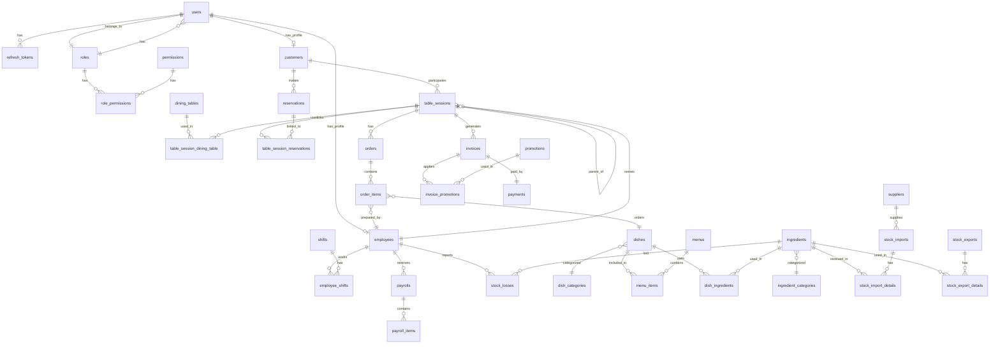
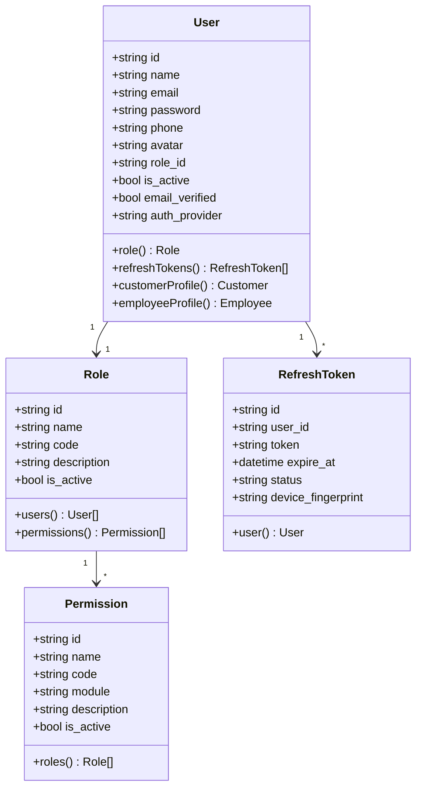
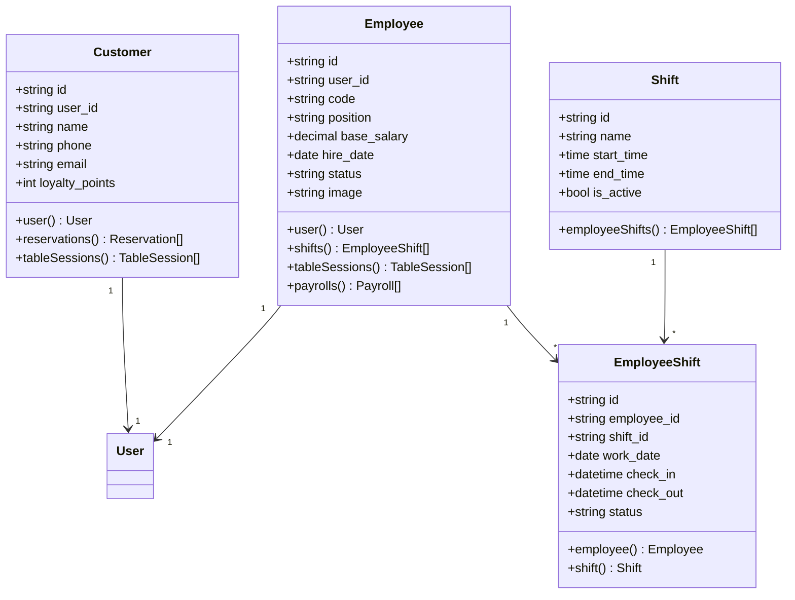
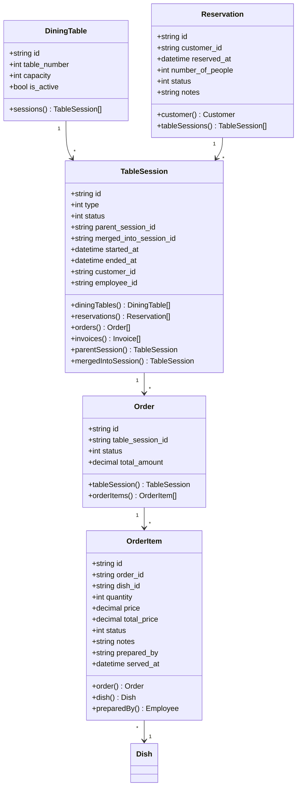
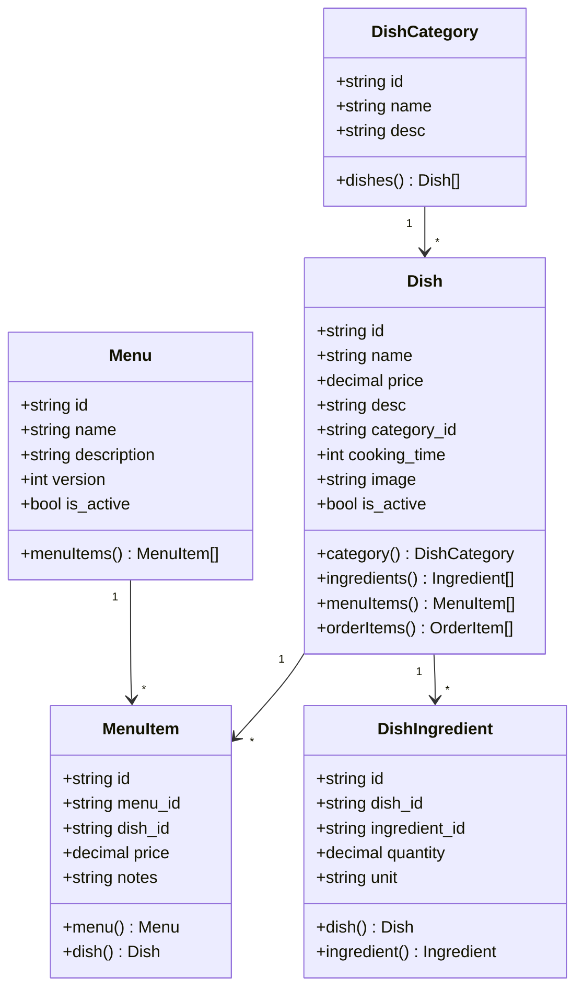
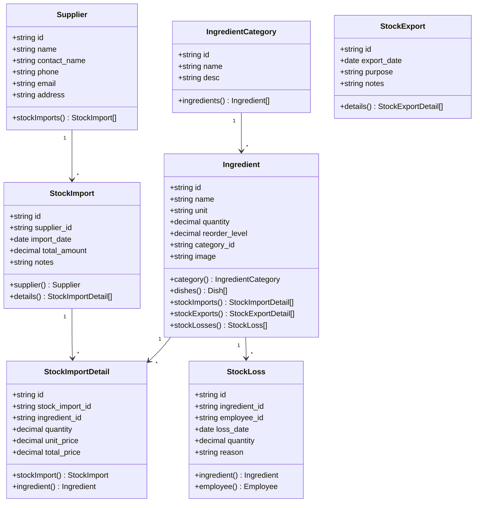
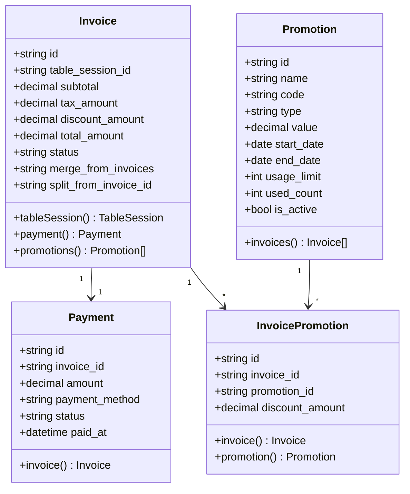
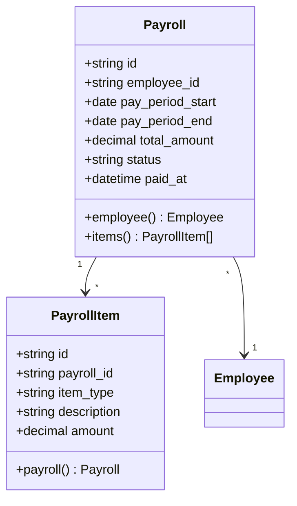

# 03 - Mô Hình Dữ Liệu (Data Model)

> **Version:** 1.0.0 | **Last Updated:** October 21, 2025

## 📖 Tổng Quan

Hệ thống sử dụng **MySQL 8.0+** làm database chính với **Eloquent ORM** của Laravel để quản lý data. Tất cả models đều extend từ `BaseModel` và sử dụng custom string IDs thay vì auto-increment.

## 🎨 Entity Relationship Diagram (ERD)

### Core System Entities



## 📊 Domain Models

### 1. **User Management Domain**



### 2. **Customer & Employee Domain**



### 3. **Table & Order Domain**



### 4. **Menu & Dish Domain**



### 5. **Inventory Domain**



### 6. **Billing & Payment Domain**



### 7. **Payroll Domain**



## 🔑 Key Design Decisions

### 1. **Custom String IDs**
- **Why**: Tránh expose sequential IDs, tăng security
- **Format**: Prefix + Random (e.g., `USR123ABC`, `ORD456DEF`)
- **Implementation**: Trait `HasCustomId` trong `BaseModel`

### 2. **Soft Deletes** (Optional)
- Sử dụng `deleted_at` column cho một số models
- Cho phép recovery data
- Không áp dụng cho tất cả tables

### 3. **Audit Fields**
- `created_at`, `updated_at` - Timestamps
- `created_by`, `updated_by` - User tracking
- **Implementation**: Trait `HasAuditFields`

### 4. **Status Enums**
- Sử dụng integers cho status (0, 1, 2, ...)
- Constants định nghĩa trong Model
- Dễ query và index

### 5. **Decimal for Money**
- Type: `decimal(18, 2)`
- Chính xác cho financial calculations
- Tránh floating-point errors

## 📝 Naming Conventions

### Database Tables
- **Singular Model**: `User` → **Plural Table**: `users`
- **Camel Case Model**: `DiningTable` → **Snake Case**: `dining_tables`
- **Pivot Tables**: `table_session_dining_table`, `invoice_promotions`

### Foreign Keys
- Pattern: `{table_singular}_id`
- Examples: `user_id`, `order_id`, `table_session_id`

### Indexes
- **Primary Key**: `id` (string, unique)
- **Foreign Keys**: Automatically indexed
- **Search Fields**: Add composite indexes
- **Unique Constraints**: email, code, etc.

## 🔗 Relationship Types

### One-to-One (1:1)
```php
// User has one Customer profile
User::hasOne(Customer::class)
Customer::belongsTo(User::class)
```

### One-to-Many (1:N)
```php
// Order has many OrderItems
Order::hasMany(OrderItem::class)
OrderItem::belongsTo(Order::class)
```

### Many-to-Many (N:N)
```php
// TableSession - DiningTable (pivot: table_session_dining_table)
TableSession::belongsToMany(DiningTable::class, 'table_session_dining_table')
DiningTable::belongsToMany(TableSession::class, 'table_session_dining_table')
```

### Polymorphic (Optional)
- Không sử dụng nhiều trong hệ thống hiện tại
- Có thể áp dụng cho: Comments, Attachments, Logs

## 📊 Data Integrity

### Cascade Rules
- **ON DELETE CASCADE**: Xóa parent → xóa children
  - Example: Order deleted → OrderItems deleted
- **ON DELETE SET NULL**: Xóa parent → set NULL cho foreign key
  - Example: Employee deleted → prepared_by = NULL
- **ON DELETE RESTRICT**: Không cho xóa nếu có references

### Constraints
- **UNIQUE**: email, code, token
- **NOT NULL**: Required fields
- **CHECK**: Status values, positive amounts
- **DEFAULT**: is_active, timestamps

## 🔄 Migration Strategy

### Version Control
- Migrations trong thư mục `database/migrations/`
- Naming: `YYYY_MM_DD_HHMMSS_description.php`
- Có thể rollback: `php artisan migrate:rollback`

### Seed Data
- Default roles & permissions
- Sample users
- Test data cho development

---

## 🔗 Related Documents

- **Previous**: [01-SYSTEM-OVERVIEW.md](./01-SYSTEM-OVERVIEW.md)
- **Next**: [04-DATABASE-SCHEMA.md](./04-DATABASE-SCHEMA.md)
- **See also**: [08-AUTHORIZATION.md](./08-AUTHORIZATION.md) - RBAC relationships

---

**📅 Last Updated:** October 21, 2025  
**👤 Author:** Development Team
