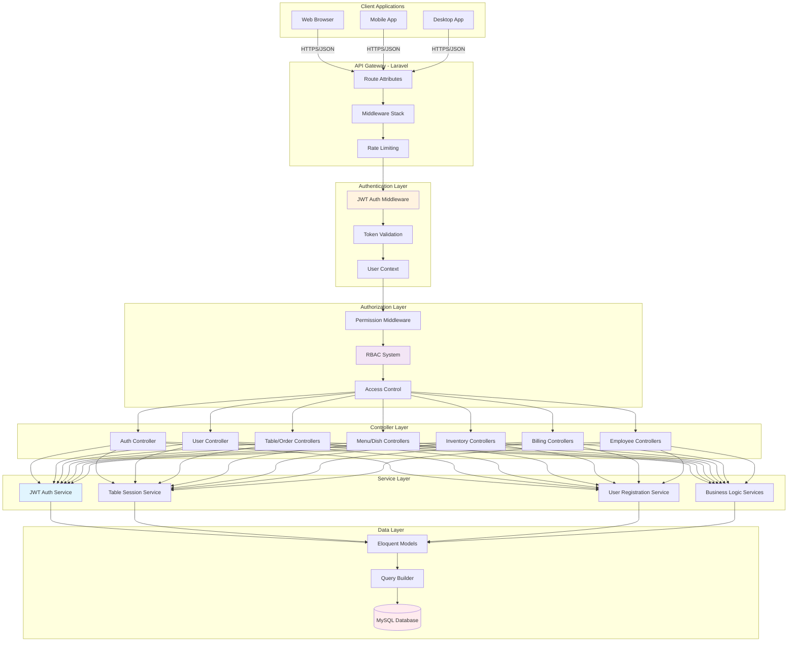
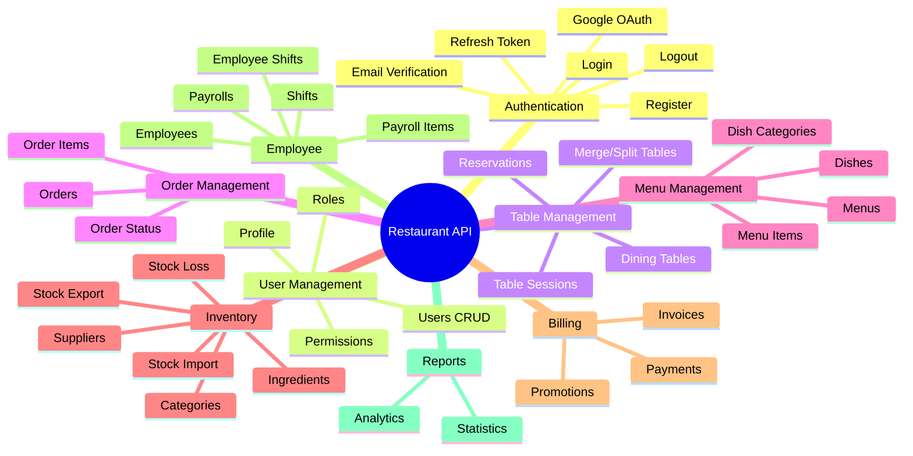
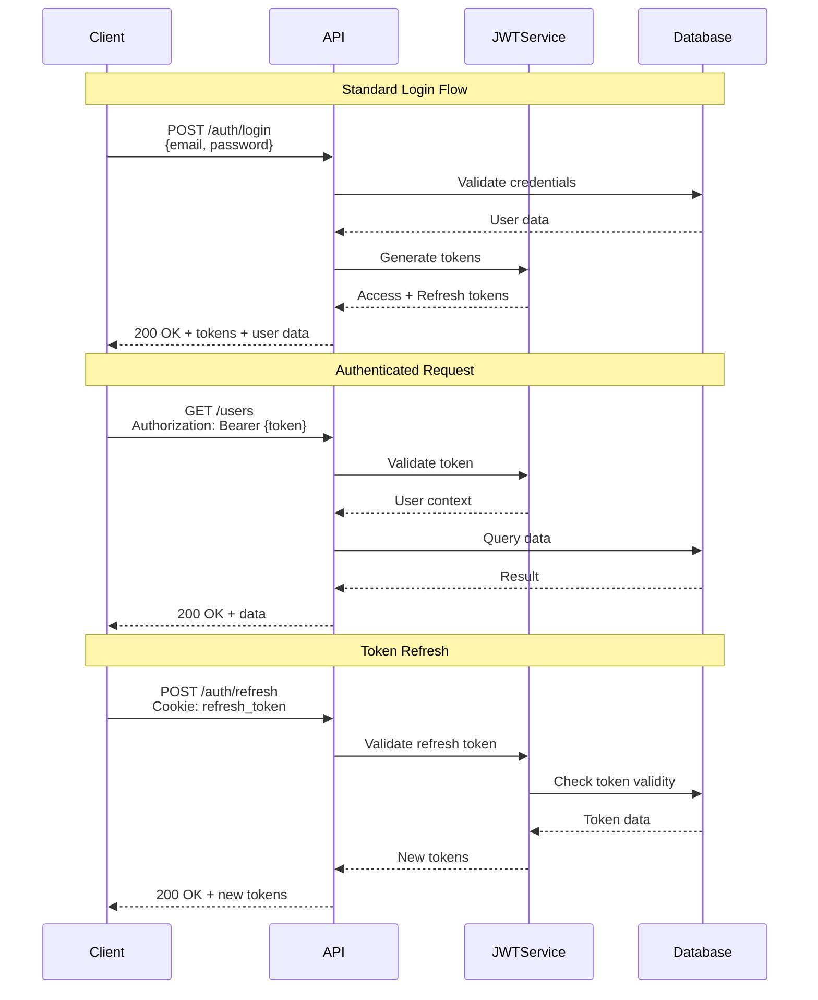
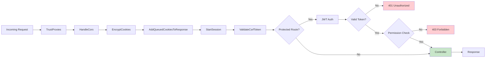

# 05 - Kiến Trúc API

> **Version:** 1.0.0 | **Last Updated:** October 21, 2025

## 📖 Tổng Quan

API của hệ thống được thiết kế theo chuẩn **RESTful**, sử dụng **Route Attributes** (Laravel) để định nghĩa routes trực tiếp trong Controllers, giúp code dễ đọc và maintain hơn.

## 🏗 API Architecture Diagram



## 🌐 Base URL Structure

### Development
```
http://localhost:8000/api
```

### Production
```
https://api.restaurant-system.com/api
```

## 📋 API Modules



## 🔐 Authentication Flow



## 🛡 Middleware Stack



### Middleware Types

#### 1. **Global Middleware**
- `TrustProxies` - Proxy configuration
- `HandleCors` - CORS headers
- `TrimStrings` - Trim input strings
- `ConvertEmptyStringsToNull` - Data normalization

#### 2. **Route Middleware**
- `auth:api` - JWT authentication
- `permission:{permission}` - Permission check
- `throttle:60,1` - Rate limiting

#### 3. **Custom Middleware**
- `CheckPermission` - RBAC validation
- `EnableCookieQueue` - Cookie management

## 📡 Request/Response Format

### Standard Request Headers
```http
Content-Type: application/json
Accept: application/json
Authorization: Bearer {access_token}
```

### Success Response (200/201)
```json
{
  "success": true,
  "message": "Operation successful",
  "data": {
    "id": "USR123ABC",
    "name": "John Doe",
    "email": "john@example.com"
  },
  "meta": {
    "timestamp": "2025-10-21T10:00:00Z"
  }
}
```

### Paginated Response (200)
```json
{
  "success": true,
  "data": [
    {...},
    {...}
  ],
  "meta": {
    "current_page": 1,
    "per_page": 15,
    "total": 150,
    "last_page": 10,
    "from": 1,
    "to": 15
  },
  "links": {
    "first": "/api/users?page=1",
    "last": "/api/users?page=10",
    "prev": null,
    "next": "/api/users?page=2"
  }
}
```

### Error Response (4xx/5xx)
```json
{
  "success": false,
  "message": "Validation failed",
  "errors": {
    "email": ["The email field is required."],
    "password": ["The password must be at least 8 characters."]
  },
  "error_code": "VALIDATION_ERROR",
  "timestamp": "2025-10-21T10:00:00Z"
}
```

## 🔢 HTTP Status Codes

### Success Codes
- **200 OK** - Successful GET, PUT, PATCH, DELETE
- **201 Created** - Successful POST (resource created)
- **204 No Content** - Successful DELETE (no response body)

### Client Error Codes
- **400 Bad Request** - Invalid request format
- **401 Unauthorized** - Missing or invalid token
- **403 Forbidden** - No permission
- **404 Not Found** - Resource not found
- **422 Unprocessable Entity** - Validation failed
- **429 Too Many Requests** - Rate limit exceeded

### Server Error Codes
- **500 Internal Server Error** - Server error
- **503 Service Unavailable** - Maintenance mode

## 🎯 API Endpoint Categories

### 1. Authentication (`/api/auth/*`)
```
POST   /auth/login              # Standard login
POST   /auth/register           # Email registration
POST   /auth/verify-email       # Email verification
GET    /auth/google             # Google OAuth redirect
GET    /auth/google/callback    # Google OAuth callback
POST   /auth/refresh            # Refresh access token
POST   /auth/logout             # Logout
GET    /auth/me                 # Current user info
GET    /auth/sessions           # Active sessions
POST   /auth/revoke-token       # Revoke refresh token
```

### 2. User Management (`/api/users/*`)
```
GET    /users                   # List users (paginated)
POST   /users                   # Create user
GET    /users/{id}              # Get user details
PUT    /users/{id}              # Update user
DELETE /users/{id}              # Delete user
POST   /users/{id}/avatar       # Upload avatar
```

### 3. RBAC (`/api/roles/*`, `/api/permissions/*`)
```
GET    /roles                   # List roles
POST   /roles                   # Create role
GET    /roles/{id}              # Role details
PUT    /roles/{id}              # Update role
DELETE /roles/{id}              # Delete role
POST   /roles/{id}/permissions  # Attach permissions

GET    /permissions             # List permissions
GET    /permissions/{id}        # Permission details
```

### 4. Table Management (`/api/dining-tables/*`, `/api/table-sessions/*`)
```
GET    /dining-tables           # List tables
POST   /dining-tables           # Create table
PUT    /dining-tables/{id}      # Update table
DELETE /dining-tables/{id}      # Delete table

GET    /table-sessions          # List sessions
POST   /table-sessions          # Create session
GET    /table-sessions/{id}     # Session details
PUT    /table-sessions/{id}     # Update session
POST   /table-sessions/{id}/merge   # Merge sessions
POST   /table-sessions/{id}/split   # Split session
POST   /table-sessions/{id}/unmerge # Unmerge session
```

### 5. Order Management (`/api/orders/*`)
```
GET    /orders                  # List orders
POST   /orders                  # Create order
GET    /orders/{id}             # Order details
PUT    /orders/{id}             # Update order
DELETE /orders/{id}             # Cancel order
POST   /orders/{id}/items       # Add order items
PUT    /orders/{id}/items/{itemId}/status  # Update item status
```

### 6. Menu & Dishes (`/api/menus/*`, `/api/dishes/*`)
```
GET    /menus                   # List menus
POST   /menus                   # Create menu
PUT    /menus/{id}              # Update menu
DELETE /menus/{id}              # Delete menu

GET    /dishes                  # List dishes
POST   /dishes                  # Create dish
PUT    /dishes/{id}             # Update dish
DELETE /dishes/{id}             # Delete dish
POST   /dishes/{id}/image       # Upload dish image

GET    /dish-categories         # List categories
POST   /dish-categories         # Create category
```

### 7. Inventory (`/api/ingredients/*`, `/api/stocks/*`)
```
GET    /ingredients             # List ingredients
POST   /ingredients             # Create ingredient
PUT    /ingredients/{id}        # Update ingredient
DELETE /ingredients/{id}        # Delete ingredient

GET    /suppliers               # List suppliers
POST   /suppliers               # Create supplier

POST   /stocks/import           # Import stock
POST   /stocks/export           # Export stock
POST   /stocks/loss             # Report stock loss
GET    /stocks/reports          # Stock reports
```

### 8. Billing (`/api/invoices/*`, `/api/payments/*`)
```
GET    /invoices                # List invoices
POST   /invoices                # Create invoice
GET    /invoices/{id}           # Invoice details
PUT    /invoices/{id}           # Update invoice

POST   /payments                # Process payment
GET    /payments/{id}           # Payment details

GET    /promotions              # List promotions
POST   /promotions              # Create promotion
```

### 9. Employee & Payroll (`/api/employees/*`, `/api/payrolls/*`)
```
GET    /employees               # List employees
POST   /employees               # Create employee
PUT    /employees/{id}          # Update employee
POST   /employees/{id}/image    # Upload employee photo

GET    /shifts                  # List shifts
POST   /shifts                  # Create shift

GET    /employee-shifts         # List employee shifts
POST   /employee-shifts         # Assign shift

GET    /payrolls                # List payrolls
POST   /payrolls                # Create payroll
PUT    /payrolls/{id}           # Update payroll
POST   /payrolls/{id}/process   # Process payroll
```

### 10. Reports & Statistics (`/api/statistics/*`)
```
GET    /statistics/dashboard    # Dashboard stats
GET    /statistics/revenue      # Revenue reports
GET    /statistics/orders       # Order analytics
GET    /statistics/dishes       # Popular dishes
GET    /statistics/employees    # Employee performance
```

## 🔄 Common Query Parameters

### Pagination
```
?page=1                   # Page number
&per_page=15              # Items per page (default: 15, max: 100)
```

### Filtering
```
?status=active            # Filter by status
&category_id=CAT123       # Filter by category
&search=keyword           # Search by keyword
```

### Sorting
```
?sort_by=created_at       # Sort field
&sort_order=desc          # Sort direction (asc/desc)
```

### Includes (Eager Loading)
```
?include=role,profile     # Include relationships
```

### Date Range
```
?from=2025-01-01          # Start date
&to=2025-12-31            # End date
```

## 🎨 Route Attributes Example

```php
use Spatie\RouteAttributes\Attributes\{Get, Post, Put, Delete, Middleware, Prefix};

#[Prefix('api/users')]
#[Middleware(['auth:api'])]
class UserController extends Controller
{
    #[Get('/', name: 'users.index', middleware: ['permission:users.view'])]
    public function index(Request $request) { }
    
    #[Post('/', name: 'users.store', middleware: ['permission:users.create'])]
    public function store(CreateUserRequest $request) { }
    
    #[Get('{id}', name: 'users.show', middleware: ['permission:users.view'])]
    public function show(string $id) { }
    
    #[Put('{id}', name: 'users.update', middleware: ['permission:users.edit'])]
    public function update(UpdateUserRequest $request, string $id) { }
    
    #[Delete('{id}', name: 'users.destroy', middleware: ['permission:users.delete'])]
    public function destroy(string $id) { }
}
```

## 🚦 Rate Limiting

### Configuration
- **Default**: 60 requests/minute per IP
- **Authenticated**: 120 requests/minute per user
- **Critical endpoints**: 10 requests/minute (login, register)

### Headers
```http
X-RateLimit-Limit: 60
X-RateLimit-Remaining: 45
X-RateLimit-Reset: 1634567890
```

## 📚 API Versioning Strategy

### Current: No Versioning
- Base URL: `/api/*`
- All endpoints in v1

### Future: URL Versioning
- `/api/v1/*` - Current stable
- `/api/v2/*` - New features/breaking changes
- Maintain backward compatibility for at least 6 months

---

## 🔗 Related Documents

- **Previous**: [03-DATA-MODEL.md](./03-DATA-MODEL.md)
- **Next**: [06-API-ENDPOINTS.md](./06-API-ENDPOINTS.md) - Chi tiết endpoints
- **See also**: [07-AUTHENTICATION.md](./07-AUTHENTICATION.md) - Auth flow
- **See also**: [08-AUTHORIZATION.md](./08-AUTHORIZATION.md) - Permission system

---

**📅 Last Updated:** October 21, 2025  
**👤 Author:** Development Team
