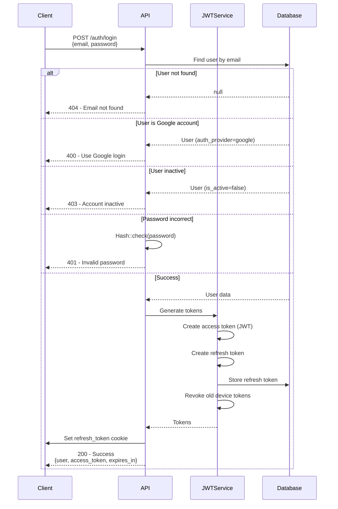

# 07 - Authentication System

> **Version:** 1.0.0 | **Last Updated:** October 21, 2025

## 📖 Tổng Quan

Hệ thống sử dụng **JWT (JSON Web Token)** làm cơ chế xác thực chính, kết hợp với **Refresh Token** mechanism và hỗ trợ **OAuth 2.0** (Google Login).

## 🔐 Authentication Architecture


## 🔑 Token System

### 1. **Access Token (JWT)**
- **Type**: Bearer Token
- **Lifetime**: 60 minutes
- **Storage**: Client-side (localStorage/memory)
- **Usage**: Sent in Authorization header
- **Contains**: User ID, Role, Permissions

```json
{
  "header": {
    "alg": "HS256",
    "typ": "JWT"
  },
  "payload": {
    "sub": "USR123ABC",
    "name": "John Doe",
    "email": "john@example.com",
    "role": "manager",
    "iat": 1634567890,
    "exp": 1634571490
  },
  "signature": "..."
}
```

### 2. **Refresh Token**
- **Type**: Random string (64 chars)
- **Lifetime**: 30 days
- **Storage**: HttpOnly Cookie + Database
- **Usage**: Refresh access token when expired
- **Security**: Device fingerprint validation

```php
// Refresh Token Model
class RefreshToken {
    string $id;
    string $user_id;
    string $token;              // Random 64-char string
    datetime $expire_at;        // 30 days from creation
    string $status;             // active, revoked, expired
    string $device_fingerprint; // MD5 hash of device info
    string $user_agent;
    string $ip_address;
    datetime $revoked_at;
    string $revoked_by;
}
```

## 🚀 Authentication Flows

### Flow 1: Standard Login



### Flow 2: Google OAuth Login


### Flow 3: Email Registration


### Flow 4: Token Refresh


### Flow 5: Logout


## 🛡️ Security Features

### 1. **Device Fingerprinting**

```php
private function getDeviceFingerprint(Request $request): string
{
    $userAgent = $request->header('User-Agent', '');
    $acceptLanguage = $request->header('Accept-Language', '');
    $acceptEncoding = $request->header('Accept-Encoding', '');
    $ipAddress = $request->ip();
    
    return md5($userAgent . $acceptLanguage . $acceptEncoding . $ipAddress);
}
```

**Benefits:**
- Detect token theft
- Prevent token reuse from different devices
- Automatic revocation on mismatch

### 2. **Token Rotation**

- **Old refresh token** is revoked when new one is issued
- Prevents refresh token reuse
- Limits attack window

### 3. **Automatic Cleanup**

```php
// Scheduled command (daily)
php artisan tokens:cleanup

// Deletes:
// - Expired tokens (expire_at < now)
// - Revoked tokens older than 7 days
```

### 4. **Session Management**

```php
// User can view all active sessions
GET /auth/sessions

// Response
{
  "sessions": [
    {
      "id": "RTK123",
      "device": "Chrome on Windows",
      "ip_address": "192.168.1.1",
      "last_active": "2025-10-21T10:00:00Z",
      "is_current": true
    }
  ]
}

// Revoke specific session
POST /auth/revoke-token
{
  "token_id": "RTK123"
}

// Revoke all sessions (except current)
POST /auth/revoke-all-tokens
```

## 🔒 Password Security

### Hashing
- **Algorithm**: bcrypt (Laravel default)
- **Cost**: 12 (configurable)
- **Salt**: Automatic

```php
// Hash on registration/password change
$hashedPassword = Hash::make($password);

// Verify on login
if (Hash::check($password, $user->password)) {
    // Valid
}
```

### Password Requirements
- **Minimum length**: 8 characters
- **Recommended**: Mix of uppercase, lowercase, numbers, symbols
- **Validation**: Laravel validation rules

```php
'password' => 'required|string|min:8|confirmed'
```

## 📧 Email Verification

### Token Generation
```php
$token = Str::random(64);
EmailVerificationToken::create([
    'email' => $user->email,
    'token' => hash('sha256', $token),
    'expire_at' => now()->addHours(24)
]);
```

### Verification Email
```
Subject: Verify Your Email Address

Click the link below to verify your email:
https://app.restaurant.com/verify-email?token={token}

This link expires in 24 hours.
```

### Resend Verification
```php
POST /auth/resend-verification
{
  "email": "user@example.com"
}
```

## 🔐 OAuth Configuration

### Google OAuth Setup

1. **Create OAuth 2.0 Credentials**
   - Go to Google Cloud Console
   - Create OAuth client ID
   - Add authorized redirect URI

2. **Environment Variables**
```env
GOOGLE_CLIENT_ID=your-client-id.apps.googleusercontent.com
GOOGLE_CLIENT_SECRET=your-client-secret
GOOGLE_REDIRECT_URI=http://localhost:8000/api/auth/google/callback
```

3. **Scopes Requested**
   - `openid` - User authentication
   - `profile` - Basic profile info
   - `email` - Email address

## 🚨 Error Handling

### Authentication Errors

| Code | Message | HTTP Status |
|------|---------|-------------|
| `EMAIL_NOT_FOUND` | Email not registered | 404 |
| `GOOGLE_ACCOUNT_ONLY` | Use Google login | 400 |
| `ACCOUNT_INACTIVE` | Account disabled | 403 |
| `INVALID_PASSWORD` | Wrong password | 401 |
| `TOKEN_EXPIRED` | Token expired | 401 |
| `TOKEN_INVALID` | Invalid token | 401 |
| `TOKEN_REVOKED` | Token revoked | 401 |
| `EMAIL_NOT_VERIFIED` | Verify email first | 403 |
| `EMAIL_ALREADY_EXISTS` | Email in use | 409 |

### Example Error Response
```json
{
  "success": false,
  "message": "Invalid credentials",
  "error_code": "INVALID_PASSWORD",
  "timestamp": "2025-10-21T10:00:00Z"
}
```

## 📊 Token Lifecycle


## 🔧 Configuration

### JWT Settings (config/jwt.php)
```php
return [
    'secret' => env('JWT_SECRET'),
    'ttl' => 60,                    // Access token lifetime (minutes)
    'refresh_ttl' => 43200,        // Refresh token lifetime (minutes = 30 days)
    'algo' => 'HS256',             // Algorithm
    'required_claims' => ['iss', 'iat', 'exp', 'nbf', 'sub', 'jti'],
    'blacklist_enabled' => true,   // Enable token blacklist
    'blacklist_grace_period' => 0, // Grace period (seconds)
];
```

### Auth Settings (config/auth.php)
```php
'defaults' => [
    'guard' => 'api',
    'passwords' => 'users',
],

'guards' => [
    'api' => [
        'driver' => 'jwt',
        'provider' => 'users',
    ],
],
```

## 📝 Best Practices

### Client-Side
✅ **DO:**
- Store access token in memory/localStorage
- Never log tokens
- Clear tokens on logout
- Handle 401 responses (refresh flow)
- Use HTTPS only

❌ **DON'T:**
- Store refresh token in localStorage
- Share tokens between users
- Hardcode tokens
- Send tokens in URL parameters

### Server-Side
✅ **DO:**
- Use HttpOnly cookies for refresh tokens
- Implement device fingerprinting
- Rotate refresh tokens
- Log authentication events
- Rate limit authentication endpoints
- Clean expired tokens regularly

❌ **DON'T:**
- Log sensitive data (passwords, tokens)
- Use weak JWT secrets
- Disable token expiration
- Skip validation

---

## 🔗 Related Documents

- **Previous**: [05-API-ARCHITECTURE.md](./05-API-ARCHITECTURE.md)
- **Next**: [08-AUTHORIZATION.md](./08-AUTHORIZATION.md) - RBAC system
- **See also**: [09-USER-MANAGEMENT.md](./09-USER-MANAGEMENT.md)

---

**📅 Last Updated:** October 21, 2025  
**👤 Author:** Development Team
