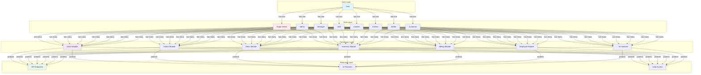
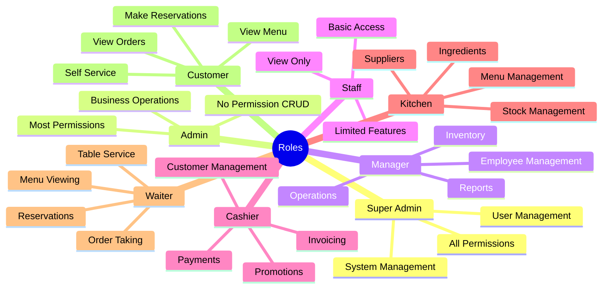
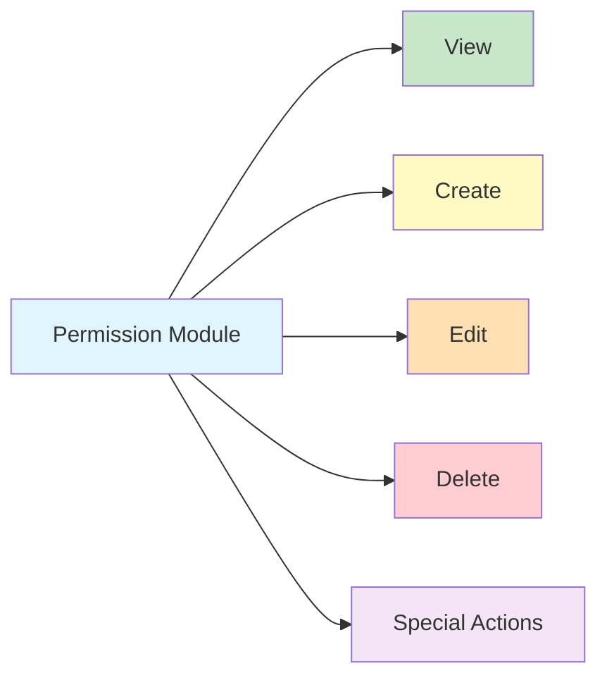
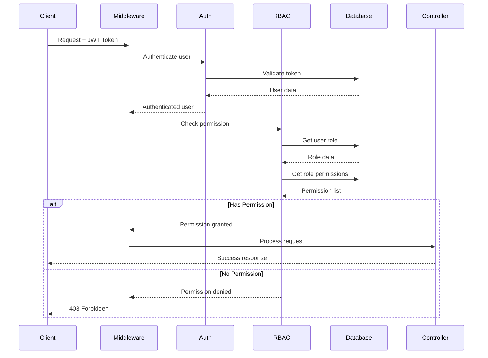

# 08 - Authorization System (RBAC)

> **Version:** 1.0.0 | **Last Updated:** October 21, 2025

## 📖 Tổng Quan

Hệ thống sử dụng **RBAC (Role-Based Access Control)** để quản lý phân quyền. Mỗi user có một role, mỗi role có nhiều permissions. System hỗ trợ 16 modules với hơn 100+ permissions.

## 🏗 RBAC Architecture



## 👥 Predefined Roles



### Role Details

#### 1. **Super Admin** (`super_admin`)
- **Description**: Full system access
- **Permissions**: `*` (All permissions)
- **Use Cases**: 
  - System configuration
  - Permission management
  - Critical operations

#### 2. **Admin** (`admin`)
- **Description**: Administrative access
- **Permissions**: All except permission CRUD
- **Use Cases**:
  - User management
  - Business operations
  - Report access

#### 3. **Manager** (`manager`)
- **Description**: Restaurant manager
- **Permissions**: Operations + Employee + Inventory + Billing
- **Use Cases**:
  - Daily operations
  - Staff scheduling
  - Inventory management
  - Financial reports

#### 4. **Staff** (`staff`)
- **Description**: View-only access
- **Permissions**: View permissions only
- **Use Cases**:
  - Information access
  - Basic operations
  - Support role

#### 5. **Cashier** (`cashier`)
- **Description**: Front desk operations
- **Permissions**: Customer + Invoice + Payment + Promotion
- **Use Cases**:
  - Customer check-in
  - Bill generation
  - Payment processing
  - Promotion application

#### 6. **Kitchen** (`kitchen`)
- **Description**: Kitchen operations
- **Permissions**: Menu + Dish + Ingredient + Stock
- **Use Cases**:
  - Menu management
  - Recipe management
  - Ingredient tracking
  - Stock operations

#### 7. **Waiter** (`waiter`)
- **Description**: Table service staff
- **Permissions**: Table + Reservation + Order (view) + Menu (view)
- **Use Cases**:
  - Table management
  - Reservation handling
  - Order taking
  - Customer service

#### 8. **Customer** (`customer`)
- **Description**: End customers
- **Permissions**: Minimal access
- **Use Cases**:
  - Self-registration
  - Make reservations
  - View menu
  - Track orders

## 🔐 Permission Modules

### Module Structure



### 1. **Users Module** (`users.*`)
```
users.view          - View user list and details
users.create        - Create new users
users.edit          - Edit user information
users.delete        - Delete users
users.manage_roles  - Assign/change user roles
```

### 2. **Roles Module** (`roles.*`)
```
roles.view                - View roles
roles.create              - Create new roles
roles.edit                - Edit role details
roles.delete              - Delete roles
roles.manage_permissions  - Attach/detach permissions
```

### 3. **Permissions Module** (`permissions.*`)
```
permissions.view    - View permissions
permissions.create  - Create new permissions
permissions.edit    - Edit permissions
permissions.delete  - Delete permissions
```

### 4. **Employees Module** (`employees.*`)
```
employees.view          - View employee list
employees.create        - Add new employees
employees.edit          - Edit employee info
employees.delete        - Remove employees
employees.manage_roles  - Assign employee roles
```

### 5. **Customers Module** (`customers.*`)
```
customers.view    - View customer list
customers.create  - Add new customers
customers.edit    - Edit customer info
customers.delete  - Remove customers
```

### 6. **Dining Tables Module** (`dining-tables.*`)
```
dining-tables.view           - View tables
dining-tables.create         - Add tables
dining-tables.edit           - Edit table details
dining-tables.delete         - Remove tables
dining-tables.manage_status  - Change availability
```

### 7. **Table Sessions Module** (`table-sessions.*`)
```
table-sessions.view      - View sessions
table-sessions.create    - Create sessions
table-sessions.edit      - Update sessions
table-sessions.delete    - Delete sessions
table-sessions.merge     - Merge tables
table-sessions.split     - Split tables
table-sessions.unmerge   - Unmerge tables
```

### 8. **Reservations Module** (`reservations.*`)
```
reservations.view    - View reservations
reservations.create  - Make reservations
reservations.edit    - Modify reservations
reservations.delete  - Cancel reservations
```

### 9. **Orders Module** (`orders.*`)
```
orders.view      - View orders
orders.create    - Create orders
orders.edit      - Edit orders
orders.delete    - Cancel orders
orders.process   - Process orders
orders.complete  - Mark complete
orders.refund    - Process refunds
```

### 10. **Order Items Module** (`orderItems.*`)
```
orderItems.view          - View order items
orderItems.create        - Add items
orderItems.edit          - Edit items
orderItems.delete        - Remove items
orderItems.updateStatus  - Update status
```

### 11. **Dishes Module** (`dishes.*`)
```
dishes.view    - View dishes
dishes.create  - Add dishes
dishes.edit    - Edit dishes
dishes.delete  - Remove dishes
```

### 12. **Menus Module** (`menus.*`)
```
menus.view    - View menus
menus.create  - Create menus
menus.edit    - Edit menus
menus.delete  - Delete menus
```

### 13. **Ingredients Module** (`ingredients.*`)
```
ingredients.view    - View ingredients
ingredients.create  - Add ingredients
ingredients.edit    - Edit ingredients
ingredients.delete  - Remove ingredients
```

### 14. **Stocks Module** (`stocks.*`)
```
stocks.view    - View stock records
stocks.create  - Import/Export stock
stocks.edit    - Edit stock records
stocks.delete  - Delete stock records
```

### 15. **Invoices Module** (`invoices.*`)
```
invoices.view    - View invoices
invoices.create  - Create invoices
invoices.edit    - Edit invoices
invoices.delete  - Delete invoices
```

### 16. **Payrolls Module** (`payrolls.*`)
```
payrolls.view     - View payrolls
payrolls.create   - Create payrolls
payrolls.edit     - Edit payrolls
payrolls.delete   - Delete payrolls
payrolls.process  - Process payments
```

## 🔄 Permission Check Flow



## 🛠 Implementation

### 1. **Permission Middleware**

```php
class CheckPermission
{
    public function handle(Request $request, Closure $next, string $permission)
    {
        $user = Auth::user();
        
        if (!$user) {
            return response()->json([
                'success' => false,
                'message' => 'Unauthenticated'
            ], 401);
        }
        
        if (!$user->hasPermission($permission)) {
            return response()->json([
                'success' => false,
                'message' => 'Insufficient permissions',
                'required_permission' => $permission
            ], 403);
        }
        
        return $next($request);
    }
}
```

### 2. **User Model Methods**

```php
class User extends BaseAuthenticatable
{
    public function hasPermission(string $permissionCode): bool
    {
        if (!$this->role) {
            return false;
        }
        
        // Super admin has all permissions
        if ($this->role->code === 'super_admin') {
            return true;
        }
        
        // Check if role has the permission
        return $this->role->permissions()
            ->where('code', $permissionCode)
            ->where('is_active', true)
            ->exists();
    }
    
    public function hasAnyPermission(array $permissions): bool
    {
        foreach ($permissions as $permission) {
            if ($this->hasPermission($permission)) {
                return true;
            }
        }
        return false;
    }
    
    public function hasAllPermissions(array $permissions): bool
    {
        foreach ($permissions as $permission) {
            if (!$this->hasPermission($permission)) {
                return false;
            }
        }
        return true;
    }
}
```

### 3. **Controller with Permissions**

```php
#[Prefix('api/users')]
#[Middleware(['auth:api'])]
class UserController extends Controller
{
    #[Get('/', middleware: ['permission:users.view'])]
    public function index() { }
    
    #[Post('/', middleware: ['permission:users.create'])]
    public function store() { }
    
    #[Put('{id}', middleware: ['permission:users.edit'])]
    public function update(string $id) { }
    
    #[Delete('{id}', middleware: ['permission:users.delete'])]
    public function destroy(string $id) { }
}
```

### 4. **Blade Directives (Optional)**

```php
// Check single permission
@can('users.edit')
    <button>Edit User</button>
@endcan

// Check any permission
@canany(['users.edit', 'users.delete'])
    <button>Actions</button>
@endcanany
```

## ⚙️ RBAC Management

### Sync Permissions from Config

```bash
# Sync all permissions from config/permissions.php
php artisan rbac sync

# Sync with role creation
php artisan rbac sync --with-roles
```

### List Roles & Permissions

```bash
# List all roles
php artisan rbac list-roles

# List all permissions
php artisan rbac list-permissions

# List permissions by module
php artisan rbac list-permissions --module=users
```

### Assign Role to User

```bash
# Via command
php artisan rbac assign-role --user=admin@restaurant.local --role=manager

# Via API
POST /api/users/{id}
{
  "role_id": "ROL123ABC"
}
```

### Check User Permissions

```bash
# Via command
php artisan rbac check-permission --user=admin@restaurant.local --permission=users.create

# Via code
if (Auth::user()->hasPermission('users.create')) {
    // Allow action
}
```

## 📊 Permission Matrix

### Role-Permission Mapping

| Permission Module | Super Admin | Admin | Manager | Staff | Cashier | Kitchen | Waiter | Customer |
|------------------|-------------|-------|---------|-------|---------|---------|--------|----------|
| **Users** | ✅ All | ✅ All | ❌ | 👁️ View | ❌ | ❌ | ❌ | 👁️ View |
| **Roles** | ✅ All | 👁️ View | 👁️ View | ❌ | ❌ | ❌ | ❌ | ❌ |
| **Permissions** | ✅ All | ❌ | ❌ | ❌ | ❌ | ❌ | ❌ | ❌ |
| **Employees** | ✅ All | ✅ All | ✅ All | 👁️ View | ❌ | ❌ | ❌ | 👁️ View |
| **Customers** | ✅ All | ✅ All | ✅ All | 👁️ View | ✅ All | ❌ | 👁️ View | ❌ |
| **Tables** | ✅ All | ✅ All | ✅ All | 👁️ View | ❌ | ❌ | 👁️ View | ❌ |
| **Sessions** | ✅ All | ✅ All | ✅ All | 👁️ View | ❌ | ❌ | ❌ | 👁️ View |
| **Reservations** | ✅ All | ✅ All | ✅ All | 👁️ View | ❌ | ❌ | ✅ All | ✅ CRUD |
| **Orders** | ✅ All | ✅ All | ✅ All | 👁️ View | ❌ | ❌ | 👁️ View | 👁️ View |
| **Dishes** | ✅ All | ✅ All | ✅ All | 👁️ View | ❌ | ✅ All | 👁️ View | 👁️ View |
| **Menus** | ✅ All | ✅ All | ✅ All | 👁️ View | ❌ | ✅ All | 👁️ View | ❌ |
| **Ingredients** | ✅ All | ✅ All | ✅ All | 👁️ View | ❌ | ✅ All | ❌ | ❌ |
| **Stocks** | ✅ All | ✅ All | ✅ All | 👁️ View | ❌ | ✅ All | ❌ | ❌ |
| **Invoices** | ✅ All | ✅ All | ✅ All | 👁️ View | ✅ All | ❌ | ❌ | ❌ |
| **Promotions** | ✅ All | ✅ All | ✅ All | 👁️ View | ✅ All | ❌ | ❌ | ❌ |
| **Payrolls** | ✅ All | ✅ All | ✅ All | ❌ | ❌ | ❌ | ❌ | ❌ |
| **Statistics** | ✅ All | ✅ All | ✅ All | 👁️ View | 👁️ View | 👁️ View | 👁️ View | ❌ |

**Legend:**
- ✅ All = Full CRUD access
- 👁️ View = Read-only access
- ❌ = No access

## 🔒 Security Best Practices

### 1. **Principle of Least Privilege**
- Users only get minimum required permissions
- Regular permission audits
- Temporary elevated access when needed

### 2. **Permission Granularity**
- Separate view/create/edit/delete permissions
- Module-specific permissions
- Special action permissions (merge, split, process)

### 3. **Role Hierarchy**
```
Super Admin > Admin > Manager > Staff/Cashier/Kitchen/Waiter > Customer
```

### 4. **Permission Caching**
- Cache user permissions for performance
- Invalidate on role/permission changes

```php
Cache::remember("user.{$userId}.permissions", 3600, function() use ($user) {
    return $user->role->permissions->pluck('code')->toArray();
});
```

### 5. **Audit Logging**
- Log permission checks
- Log role changes
- Log permission grants/revokes

## 🚨 Error Responses

### Insufficient Permissions (403)
```json
{
  "success": false,
  "message": "Insufficient permissions to perform this action",
  "required_permission": "users.delete",
  "user_role": "staff",
  "error_code": "INSUFFICIENT_PERMISSIONS"
}
```

### Role Not Found (404)
```json
{
  "success": false,
  "message": "Role not found",
  "error_code": "ROLE_NOT_FOUND"
}
```

## 📝 Configuration File

**Location**: `config/permissions.php`

```php
return [
    'modules' => [
        'users' => [
            'name' => 'User Management',
            'permissions' => [
                'users.view' => ['name' => 'View Users', ...],
                'users.create' => ['name' => 'Create Users', ...],
                // ...
            ]
        ],
        // ... more modules
    ],
    
    'roles' => [
        'super_admin' => [
            'name' => 'Super Administrator',
            'permissions' => '*', // All permissions
        ],
        // ... more roles
    ],
];
```

---

## 🔗 Related Documents

- **Previous**: [07-AUTHENTICATION.md](./07-AUTHENTICATION.md)
- **Next**: [09-USER-MANAGEMENT.md](./09-USER-MANAGEMENT.md)
- **See also**: [03-DATA-MODEL.md](./03-DATA-MODEL.md) - Role/Permission models

---

**📅 Last Updated:** October 21, 2025  
**👤 Author:** Development Team
