# 10 - Table & Order Management

> **Version:** 1.0.0 | **Last Updated:** October 21, 2025

## 📖 Tổng Quan

Module quản lý bàn và đơn hàng là core business của hệ thống nhà hàng, bao gồm: quản lý bàn ăn, phiên bàn (table sessions), đặt bàn (reservations), và đơn hàng (orders).

## 🏗 Architecture Overview

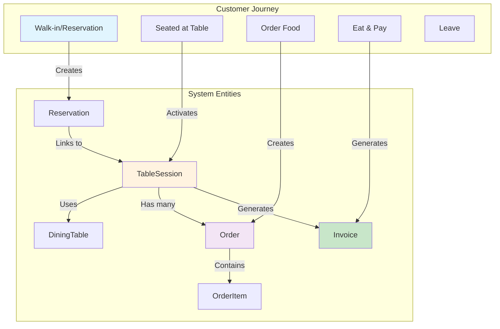

## 🪑 Dining Tables

### Entity Structure

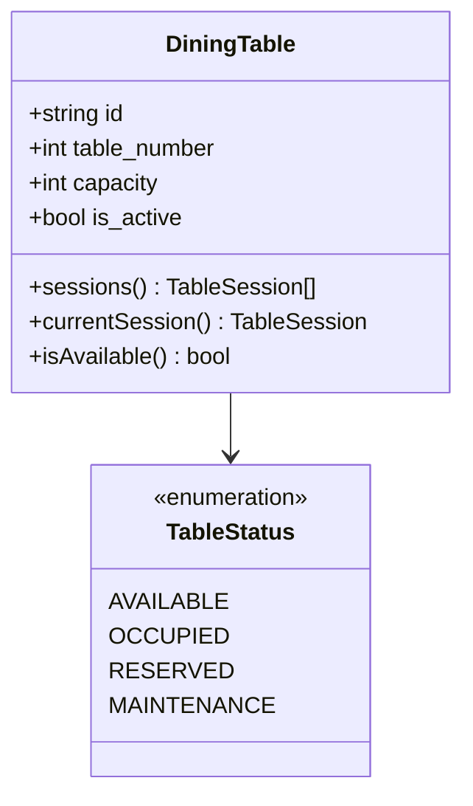

### Table States

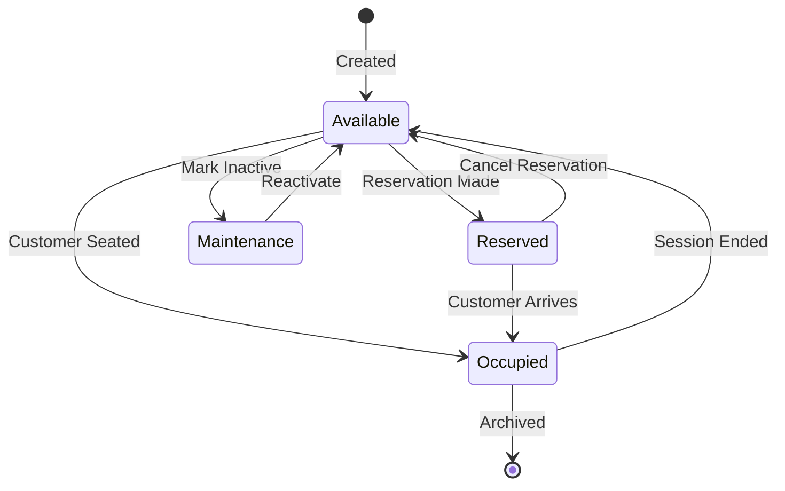

### API Endpoints

```http
# List tables (with status)
GET /api/dining-tables
Query: ?status=available&capacity_min=4

# Create table
POST /api/dining-tables
{
  "table_number": 5,
  "capacity": 4,
  "is_active": true
}

# Update table
PUT /api/dining-tables/{id}
{
  "capacity": 6,
  "is_active": true
}

# Get table details with current session
GET /api/dining-tables/{id}?include=currentSession

# Delete table
DELETE /api/dining-tables/{id}
```

## 📅 Reservations

### Entity Structure

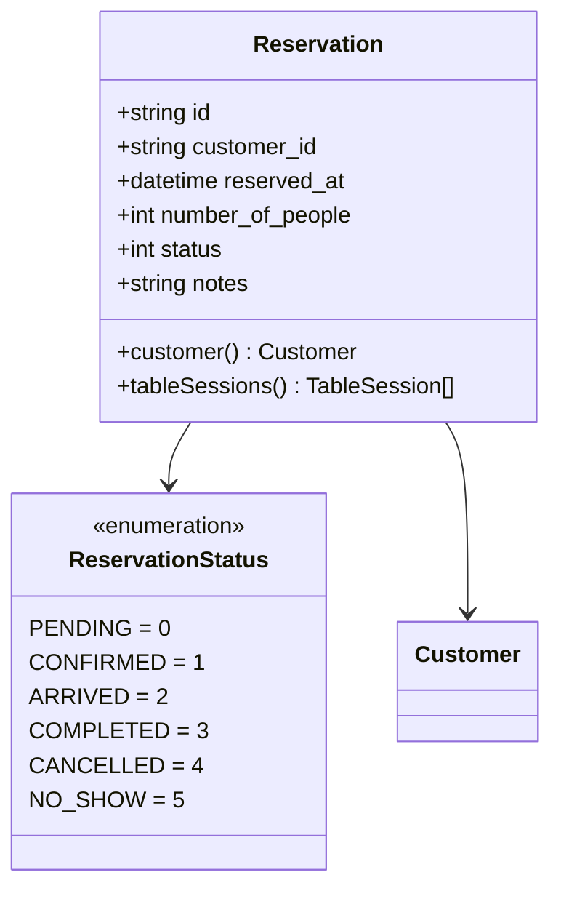

### Reservation Flow

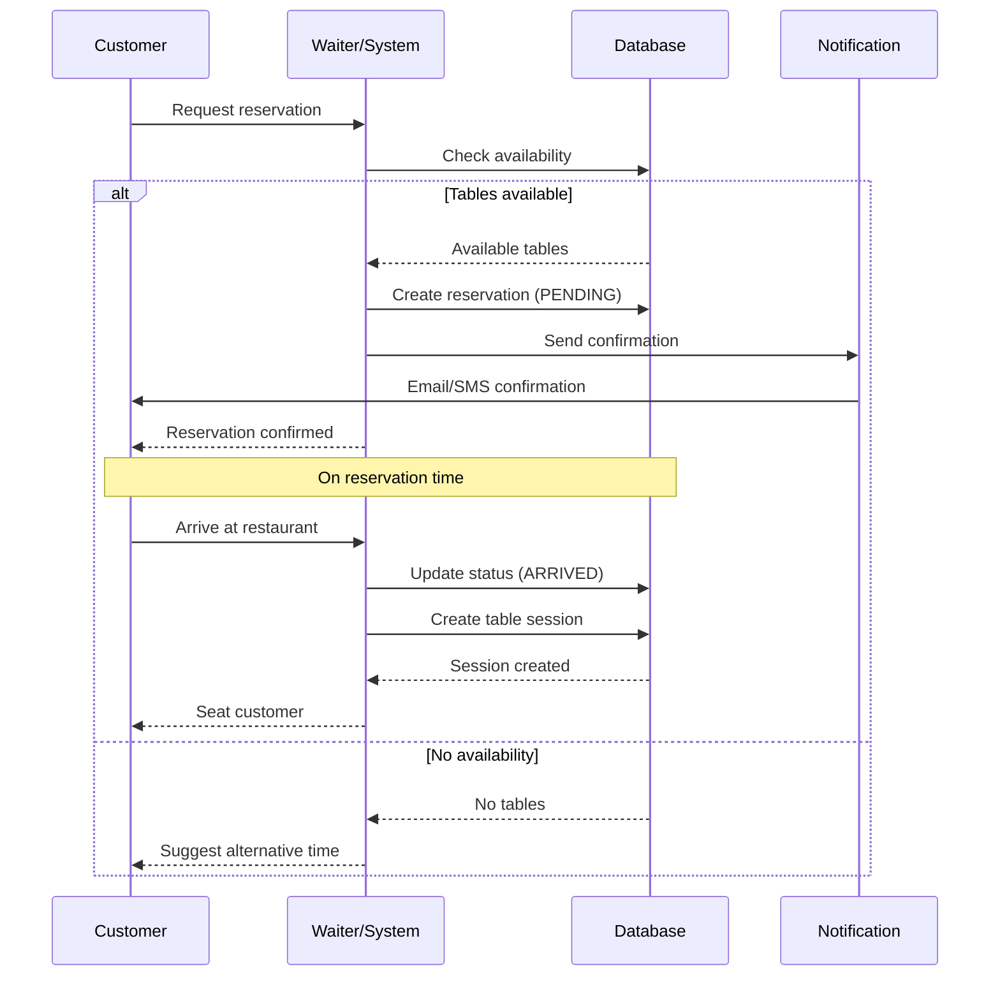

### API Endpoints

```http
# List reservations
GET /api/reservations
Query: ?date=2025-10-21&status=confirmed&customer_id=CUS123

# Create reservation
POST /api/reservations
{
  "customer_id": "CUS123ABC",
  "reserved_at": "2025-10-21T19:00:00Z",
  "number_of_people": 4,
  "notes": "Birthday celebration"
}

# Update reservation
PUT /api/reservations/{id}
{
  "status": 1,  // CONFIRMED
  "reserved_at": "2025-10-21T19:30:00Z"
}

# Cancel reservation
DELETE /api/reservations/{id}

# Mark as no-show
POST /api/reservations/{id}/no-show
```

## 🔄 Table Sessions

### Entity Structure

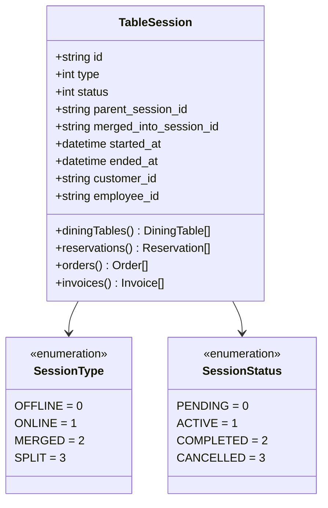

### Session Lifecycle

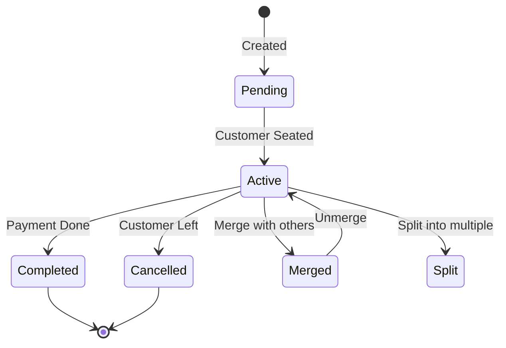

### Merge/Split Tables Feature

#### Merge Tables

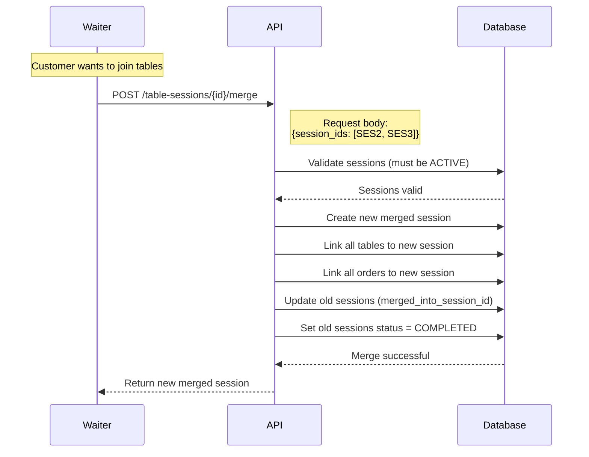

#### Split Tables

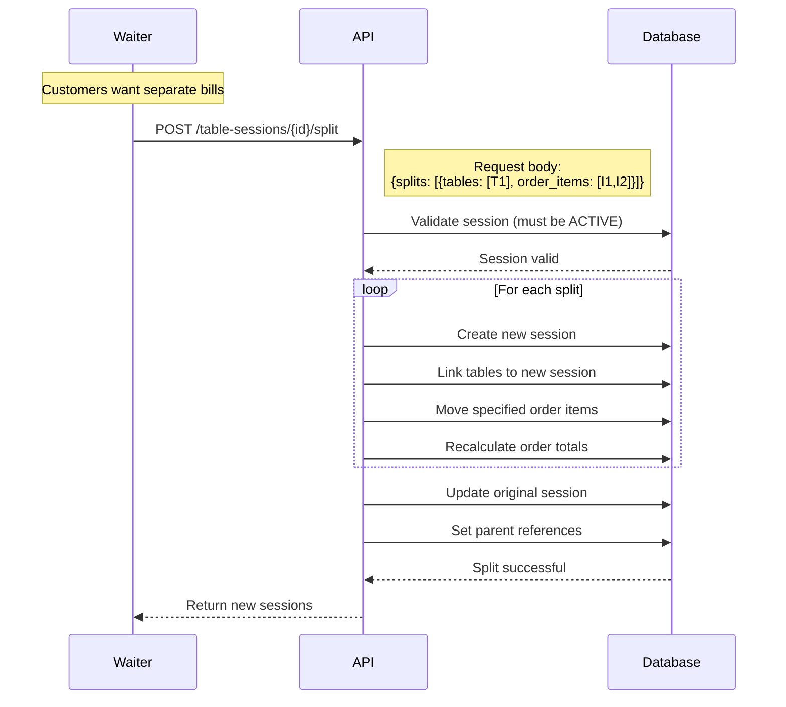

### API Endpoints

```http
# List sessions
GET /api/table-sessions
Query: ?status=active&date=2025-10-21&employee_id=EMP123

# Create session (seat customer)
POST /api/table-sessions
{
  "type": 0,  // OFFLINE
  "dining_table_ids": ["TBL001", "TBL002"],
  "customer_id": "CUS123ABC",
  "employee_id": "EMP456DEF",
  "reservation_id": "RES789GHI"  // Optional
}

# Get session details
GET /api/table-sessions/{id}
Query: ?include=diningTables,orders,customer,employee

# Update session
PUT /api/table-sessions/{id}
{
  "status": 1,  // ACTIVE
  "customer_id": "CUS123ABC"
}

# Merge sessions
POST /api/table-sessions/{id}/merge
{
  "session_ids": ["SES002", "SES003"]
}

# Split session
POST /api/table-sessions/{id}/split
{
  "splits": [
    {
      "dining_table_ids": ["TBL001"],
      "order_item_ids": ["ITM001", "ITM002"]
    },
    {
      "dining_table_ids": ["TBL002"],
      "order_item_ids": ["ITM003"]
    }
  ]
}

# Unmerge session (restore original sessions)
POST /api/table-sessions/{id}/unmerge

# End session
POST /api/table-sessions/{id}/end
```

## 🍽 Orders

### Entity Structure

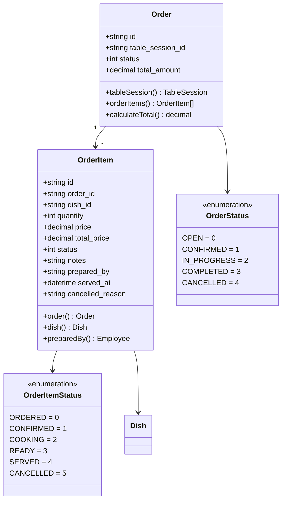

### Order Flow

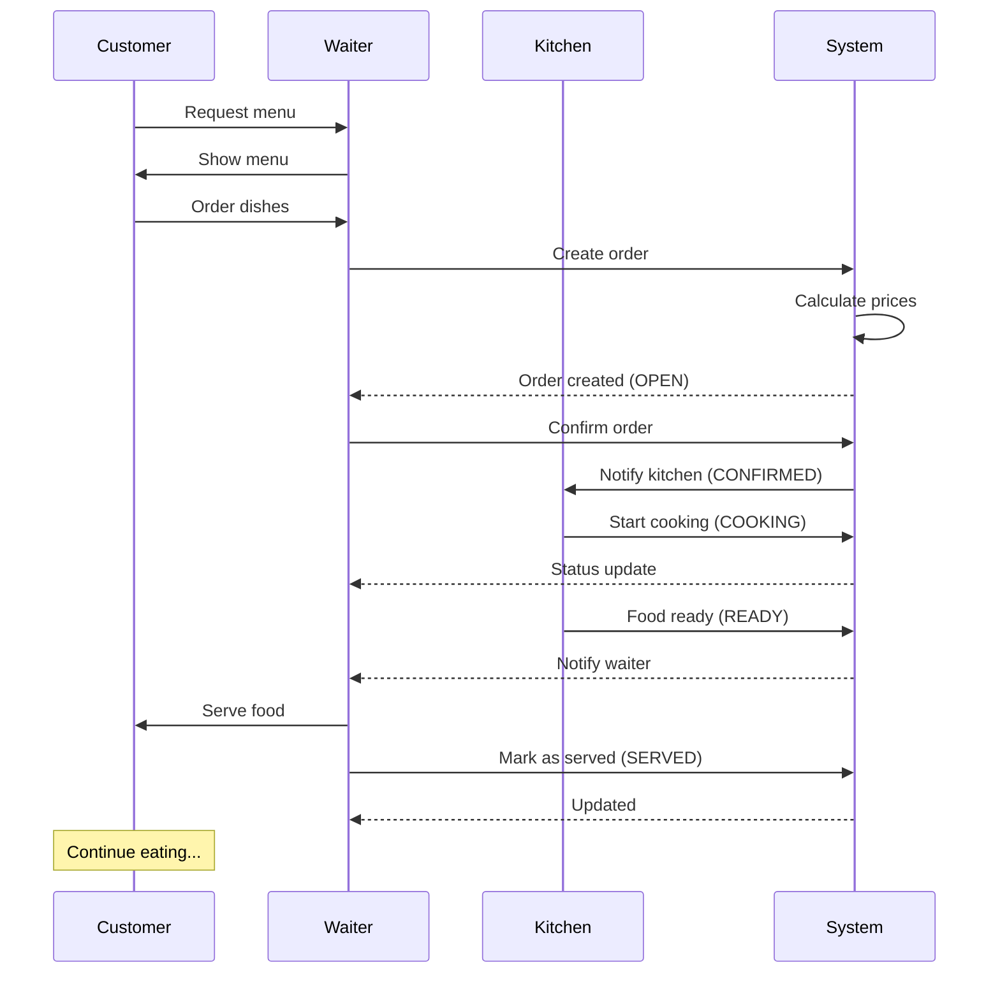

### Order Item State Machine

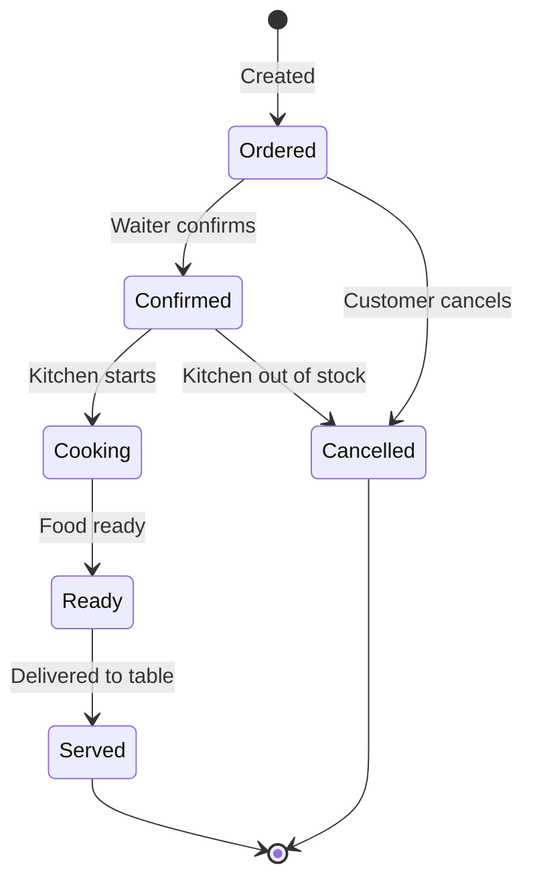

### API Endpoints

```http
# List orders
GET /api/orders
Query: ?table_session_id=SES123&status=confirmed&date=2025-10-21

# Create order
POST /api/orders
{
  "table_session_id": "SES123ABC",
  "items": [
    {
      "dish_id": "DSH001",
      "quantity": 2,
      "notes": "No onions"
    },
    {
      "dish_id": "DSH002",
      "quantity": 1
    }
  ]
}

# Get order details
GET /api/orders/{id}
Query: ?include=orderItems.dish,tableSession

# Update order
PUT /api/orders/{id}
{
  "status": 1  // CONFIRMED
}

# Add items to order
POST /api/orders/{id}/items
{
  "items": [
    {
      "dish_id": "DSH003",
      "quantity": 1
    }
  ]
}

# Update order item status
PUT /api/order-items/{id}/status
{
  "status": 2,  // COOKING
  "prepared_by": "EMP123ABC"
}

# Cancel order item
POST /api/order-items/{id}/cancel
{
  "reason": "Out of stock"
}

# Delete order (before confirmation)
DELETE /api/orders/{id}
```

## 📊 Business Logic

### Total Calculation

```php
// Order total calculation
class Order extends BaseModel
{
    public function calculateTotal(): float
    {
        return $this->orderItems()
            ->whereNotIn('status', [OrderItemStatus::CANCELLED])
            ->sum('total_price');
    }
    
    // Auto-update on item changes
    protected static function booted()
    {
        static::updating(function ($order) {
            $order->total_amount = $order->calculateTotal();
        });
    }
}

// OrderItem total calculation
class OrderItem extends BaseModel
{
    protected static function booted()
    {
        static::saving(function ($item) {
            $item->total_price = $item->price * $item->quantity;
        });
    }
}
```

### Table Availability Check

```php
class DiningTable extends BaseModel
{
    public function isAvailable(): bool
    {
        if (!$this->is_active) {
            return false;
        }
        
        // Check if table has active session
        return !$this->currentSession()->exists();
    }
    
    public function currentSession()
    {
        return $this->belongsToMany(TableSession::class)
            ->wherePivotIn('status', [
                SessionStatus::PENDING,
                SessionStatus::ACTIVE
            ]);
    }
}
```

### Reservation Conflict Detection

```php
class Reservation extends BaseModel
{
    public static function hasConflict(
        Carbon $reservedAt,
        int $durationMinutes = 120,
        int $numberOfPeople = 1
    ): bool {
        $startTime = $reservedAt;
        $endTime = $reservedAt->copy()->addMinutes($durationMinutes);
        
        // Check overlapping reservations
        $conflicts = self::where('status', '!=', ReservationStatus::CANCELLED)
            ->where(function ($query) use ($startTime, $endTime) {
                $query->whereBetween('reserved_at', [$startTime, $endTime])
                    ->orWhere(function ($q) use ($startTime) {
                        $q->where('reserved_at', '<=', $startTime)
                          ->whereRaw('DATE_ADD(reserved_at, INTERVAL 120 MINUTE) >= ?', [$startTime]);
                    });
            })
            ->count();
            
        // Check if we have enough capacity
        $availableTables = DiningTable::where('is_active', true)
            ->where('capacity', '>=', $numberOfPeople)
            ->count();
            
        return $conflicts >= $availableTables;
    }
}
```

## 📈 Statistics & Reports

```http
# Table utilization
GET /api/statistics/tables
Query: ?from=2025-10-01&to=2025-10-31

Response:
{
  "data": {
    "total_tables": 20,
    "average_utilization": 75.5,  // %
    "most_popular_tables": [1, 5, 10],
    "least_popular_tables": [15, 18],
    "peak_hours": ["12:00-14:00", "19:00-21:00"]
  }
}

# Order statistics
GET /api/statistics/orders
Query: ?from=2025-10-01&to=2025-10-31

Response:
{
  "data": {
    "total_orders": 1250,
    "total_revenue": 125000000,
    "average_order_value": 100000,
    "most_ordered_dishes": [
      {"dish_id": "DSH001", "name": "Phở", "count": 320},
      {"dish_id": "DSH005", "name": "Bún chả", "count": 280}
    ]
  }
}
```

## 🔔 Notifications (Future Enhancement)

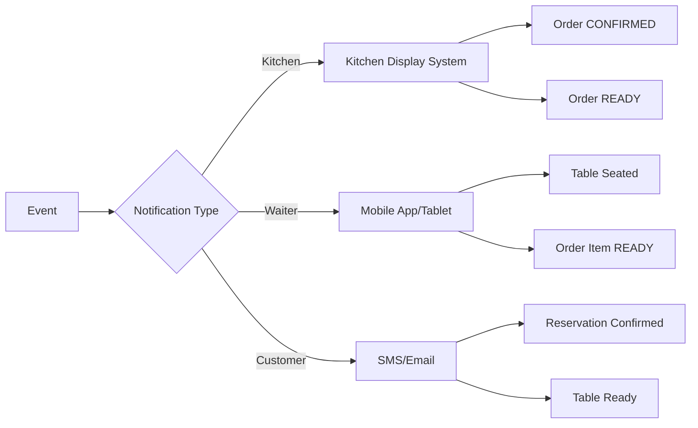

---

## 🔗 Related Documents

- **Previous**: [08-AUTHORIZATION.md](./08-AUTHORIZATION.md)
- **Next**: [11-MENU-DISH-MANAGEMENT.md](./11-MENU-DISH-MANAGEMENT.md)
- **See also**: [03-DATA-MODEL.md](./03-DATA-MODEL.md) - Table/Order models
- **See also**: [13-BILLING-PAYMENT.md](./13-BILLING-PAYMENT.md) - Invoice generation

---

**📅 Last Updated:** October 21, 2025  
**👤 Author:** Development Team
