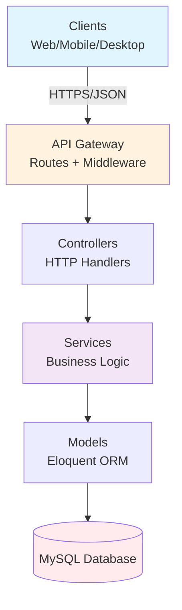
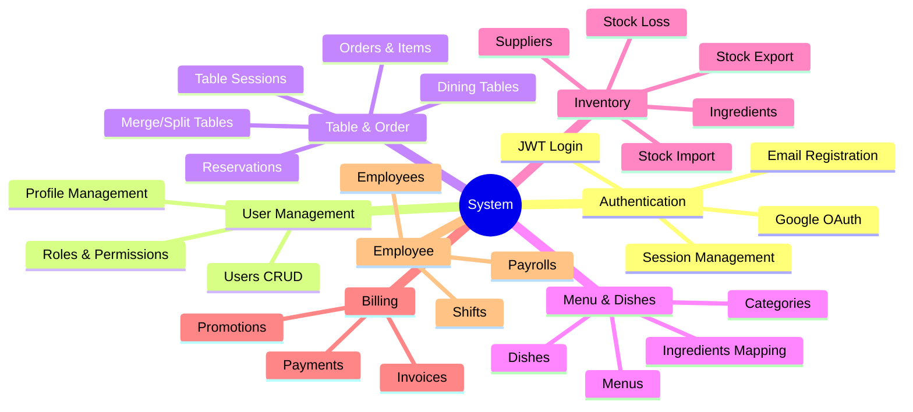

# 📚 Tổng Quan Kiến Trúc Hệ Thống

> **Restaurant Management System - Backend API**  
> **Version:** 1.0.0 | **Last Updated:** October 21, 2025

## 🎯 Giới Thiệu

Đây là **tài liệu tổng hợp kiến trúc** cho hệ thống quản lý nhà hàng. Tài liệu được chia thành nhiều file nhỏ, mỗi file tập trung vào một khía cạnh cụ thể của hệ thống để dễ đọc và maintain.

## 📖 Cách Sử Dụng Tài Liệu

### Cho Developer Mới

Nếu bạn mới join project, đọc theo thứ tự sau:

1. ✅ **[00-INDEX.md](./00-INDEX.md)** - Mục lục tổng hợp
2. ✅ **[01-SYSTEM-OVERVIEW.md](./01-SYSTEM-OVERVIEW.md)** - Hiểu tổng quan hệ thống
3. ✅ **[02-FOLDER-STRUCTURE.md](./02-FOLDER-STRUCTURE.md)** - Nắm cấu trúc thư mục
4. ✅ **[03-DATA-MODEL.md](./03-DATA-MODEL.md)** - Hiểu mô hình dữ liệu
5. ✅ **[07-AUTHENTICATION.md](./07-AUTHENTICATION.md)** - Hiểu cách xác thực
6. ✅ **[08-AUTHORIZATION.md](./08-AUTHORIZATION.md)** - Hiểu phân quyền RBAC

### Cho Backend Developer

Nếu bạn làm việc với API:

- **[05-API-ARCHITECTURE.md](./05-API-ARCHITECTURE.md)** - Kiến trúc API tổng thể
- **[07-AUTHENTICATION.md](./07-AUTHENTICATION.md)** - JWT & OAuth implementation
- **[10-TABLE-ORDER-MANAGEMENT.md](./10-TABLE-ORDER-MANAGEMENT.md)** - Business logic chính

### Cho Database Developer

Nếu bạn làm việc với database:

- **[03-DATA-MODEL.md](./03-DATA-MODEL.md)** - ERD và relationships
- **[04-DATABASE-SCHEMA.md](./04-DATABASE-SCHEMA.md)** - Chi tiết schema (to be created)

### Cho DevOps/Deployment

Nếu bạn triển khai hệ thống:

- **[18-DEPLOYMENT.md](./18-DEPLOYMENT.md)** - Hướng dẫn deploy (to be created)
- **[19-MONITORING.md](./19-MONITORING.md)** - Monitoring setup (to be created)

## 🏗 Kiến Trúc Tổng Quan

### Tech Stack
```
┌─────────────────────────────────────────┐
│  Laravel 12 + PHP 8.2+                  │
├─────────────────────────────────────────┤
│  MySQL 8.0+ (Primary Database)          │
├─────────────────────────────────────────┤
│  JWT Authentication (Stateless)         │
├─────────────────────────────────────────┤
│  RBAC (Role-Based Access Control)       │
├─────────────────────────────────────────┤
│  RESTful API with Route Attributes      │
└─────────────────────────────────────────┘
```

### Layer Architecture


## 🔐 Security Architecture

### Authentication
- **JWT Access Tokens** (60 min lifetime)
- **Refresh Tokens** (30 days lifetime)
- **HttpOnly Cookies** for refresh tokens
- **Device Fingerprinting** for security
- **OAuth 2.0** (Google Login support)

### Authorization
- **RBAC System** with 16 permission modules
- **7 Predefined Roles**: Super Admin, Admin, Manager, Staff, Cashier, Kitchen, Waiter, Customer
- **100+ Permissions** covering all operations
- **Middleware-based** permission checking

## 📊 Core Business Modules



## 🔑 Key Features

### 1. Custom ID System
- **Format**: `PREFIX` + `RANDOM` (e.g., `USR123ABC`, `ORD456DEF`)
- **Benefits**: Security, no sequential exposure
- **Implementation**: `HasCustomId` trait

### 2. Audit Trail
- **Fields**: `created_by`, `updated_by`, `created_at`, `updated_at`
- **Automatic**: Via `HasAuditFields` trait
- **Use case**: Track who did what and when

### 3. Route Attributes
```php
#[Prefix('api/users')]
#[Middleware(['auth:api'])]
class UserController extends Controller
{
    #[Get('/', middleware: ['permission:users.view'])]
    public function index() { }
}
```

### 4. Table Merge/Split
- **Merge**: Combine multiple tables into one session
- **Split**: Separate bills for different groups
- **Unmerge**: Restore original sessions
- **Use case**: Flexible table management

### 5. Multi-level Permissions
- **Module level**: `users.*`
- **Action level**: `users.view`, `users.create`, `users.edit`, `users.delete`
- **Special actions**: `table-sessions.merge`, `table-sessions.split`

## 📈 Data Flow Examples

### Order Creation Flow
```
Waiter → Create Order → Validate Dishes → Calculate Total → Save to DB → Notify Kitchen
```

### Payment Flow
```
Customer Request → Generate Invoice → Apply Promotions → Process Payment → Update Session → Release Table
```

### Reservation Flow
```
Customer Request → Check Availability → Create Reservation → Send Confirmation → Create Session on Arrival
```

## 🔧 Configuration Highlights

### JWT Settings
```php
'ttl' => 60,                    // 60 minutes
'refresh_ttl' => 43200,        // 30 days
'algo' => 'HS256',
'blacklist_enabled' => true,
```

### RBAC Settings
```php
'modules' => [
    'users' => [...],
    'orders' => [...],
    // 16 modules total
],

'roles' => [
    'super_admin' => ['permissions' => '*'],
    'manager' => ['permissions' => [...]],
    // 8 roles total
],
```

## 📝 API Standards

### Request Headers
```http
Content-Type: application/json
Accept: application/json
Authorization: Bearer {access_token}
```

### Response Format
```json
{
  "success": true,
  "message": "Operation successful",
  "data": { ... },
  "meta": { ... }
}
```

### HTTP Status Codes
- **2xx**: Success (200, 201, 204)
- **4xx**: Client errors (400, 401, 403, 404, 422)
- **5xx**: Server errors (500, 503)

## 🚀 Development Best Practices

### Code Organization
✅ **DO:**
- Keep controllers thin
- Use services for business logic
- Use Form Requests for validation
- Follow PSR-12 standards
- Use Route Attributes
- Write tests

❌ **DON'T:**
- Put logic in controllers
- Skip validation
- Hardcode values
- Mix concerns
- Ignore errors

### Database
✅ **DO:**
- Use migrations
- Create relationships
- Add indexes
- Use transactions
- Seed initial data

❌ **DON'T:**
- Edit migrations after merge
- Skip foreign keys
- Forget indexes
- Use raw queries unnecessarily

### Security
✅ **DO:**
- Validate all inputs
- Use prepared statements
- Hash passwords (bcrypt)
- Implement rate limiting
- Log security events
- Use HTTPS in production

❌ **DON'T:**
- Trust user input
- Log sensitive data
- Use weak secrets
- Skip authentication
- Ignore permissions

## 📊 Performance Considerations

### Query Optimization
- **Eager Loading**: `->with(['role', 'profile'])`
- **Select Specific Columns**: `->select(['id', 'name'])`
- **Pagination**: `->paginate(15)`
- **Indexes**: On foreign keys and search fields

### Caching Strategy
```php
// Cache user permissions
Cache::remember("user.{$id}.permissions", 3600, fn() => ...);

// Cache frequently accessed data
Cache::remember("menu.active", 1800, fn() => Menu::active()->get());
```

### API Response Caching
```php
// HTTP cache headers
return response()->json($data)
    ->setMaxAge(300)
    ->setPublic();
```

## 🔍 Monitoring & Debugging

### Logs
```
storage/logs/laravel.log
```

### API Documentation
```
http://localhost:8000/swagger
```

### Health Check
```
GET /api/health
```

## 📚 Documentation Structure

### Architecture Docs (`docs/architecture/`)
- 00-INDEX.md - Mục lục
- 01-SYSTEM-OVERVIEW.md - Tổng quan
- 02-FOLDER-STRUCTURE.md - Cấu trúc
- 03-DATA-MODEL.md - Mô hình dữ liệu
- 05-API-ARCHITECTURE.md - API
- 07-AUTHENTICATION.md - Xác thực
- 08-AUTHORIZATION.md - Phân quyền
- 10-TABLE-ORDER-MANAGEMENT.md - Quản lý bàn/đơn hàng

### Development Docs (`docs/development/`)
- DEVELOPMENT_GUIDE.md
- RBAC_GUIDE.md
- EMAIL_SETUP.md
- GOOGLE_OAUTH_SETUP.md

## 🎓 Learning Resources

### Laravel Documentation
- https://laravel.com/docs/12.x

### JWT Auth
- https://jwt-auth.readthedocs.io/

### API Design
- RESTful API Best Practices
- OpenAPI/Swagger Specification

### Database Design
- Entity-Relationship Modeling
- Database Normalization

## 🤝 Contributing

### Updating Documentation

Khi thêm feature mới:
1. ✅ Update relevant architecture doc
2. ✅ Add diagrams if needed (Mermaid)
3. ✅ Update API endpoints list
4. ✅ Document permissions required
5. ✅ Add examples

### Documentation Standards
- Use Markdown format
- Include Mermaid diagrams
- Add code examples
- Keep it concise
- Update date and version

## 📞 Support

### Internal Resources
- **Architecture Docs**: `docs/architecture/`
- **Development Guides**: `docs/development/`
- **API Docs**: `/swagger`

### External Resources
- Laravel Documentation
- PHP Documentation
- MySQL Documentation

## 🎯 Quick Reference

### Artisan Commands
```bash
php artisan migrate              # Run migrations
php artisan db:seed              # Seed database
php artisan rbac:sync            # Sync permissions
php artisan serve                # Start dev server
php artisan l5-swagger:generate  # Generate API docs
php artisan test                 # Run tests
```

### Common Routes
```
POST   /api/auth/login          # Login
GET    /api/auth/me             # Current user
GET    /api/users               # List users
POST   /api/table-sessions      # Create session
POST   /api/orders              # Create order
POST   /api/invoices            # Create invoice
GET    /swagger                 # API documentation
```

### Permission Examples
```
users.view                       # View users
orders.create                    # Create orders
table-sessions.merge             # Merge tables
invoices.create                  # Generate invoices
payrolls.process                 # Process payroll
```

---

## 📅 Document Version History

| Version | Date | Changes |
|---------|------|---------|
| 1.0.0 | 2025-10-21 | Initial architecture documentation |

---

## ✅ Documentation Checklist

- [x] System overview
- [x] Folder structure
- [x] Data model & ERD
- [x] API architecture
- [x] Authentication system
- [x] Authorization (RBAC)
- [x] Table & Order management
- [ ] Menu & Dish management (to be created)
- [ ] Inventory management (to be created)
- [ ] Billing & Payment (to be created)
- [ ] Employee & Payroll (to be created)
- [ ] Deployment guide (to be created)

---

**📘 Tài liệu được tạo và duy trì bởi Development Team**  
**📧 Contact:** development@restaurant-system.com  
**📅 Last Updated:** October 21, 2025
