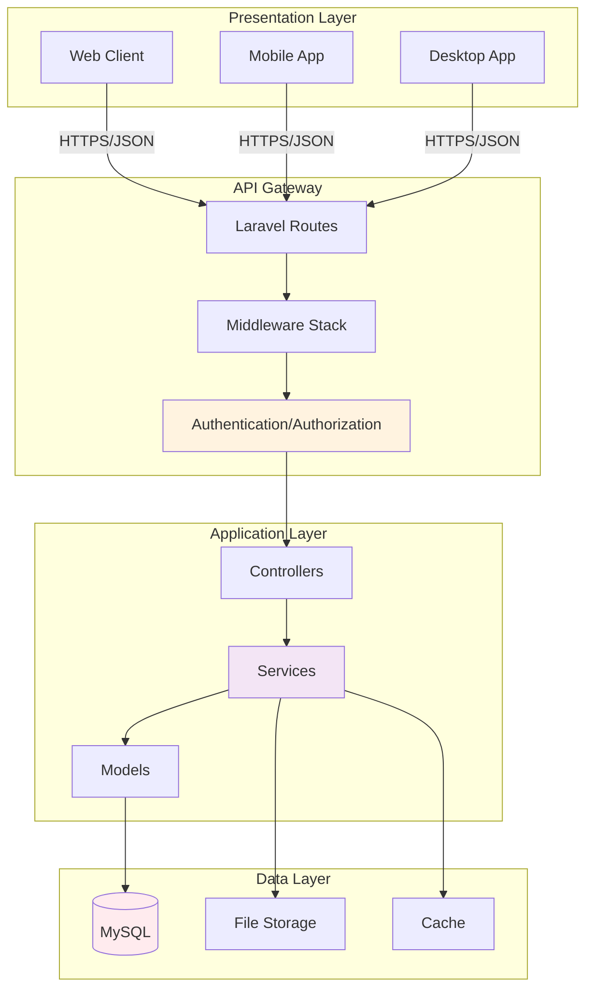

# 🏗️ Kiến Trúc Hệ Thống - Restaurant Management

> **Tài liệu kiến trúc chi tiết cho hệ thống quản lý nhà hàng**

## 📚 Mục Lục Tài Liệu

Tài liệu được tổ chức thành nhiều file riêng biệt, mỗi file tập trung vào một khía cạnh cụ thể:

### 🎯 Bắt Đầu

| File | Mô Tả | Độ Quan Trọng |
|------|-------|---------------|
| **[ARCHITECTURE-SUMMARY.md](./ARCHITECTURE-SUMMARY.md)** | Tổng quan toàn bộ kiến trúc | ⭐⭐⭐⭐⭐ |
| **[00-INDEX.md](./00-INDEX.md)** | Mục lục chi tiết tất cả tài liệu | ⭐⭐⭐⭐⭐ |
| **[01-SYSTEM-OVERVIEW.md](./01-SYSTEM-OVERVIEW.md)** | Tổng quan hệ thống và tech stack | ⭐⭐⭐⭐⭐ |
| **[02-FOLDER-STRUCTURE.md](./02-FOLDER-STRUCTURE.md)** | Cấu trúc thư mục dự án | ⭐⭐⭐⭐ |

### 💾 Database & Models

| File | Mô Tả | Độ Quan Trọng |
|------|-------|---------------|
| **[03-DATA-MODEL.md](./03-DATA-MODEL.md)** | Mô hình dữ liệu với ERD diagrams | ⭐⭐⭐⭐⭐ |
| **[04-DATABASE-SCHEMA.md](./04-DATABASE-SCHEMA.md)** | Chi tiết schema database | ⭐⭐⭐⭐ |

### 🌐 API & Routing

| File | Mô Tả | Độ Quan Trọng |
|------|-------|---------------|
| **[05-API-ARCHITECTURE.md](./05-API-ARCHITECTURE.md)** | Kiến trúc API tổng quan | ⭐⭐⭐⭐⭐ |
| **[06-API-ENDPOINTS.md](./06-API-ENDPOINTS.md)** | Chi tiết tất cả endpoints | ⭐⭐⭐⭐ |

### 🔐 Security

| File | Mô Tả | Độ Quan Trọng |
|------|-------|---------------|
| **[07-AUTHENTICATION.md](./07-AUTHENTICATION.md)** | JWT & OAuth authentication | ⭐⭐⭐⭐⭐ |
| **[08-AUTHORIZATION.md](./08-AUTHORIZATION.md)** | RBAC & Permission system | ⭐⭐⭐⭐⭐ |

### 🍽️ Business Modules

| File | Mô Tả | Độ Quan Trọng |
|------|-------|---------------|
| **[09-USER-MANAGEMENT.md](./09-USER-MANAGEMENT.md)** | Quản lý người dùng | ⭐⭐⭐⭐ |
| **[10-TABLE-ORDER-MANAGEMENT.md](./10-TABLE-ORDER-MANAGEMENT.md)** | Quản lý bàn & đơn hàng | ⭐⭐⭐⭐⭐ |
| **[11-MENU-DISH-MANAGEMENT.md](./11-MENU-DISH-MANAGEMENT.md)** | Quản lý menu & món ăn | ⭐⭐⭐⭐ |
| **[12-INVENTORY-MANAGEMENT.md](./12-INVENTORY-MANAGEMENT.md)** | Quản lý kho & nguyên liệu | ⭐⭐⭐⭐ |
| **[13-BILLING-PAYMENT.md](./13-BILLING-PAYMENT.md)** | Hóa đơn & thanh toán | ⭐⭐⭐⭐ |
| **[14-EMPLOYEE-PAYROLL.md](./14-EMPLOYEE-PAYROLL.md)** | Nhân viên & lương | ⭐⭐⭐⭐ |

### 🔧 Technical Deep Dive

| File | Mô Tả | Độ Quan Trọng |
|------|-------|---------------|
| **[15-SERVICES-LAYER.md](./15-SERVICES-LAYER.md)** | Business logic services | ⭐⭐⭐⭐ |
| **[16-MIDDLEWARE.md](./16-MIDDLEWARE.md)** | Middleware & security | ⭐⭐⭐⭐ |
| **[17-ERROR-HANDLING.md](./17-ERROR-HANDLING.md)** | Error handling & validation | ⭐⭐⭐ |

### 🚀 Deployment & Operations

| File | Mô Tả | Độ Quan Trọng |
|------|-------|---------------|
| **[18-DEPLOYMENT.md](./18-DEPLOYMENT.md)** | Hướng dẫn triển khai | ⭐⭐⭐⭐ |
| **[19-MONITORING.md](./19-MONITORING.md)** | Monitoring & logging | ⭐⭐⭐ |

---

## 🎯 Hướng Dẫn Đọc Tài Liệu

### Cho Developer Mới Tham Gia

**Đọc theo thứ tự:**
1. ✅ [ARCHITECTURE-SUMMARY.md](./ARCHITECTURE-SUMMARY.md) - Hiểu tổng quan
2. ✅ [01-SYSTEM-OVERVIEW.md](./01-SYSTEM-OVERVIEW.md) - Kiến trúc hệ thống
3. ✅ [02-FOLDER-STRUCTURE.md](./02-FOLDER-STRUCTURE.md) - Cấu trúc code
4. ✅ [03-DATA-MODEL.md](./03-DATA-MODEL.md) - Mô hình dữ liệu
5. ✅ [07-AUTHENTICATION.md](./07-AUTHENTICATION.md) - Xác thực
6. ✅ [08-AUTHORIZATION.md](./08-AUTHORIZATION.md) - Phân quyền

**Thời gian:** Khoảng 2-3 giờ

### Cho Backend Developer

**Focus vào:**
- [05-API-ARCHITECTURE.md](./05-API-ARCHITECTURE.md)
- [07-AUTHENTICATION.md](./07-AUTHENTICATION.md)
- [10-TABLE-ORDER-MANAGEMENT.md](./10-TABLE-ORDER-MANAGEMENT.md)
- [15-SERVICES-LAYER.md](./15-SERVICES-LAYER.md)

**Thời gian:** Khoảng 1-2 giờ

### Cho Database Engineer

**Focus vào:**
- [03-DATA-MODEL.md](./03-DATA-MODEL.md)
- [04-DATABASE-SCHEMA.md](./04-DATABASE-SCHEMA.md)

**Thời gian:** Khoảng 1 giờ

### Cho DevOps/SRE

**Focus vào:**
- [18-DEPLOYMENT.md](./18-DEPLOYMENT.md)
- [19-MONITORING.md](./19-MONITORING.md)

**Thời gian:** Khoảng 1 giờ

---

## 📊 Sơ Đồ Kiến Trúc Tổng Quan

### High-Level Architecture



### Tech Stack

```
Frontend: Web/Mobile/Desktop (Separate)
    ↓
Backend: Laravel 12 + PHP 8.2
    ↓
Database: MySQL 8.0+
    ↓
Auth: JWT + OAuth 2.0
    ↓
Authorization: RBAC System
```

---

## 🔑 Key Features

### 1. JWT Authentication
- Access token (60 min)
- Refresh token (30 days)
- Device fingerprinting
- Session management

### 2. RBAC System
- 16 permission modules
- 7 predefined roles
- 100+ permissions
- Dynamic permission check

### 3. Table Management
- Multi-table sessions
- Merge/Split tables
- Reservation system
- Real-time status

### 4. Order Processing
- Multi-level status tracking
- Kitchen integration
- Order modifications
- Cancellation handling

### 5. Custom ID System
- Prefix-based IDs (USR, ORD, DSH, etc.)
- No sequential exposure
- Better security

---

## 🛠️ Tech Stack Details

### Backend
- **Framework**: Laravel 12
- **Language**: PHP 8.2+
- **Architecture**: Layered (Controller → Service → Model)

### Database
- **Primary**: MySQL 8.0+
- **ORM**: Eloquent
- **Migrations**: Version controlled

### Authentication
- **JWT**: tymon/jwt-auth 2.2
- **OAuth**: Laravel Socialite (Google)
- **Sessions**: Stateless

### API
- **Style**: RESTful
- **Routing**: Route Attributes (Spatie)
- **Documentation**: Swagger/OpenAPI (L5-Swagger)

### Security
- **RBAC**: Custom implementation
- **Encryption**: bcrypt for passwords
- **CORS**: Configurable
- **Rate Limiting**: Built-in

---

## 📝 Document Status

| Document | Status | Last Updated |
|----------|--------|--------------|
| ARCHITECTURE-SUMMARY.md | ✅ Complete | 2025-10-21 |
| 00-INDEX.md | ✅ Complete | 2025-10-21 |
| 01-SYSTEM-OVERVIEW.md | ✅ Complete | 2025-10-21 |
| 02-FOLDER-STRUCTURE.md | ✅ Complete | 2025-10-21 |
| 03-DATA-MODEL.md | ✅ Complete | 2025-10-21 |
| 04-DATABASE-SCHEMA.md | 📝 To be created | - |
| 05-API-ARCHITECTURE.md | ✅ Complete | 2025-10-21 |
| 06-API-ENDPOINTS.md | 📝 To be created | - |
| 07-AUTHENTICATION.md | ✅ Complete | 2025-10-21 |
| 08-AUTHORIZATION.md | ✅ Complete | 2025-10-21 |
| 09-USER-MANAGEMENT.md | 📝 To be created | - |
| 10-TABLE-ORDER-MANAGEMENT.md | ✅ Complete | 2025-10-21 |
| 11-MENU-DISH-MANAGEMENT.md | 📝 To be created | - |
| 12-INVENTORY-MANAGEMENT.md | 📝 To be created | - |
| 13-BILLING-PAYMENT.md | 📝 To be created | - |
| 14-EMPLOYEE-PAYROLL.md | 📝 To be created | - |
| 15-SERVICES-LAYER.md | 📝 To be created | - |
| 16-MIDDLEWARE.md | 📝 To be created | - |
| 17-ERROR-HANDLING.md | 📝 To be created | - |
| 18-DEPLOYMENT.md | 📝 To be created | - |
| 19-MONITORING.md | 📝 To be created | - |

**Legend:**
- ✅ Complete - Đã hoàn thành
- 📝 To be created - Sẽ được tạo
- 🔄 In progress - Đang cập nhật

---

## 🤝 Đóng Góp

### Cập Nhật Tài Liệu

Khi có thay đổi về hệ thống:
1. ✅ Cập nhật file tương ứng
2. ✅ Thêm diagrams nếu cần
3. ✅ Cập nhật version và ngày
4. ✅ Review bởi team lead

### Tiêu Chuẩn

- **Format**: Markdown
- **Diagrams**: Mermaid
- **Code Examples**: Có syntax highlighting
- **Độ dài**: Ngắn gọn, rõ ràng
- **Ngôn ngữ**: Tiếng Việt có dấu

---

## 📞 Liên Hệ

- **Email**: development@restaurant-system.com
- **Slack**: #architecture-docs
- **Wiki**: Internal wiki system

---

## 📅 Version History

| Version | Date | Author | Changes |
|---------|------|--------|---------|
| 1.0.0 | 2025-10-21 | Dev Team | Initial architecture documentation |

---

**🎓 Happy Learning!**  
**📖 Documentation maintained by Development Team**

---

## Quick Links

- [Main README](../../README.md)
- [Development Guide](../development/DEVELOPMENT_GUIDE.md)
- [API Documentation](http://localhost:8000/swagger)
- [GitHub Repository](#)
