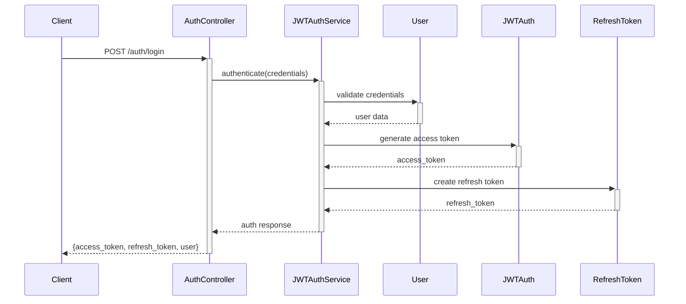
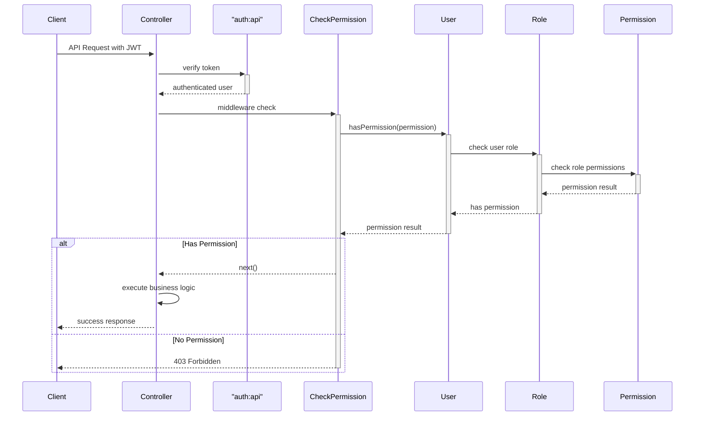

# Hướng Dẫn Phát Triển Hệ Thống Restaurant Management System

## Mục Lục
1. [Tổng Quan Kiến Trúc](#1-tổng-quan-kiến-trúc)
2. [Standards và Conventions](#2-standards-và-conventions)
3. [Cấu Trúc Database](#3-cấu-trúc-database)
4. [Hệ Thống Authentication & Authorization](#4-hệ-thống-authentication--authorization)
5. [Phát Triển Controller Mới](#5-phát-triển-controller-mới)
6. [Phát Triển Model Mới](#6-phát-triển-model-mới)
7. [Phát Triển Service](#7-phát-triển-service)
8. [Migration và Database](#8-migration-và-database)
9. [API Documentation](#9-api-documentation)
10. [Testing](#10-testing)
11. [Workflow Phát Triển](#11-workflow-phát-triển)

---

## 1. Tổng Quan Kiến Trúc

### 1.1 Kiến Trúc Hệ Thống
Hệ thống được xây dựng theo mô hình **API-First Backend** với các đặc điểm chính:

- **Laravel 12** với PHP 8.2+
- **JWT Authentication** cho stateless authentication
- **Role-Based Access Control (RBAC)** cho phân quyền chi tiết
- **Route Attributes** thay vì route files truyền thống
- **OpenAPI/Swagger** cho documentation
- **Custom ID Generation** thay vì auto-increment

### 1.2 Cấu Trúc Thư Mục
```
app/
├── Http/
│   ├── Controllers/
│   │   └── Api/           # API Controllers
│   │       ├── AuthController.php
│   │       ├── UserController.php
│   │       ├── RoleController.php
│   │       ├── PermissionController.php
│   │       └── Traits/
│   │           └── ApiResponseTrait.php
│   └── Middleware/
│       └── CheckPermission.php
├── Models/
│   ├── BaseModel.php      # Base model với custom ID
│   ├── BaseAuthenticatable.php
│   ├── User.php
│   ├── Role.php
│   ├── Permission.php
│   └── Traits/
│       ├── HasCustomId.php
│       └── HasAuditFields.php
├── Services/
│   └── JWTAuthService.php
└── Helpers/               # Helper functions
```

### 1.3 Tech Stack
- **Backend Framework**: Laravel 12
- **Authentication**: tymon/jwt-auth
- **API Documentation**: darkaonline/l5-swagger (OpenAPI 3.0)
- **Route Management**: spatie/laravel-route-attributes
- **Database**: MySQL
- **Caching**: Redis (not implement)

---

## 2. Standards và Conventions

### 2.1 Naming Conventions

#### Database Tables
```
users          # Lowercase, plural
roles          # Lowercase, plural
permissions    # Lowercase, plural
role_permission # Pivot tables: alphabetical order
```

#### Models
```php
User           # Singular, PascalCase
Role           # Singular, PascalCase
Permission     # Singular, PascalCase
```

#### Controllers
```php
UserController        # Resource + Controller
AuthController        # Function + Controller
PermissionController  # Resource + Controller
```

#### Routes & Endpoints
```
GET    /api/users           # Index - list resources
POST   /api/users           # Store - create new resource
GET    /api/users/{id}      # Show - get specific resource
PUT    /api/users/{id}      # Update - update resource
DELETE /api/users/{id}      # Destroy - delete resource
```

#### Permissions
```
users.view          # module.action
users.create        # module.action
users.update        # module.action
users.delete        # module.action
roles.assign        # module.action
```

### 2.2 ID Generation Pattern
Hệ thống sử dụng **Custom ID** thay vì auto-increment:

```php
User: U + 8 random characters     # U12345678
Role: R + 8 random characters     # R12345678
Permission: P + 8 random characters # P12345678
```

### 2.3 Response Format
Tất cả API response phải tuân theo format chuẩn được thiết kế ApiResponseTrait.php

```json
{
    "status": "success|error",
    "message": "Human readable message",
    "data": {
        // Response data hoặc error details
    }
}
```

---

## 3. Cấu Trúc Database

### 3.1 Base Model Structure
Tất cả models đều kế thừa từ `BaseModel` hoặc `BaseAuthenticatable`:

```php
// Các field bắt buộc trong mọi table
id               VARCHAR(10) PRIMARY KEY    # Custom ID
created_at       TIMESTAMP
updated_at       TIMESTAMP
created_by       VARCHAR(10) NULLABLE       # User ID created
updated_by       VARCHAR(10) NULLABLE       # User ID updated
```

### 3.2 Authentication Tables

#### users table
```sql
id               VARCHAR(10) PRIMARY KEY
name             VARCHAR(100) NOT NULL
email            VARCHAR(100) UNIQUE NOT NULL
password         VARCHAR(255) NOT NULL
status           TINYINT DEFAULT 1          # 0=inactive, 1=active, 2=pending, 3=banned, 4=deleted
avatar           VARCHAR(255) NULLABLE
role_id          VARCHAR(10) NULLABLE
email_verified_at TIMESTAMP NULLABLE
remember_token   VARCHAR(100) NULLABLE
created_at       TIMESTAMP
updated_at       TIMESTAMP
created_by       VARCHAR(10) NULLABLE
updated_by       VARCHAR(10) NULLABLE
```

#### roles table
```sql
id               VARCHAR(10) PRIMARY KEY
name             VARCHAR(50) NOT NULL
description      VARCHAR(200) NULLABLE
is_active        BOOLEAN DEFAULT true
created_at       TIMESTAMP
updated_at       TIMESTAMP
created_by       VARCHAR(10) NULLABLE
updated_by       VARCHAR(10) NULLABLE
```

#### permissions table
```sql
id               VARCHAR(10) PRIMARY KEY
code             VARCHAR(50) UNIQUE NOT NULL    # users.view, users.create
name             VARCHAR(50) NOT NULL
description      VARCHAR(200) NULLABLE
is_active        BOOLEAN DEFAULT true
created_at       TIMESTAMP
updated_at       TIMESTAMP
created_by       VARCHAR(10) NULLABLE
updated_by       VARCHAR(10) NULLABLE
```

#### role_permission table
```sql
role_id          VARCHAR(10) NOT NULL
permission_id    VARCHAR(10) NOT NULL
PRIMARY KEY (role_id, permission_id)
```

#### refresh_tokens table
```sql
id               VARCHAR(10) PRIMARY KEY
user_id          VARCHAR(10) NOT NULL
token            VARCHAR(500) UNIQUE NOT NULL
expires_at       TIMESTAMP NOT NULL
ip_address       VARCHAR(45) NULLABLE
user_agent       TEXT NULLABLE
is_active        BOOLEAN DEFAULT true
created_at       TIMESTAMP
updated_at       TIMESTAMP
```

---

## 4. Hệ Thống Authentication & Authorization

### 4.1 JWT Authentication Flow



### 4.2 Permission Check Flow



### 4.3 Authentication Service Implementation

**JWTAuthService** chịu trách nhiệm:
- Authenticate user credentials
- Generate access & refresh tokens
- Token refresh logic
- Session management
- Token revocation

```php
// Core methods trong JWTAuthService
authenticate(array $credentials, Request $request): ?array
refreshToken(string $refreshTokenString, Request $request): ?array
logout(string $refreshTokenString): bool
revokeToken(string $tokenId, User $user): bool
getUserSessions(User $user): Collection
```

---

## 5. Phát Triển Controller Mới

### 5.1 Template Controller

```php
<?php

namespace App\Http\Controllers\Api;

use App\Http\Controllers\Controller;
use App\Models\{ModelName};
use Illuminate\Http\Request;
use Illuminate\Http\JsonResponse;
use Illuminate\Support\Facades\Validator;
use OpenApi\Attributes as OA;
use Spatie\RouteAttributes\Attributes\Get;
use Spatie\RouteAttributes\Attributes\Post;
use Spatie\RouteAttributes\Attributes\Put;
use Spatie\RouteAttributes\Attributes\Delete;
use Spatie\RouteAttributes\Attributes\Middleware;
use Spatie\RouteAttributes\Attributes\Prefix;

/**
 * @OA\Tag(
 *     name="ModuleName",
 *     description="API Endpoints for ModuleName Management"
 * )
 */
#[Prefix('module-name')]
#[Middleware('auth:api')]
class ModuleNameController extends Controller
{
    /**
     * Display a listing of the resource.
     */
    #[Get('/', middleware: ['permission:module_name.view'])]
    public function index(Request $request): JsonResponse
    {
        $perPage = min($request->get('per_page', 15), 100);
        
        $items = ModelName::orderBy('created_at', 'desc')
            ->paginate($perPage);

        return $this->successResponse(
            $items,
            'Items retrieved successfully'
        );
    }

    /**
     * Store a newly created resource.
     */
    #[Post('/', middleware: ['permission:module_name.create'])]
    public function store(Request $request): JsonResponse
    {
        $validator = Validator::make($request->all(), [
            'name' => 'required|string|max:100',
            // Add other validation rules
        ]);

        if ($validator->fails()) {
            return $this->errorResponse(
                'Validation failed',
                $validator->errors(),
                422
            );
        }

        $item = ModelName::create($request->validated());

        return $this->successResponse(
            $item,
            'Item created successfully',
            201
        );
    }

    /**
     * Display the specified resource.
     */
    #[Get('/{id}', middleware: ['permission:module_name.view'])]
    public function show(string $id): JsonResponse
    {
        $item = ModelName::find($id);
        
        if (!$item) {
            return $this->errorResponse('Item not found', [], 404);
        }

        return $this->successResponse($item, 'Item retrieved successfully');
    }

    /**
     * Update the specified resource.
     */
    #[Put('/{id}', middleware: ['permission:module_name.update'])]
    public function update(Request $request, string $id): JsonResponse
    {
        $item = ModelName::find($id);
        
        if (!$item) {
            return $this->errorResponse('Item not found', [], 404);
        }

        $validator = Validator::make($request->all(), [
            'name' => 'sometimes|required|string|max:100',
            // Add other validation rules
        ]);

        if ($validator->fails()) {
            return $this->errorResponse(
                'Validation failed',
                $validator->errors(),
                422
            );
        }

        $item->update($request->validated());

        return $this->successResponse($item, 'Item updated successfully');
    }

    /**
     * Remove the specified resource.
     */
    #[Delete('/{id}', middleware: ['permission:module_name.delete'])]
    public function destroy(string $id): JsonResponse
    {
        $item = ModelName::find($id);
        
        if (!$item) {
            return $this->errorResponse('Item not found', [], 404);
        }

        $item->delete();

        return $this->successResponse([], 'Item deleted successfully');
    }
}
```

### 5.2 Checklist Phát Triển Controller

- [ ] Kế thừa từ `Controller` base class
- [ ] Sử dụng `ApiResponseTrait` cho standardized responses
- [ ] Implement Route Attributes cho tất cả endpoints
- [ ] Thêm Permission middleware cho mọi endpoint
- [ ] Validation cho tất cả input data
- [ ] OpenAPI documentation cho mọi endpoint
- [ ] Error handling đầy đủ
- [ ] Pagination cho list endpoints
- [ ] Proper HTTP status codes

---

## 6. Phát Triển Model Mới

### 6.1 Template Model

```php
<?php

namespace App\Models;

use App\Models\BaseModel;
use Illuminate\Database\Eloquent\Relations\BelongsTo;
use Illuminate\Database\Eloquent\Relations\HasMany;
use Illuminate\Database\Eloquent\Relations\BelongsToMany;

class ModelName extends BaseModel
{
    /**
     * The table associated with the model.
     */
    protected $table = 'table_name';

    /**
     * ID prefix for custom ID generation.
     */
    protected $idPrefix = 'TN'; // Table Name prefix

    /**
     * The attributes that are mass assignable.
     */
    protected $fillable = [
        'name',
        'description',
        'status',
        // Add other fillable fields
    ];

    /**
     * The attributes that should be hidden for serialization.
     */
    protected $hidden = [
        'created_by',
        'updated_by',
    ];

    /**
     * Get the attributes that should be cast.
     */
    protected function casts(): array
    {
        return [
            'created_at' => 'datetime',
            'updated_at' => 'datetime',
            'status' => 'integer',
            'is_active' => 'boolean',
        ];
    }

    /**
     * Define relationships
     */
    public function user(): BelongsTo
    {
        return $this->belongsTo(User::class, 'user_id');
    }

    public function items(): HasMany
    {
        return $this->hasMany(RelatedModel::class, 'parent_id');
    }

    public function tags(): BelongsToMany
    {
        return $this->belongsToMany(Tag::class, 'model_tag', 'model_id', 'tag_id');
    }

    /**
     * Scopes
     */
    public function scopeActive($query)
    {
        return $query->where('is_active', true);
    }

    public function scopeByStatus($query, $status)
    {
        return $query->where('status', $status);
    }

    /**
     * Accessors & Mutators
     */
    public function getFullNameAttribute(): string
    {
        return "{$this->name} - {$this->description}";
    }

    /**
     * Business Logic Methods
     */
    public function isActive(): bool
    {
        return $this->is_active === true;
    }

    public function canBeDeleted(): bool
    {
        // Add business logic for deletion constraints
        return $this->items()->count() === 0;
    }
}
```

### 6.2 Checklist Phát Triển Model

- [ ] Kế thừa từ `BaseModel` (hoặc `BaseAuthenticatable` cho auth models)
- [ ] Định nghĩa `$table` property
- [ ] Định nghĩa `$idPrefix` cho custom ID
- [ ] Thiết lập `$fillable` attributes
- [ ] Thiết lập `$hidden` attributes cho sensitive data
- [ ] Định nghĩa `casts()` method cho type casting
- [ ] Implement relationships (belongsTo, hasMany, belongsToMany)
- [ ] Thêm query scopes hữu ích
- [ ] Thêm accessors/mutators nếu cần
- [ ] Implement business logic methods

---

## 7. Phát Triển Service

### 7.1 Khi Nào Cần Service Class

Service classes được sử dụng khi:
- Business logic phức tạp
- Xử lý nhiều models cùng lúc
- External API calls
- Complex data transformations
- Email/notification logic
- File upload/processing

### 7.2 Template Service

```php
<?php

namespace App\Services;

use App\Models\ModelName;
use Illuminate\Support\Collection;
use Illuminate\Support\Facades\DB;
use Illuminate\Support\Facades\Log;

class ModuleNameService
{
    /**
     * Process complex business logic
     */
    public function processComplexOperation(array $data): array
    {
        DB::beginTransaction();
        
        try {
            // Step 1: Validate business rules
            $this->validateBusinessRules($data);
            
            // Step 2: Process main operation
            $result = $this->executeMainOperation($data);
            
            // Step 3: Handle side effects
            $this->handleSideEffects($result, $data);
            
            DB::commit();
            
            Log::info('Complex operation completed successfully', [
                'operation' => 'processComplexOperation',
                'result_id' => $result->id
            ]);
            
            return [
                'success' => true,
                'data' => $result,
                'message' => 'Operation completed successfully'
            ];
            
        } catch (\Exception $e) {
            DB::rollBack();
            
            Log::error('Complex operation failed', [
                'operation' => 'processComplexOperation',
                'error' => $e->getMessage(),
                'data' => $data
            ]);
            
            return [
                'success' => false,
                'data' => null,
                'message' => 'Operation failed: ' . $e->getMessage()
            ];
        }
    }

    /**
     * Private helper methods
     */
    private function validateBusinessRules(array $data): void
    {
        // Implement business validation logic
        if (empty($data['required_field'])) {
            throw new \InvalidArgumentException('Required field is missing');
        }
    }

    private function executeMainOperation(array $data): ModelName
    {
        // Main business logic implementation
        return ModelName::create($data);
    }

    private function handleSideEffects($result, array $data): void
    {
        // Handle any side effects like notifications, cache updates, etc.
    }
}
```

### 7.3 Service Integration trong Controller

```php
class ModuleNameController extends Controller
{
    protected ModuleNameService $service;

    public function __construct(ModuleNameService $service)
    {
        $this->service = $service;
    }

    public function complexAction(Request $request): JsonResponse
    {
        $result = $this->service->processComplexOperation($request->validated());
        
        if ($result['success']) {
            return $this->successResponse($result['data'], $result['message']);
        }
        
        return $this->errorResponse($result['message'], [], 400);
    }
}
```

---

## 8. Migration và Database

### 8.1 Template Migration

```php
<?php

use Illuminate\Database\Migrations\Migration;
use Illuminate\Database\Schema\Blueprint;
use Illuminate\Support\Facades\Schema;

return new class extends Migration
{
    /**
     * Run the migrations.
     */
    public function up(): void
    {
        Schema::create('table_name', function (Blueprint $table) {
            // Primary key - custom ID
            $table->string('id', 10)->primary();
            
            // Business fields
            $table->string('name', 100);
            $table->text('description')->nullable();
            $table->boolean('is_active')->default(true);
            $table->integer('status')->default(1);
            
            // Foreign keys
            $table->string('user_id', 10)->nullable();
            $table->foreign('user_id')->references('id')->on('users')->onDelete('set null');
            
            // Base model fields - ALWAYS include these
            $table->timestamp('created_at')->nullable();
            $table->timestamp('updated_at')->nullable();
            $table->string('created_by', 10)->nullable();
            $table->string('updated_by', 10)->nullable();
            
            // Indexes
            $table->index(['is_active', 'status']);
            $table->index('created_at');
        });
    }

    /**
     * Reverse the migrations.
     */
    public function down(): void
    {
        Schema::dropIfExists('table_name');
    }
};
```

### 8.2 Migration Best Practices

- Luôn sử dụng `string('id', 10)->primary()` cho primary key
- Thêm foreign key constraints với proper `onDelete` actions
- Tạo indexes cho các fields thường được query
- Luôn bao gồm base model fields (created_at, updated_at, created_by, updated_by)
- Sử dụng `nullable()` cho optional fields
- Đặt default values phù hợp

### 8.3 Commands Migration Thường Dùng

```bash
# Tạo migration mới
php artisan make:migration create_table_name_table

# Tạo migration modify existing table
php artisan make:migration modify_table_name_table

# Chạy migrations
php artisan migrate

# Rollback migrations
php artisan migrate:rollback

# Fresh migrate với seeder
php artisan migrate:fresh --seed

# Check migration status
php artisan migrate:status
```

---

## 9. API Documentation

### 9.1 OpenAPI Documentation Template

Mọi controller method phải có OpenAPI documentation:

```php
/**
 * @OA\Post(
 *     path="/api/module-name",
 *     tags={"ModuleName"},
 *     summary="Create new item",
 *     description="Create a new module item with provided data",
 *     security={{"bearerAuth":{}}},
 *     @OA\RequestBody(
 *         required=true,
 *         @OA\JsonContent(
 *             required={"name"},
 *             @OA\Property(property="name", type="string", maxLength=100, example="Item Name"),
 *             @OA\Property(property="description", type="string", example="Item description"),
 *             @OA\Property(property="is_active", type="boolean", example=true)
 *         )
 *     ),
 *     @OA\Response(
 *         response=201,
 *         description="Item created successfully",
 *         @OA\JsonContent(
 *             @OA\Property(property="status", type="string", example="success"),
 *             @OA\Property(property="message", type="string", example="Item created successfully"),
 *             @OA\Property(
 *                 property="data",
 *                 type="object",
 *                 @OA\Property(property="id", type="string", example="TN12345678"),
 *                 @OA\Property(property="name", type="string", example="Item Name"),
 *                 @OA\Property(property="description", type="string", example="Item description"),
 *                 @OA\Property(property="is_active", type="boolean", example=true),
 *                 @OA\Property(property="created_at", type="string", format="date-time")
 *             )
 *         )
 *     ),
 *     @OA\Response(
 *         response=422,
 *         description="Validation error",
 *         @OA\JsonContent(
 *             @OA\Property(property="status", type="string", example="error"),
 *             @OA\Property(property="message", type="string", example="Validation failed"),
 *             @OA\Property(property="errors", type="object")
 *         )
 *     ),
 *     @OA\Response(
 *         response=403,
 *         description="Permission denied",
 *         @OA\JsonContent(
 *             @OA\Property(property="status", type="string", example="error"),
 *             @OA\Property(property="message", type="string", example="Forbidden - You do not have permission to access this resource"),
 *             @OA\Property(property="errors", type="object")
 *         )
 *     )
 * )
 */
```

### 9.2 Generate Documentation

```bash
# Generate Swagger documentation
php artisan l5-swagger:generate

# Access documentation
http://localhost:8000/swagger
```

---

## 10. Testing

### 10.1 Testing Structure

```
tests/
├── Feature/           # Integration tests
│   ├── Auth/
│   │   ├── LoginTest.php
│   │   └── LogoutTest.php
│   └── Api/
│       ├── UserControllerTest.php
│       └── RoleControllerTest.php
├── Unit/              # Unit tests
│   ├── Models/
│   │   ├── UserTest.php
│   │   └── RoleTest.php
│   └── Services/
│       └── JWTAuthServiceTest.php
└── TestCase.php       # Base test class
```

### 10.3 Running Tests

```bash
# Run all tests
php artisan test

# Run specific test file
php artisan test tests/Feature/Api/UserControllerTest.php

# Run with coverage
php artisan test --coverage

# Run specific test method
php artisan test --filter test_can_create_user
```

---

## 11. Workflow Phát Triển

### 11.1 Quy Trình Phát Triển Feature Mới

1. **Phân Tích Requirements**
   - Xác định business logic
   - Thiết kế database schema
   - Xác định permissions cần thiết
   - Thiết kế API endpoints

2. **Database Development**
   ```bash
   # Tạo migration
   php artisan make:migration create_new_table
   
   # Chạy migration
   php artisan migrate
   ```

3. **Model Development**
   ```bash
   # Tạo model
   php artisan make:model NewModel
   
   # Implement relationships và business logic
   ```

4. **Permission Setup**
   - Thêm permissions vào `config/permissions.php`
   ```bash
   # Sync permissions
   php artisan rbac sync --dry-run
   php artisan rbac sync
   ```

5. **Controller Development**
   ```bash
   # Tạo controller
   php artisan make:controller Api/NewController
   
   # Implement CRUD operations với route attributes
   ```

6. **Service Development** (nếu cần)
   ```bash
   # Tạo service class cho complex business logic
   ```

7. **Testing**
   ```bash
   # Tạo tests
   php artisan make:test NewControllerTest
   
   # Run tests
   php artisan test
   ```

8. **Documentation**
   ```bash
   # Generate API documentation
   php artisan l5-swagger:generate
   ```

### 11.2 Checklist Hoàn Thành Feature

- [ ] Migration created và tested
- [ ] Model với relationships và business logic
- [ ] Permissions added và synced
- [ ] Controller với full CRUD operations
- [ ] Route attributes properly configured
- [ ] Input validation implemented
- [ ] Error handling comprehensive
- [ ] OpenAPI documentation complete
- [ ] Feature tests written và passing
- [ ] Unit tests for complex logic
- [ ] Manual testing completed
- [ ] Code review done

### 11.3 Commands Hữu Ích

```bash
# Development
php artisan serve                    # Start development server
php artisan route:list              # List all routes
php artisan migrate:status          # Check migration status
php artisan rbac sync --dry-run     # Preview permission changes

# Testing
php artisan test                     # Run tests
php artisan test --coverage         # Run with coverage
php artisan test --filter UserTest  # Run specific tests

# Documentation
php artisan l5-swagger:generate      # Generate API docs
php artisan route:list --path=api   # List API routes

# Database
php artisan migrate:fresh --seed    # Fresh database with sample data
php artisan db:seed                 # Run seeders only
php artisan tinker                  # Laravel REPL

# Cache & Optimization
php artisan config:clear            # Clear config cache
php artisan route:clear             # Clear route cache
php artisan view:clear              # Clear view cache
php artisan optimize:clear          # Clear all caches
```

---

## Kết Luận

Tài liệu này cung cấp framework hoàn chỉnh để phát triển các module mới trong Restaurant Management System. Mọi thành viên trong team nên:

1. **Tuân thủ standards** được định nghĩa trong tài liệu
2. **Sử dụng templates** làm starting point cho development
3. **Follow workflow** được mô tả để đảm bảo quality
4. **Write tests** cho mọi feature mới
5. **Document APIs** đầy đủ với OpenAPI

Hệ thống được thiết kế để **scalable** và **maintainable**, việc tuân thủ những guidelines này sẽ đảm bảo code quality và team collaboration hiệu quả.

### Liên Hệ & Hỗ Trợ

- Đối với câu hỏi về architecture: Tham khảo `SYSTEM_ANALYSIS.md`
- Đối với RBAC implementation: Tham khảo `RBAC_GUIDE.md`
- Đối với setup instructions: Tham khảo `README.md`