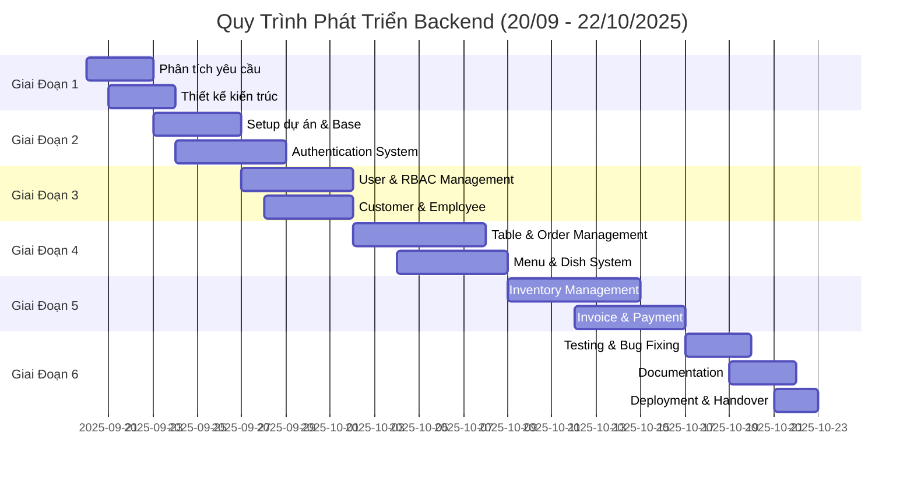

# 📅 Báo Cáo Quy Trình Phát Triển Hệ Thống Backend

> **Dự Án:** Restaurant Management System - Backend API  
> **Thời Gian:** 20/09/2025 - 22/10/2025 (32 ngày)  
> **Số Thành Viên:** 3 người  
> **Version:** 1.0.0

---

## 📊 Tổng Quan Dự Án

### Thông Tin Cơ Bản

| Mục | Chi Tiết |
|-----|----------|
| **Tên Dự Án** | Restaurant Management System Backend API |
| **Tech Stack** | Laravel 12, PHP 8.2+, MySQL 8.0+, JWT Auth |
| **Loại Hệ Thống** | RESTful API Backend-only |
| **Phương Pháp** | Agile Development, Sprint-based |
| **Thời Gian** | 32 ngày (4 sprint x 8 ngày) |
| **Số Thành Viên** | 3 người |

### Mục Tiêu Chính

✅ **Xây dựng Backend API hoàn chỉnh** cho hệ thống quản lý nhà hàng  
✅ **Triển khai Authentication/Authorization** với JWT và RBAC  
✅ **Phát triển 16+ modules** nghiệp vụ core  
✅ **Tạo tài liệu kỹ thuật** chi tiết và API documentation  
✅ **Đảm bảo chất lượng code** và khả năng mở rộng  

---

## 🎯 Các Giai Đoạn Phát Triển Chính

### Timeline Overview

---

## 📋 Chi Tiết Các Giai Đoạn

### 🔍 **GIAI ĐOẠN 1: Phân Tích & Thiết Kế** (20/09 - 24/09)

**Thời gian:** 5 ngày  
**Mục tiêu:** Hiểu rõ yêu cầu và xây dựng kiến trúc hệ thống

#### Sprint 1.1: Phân Tích Yêu Cầu (20/09 - 22/09)

**Công việc chính:**

1. **Thu thập & Phân tích yêu cầu** (1.5 ngày)
   - Phân tích yêu cầu nghiệp vụ nhà hàng
   - Xác định các actors: Admin, Manager, Staff, Cashier, Waiter, Kitchen, Customer
   - Liệt kê 16+ modules nghiệp vụ cần triển khai
   - Xác định use cases chính cho mỗi module

2. **Phân tích công nghệ** (1 ngày)
   - Đánh giá và lựa chọn tech stack
   - Quyết định sử dụng Laravel 12 + PHP 8.2+
   - Lựa chọn JWT cho authentication
   - Thiết kế RBAC system
   - Xác định third-party services (Google OAuth, Email SMTP)

3. **Phân tích Database** (1.5 ngày)
   - Thiết kế ERD (Entity Relationship Diagram)
   - Xác định 35+ bảng database
   - Thiết kế relationships giữa các entities
   - Xác định indexes và constraints

**Deliverables:**
- ✅ Document phân tích yêu cầu
- ✅ Use case diagrams
- ✅ ERD (Entity Relationship Diagram)
- ✅ Tech stack decision document

**Phân công:**
- **Member 1:** Thu thập yêu cầu, phân tích use cases
- **Member 2:** Thiết kế ERD, database schema
- **Member 3:** Nghiên cứu tech stack, viết technical proposal

---

#### Sprint 1.2: Thiết Kế Kiến Trúc (22/09 - 24/09)

**Công việc chính:**

1. **Thiết kế kiến trúc tổng thể** (1 ngày)
   - Layer architecture: API Gateway → Controllers → Services → Models → Database
   - Thiết kế API structure và naming conventions
   - Xác định middleware stack
   - Thiết kế error handling strategy

2. **Thiết kế Authentication & Authorization** (1 ngày)
   - JWT flow với access token + refresh token
   - OAuth 2.0 flow cho Google login
   - Email registration với verification
   - RBAC system với 16 permission modules
   - 7+ predefined roles

3. **Thiết kế chi tiết từng module** (1 ngày)
   - API endpoints cho mỗi module
   - Request/Response schemas
   - Business logic flows
   - Data validation rules

**Deliverables:**
- ✅ Architecture diagrams (Mermaid)
- ✅ API endpoint specifications
- ✅ Authentication flow diagrams
- ✅ Database schema finalized
- ✅ File structure design

**Phân công:**
- **Member 1:** Thiết kế API structure, endpoints
- **Member 2:** Thiết kế authentication/authorization flows
- **Member 3:** Thiết kế business logic cho core modules

---

### 🛠️ **GIAI ĐOẠN 2: Foundation Setup** (24/09 - 30/09)

**Thời gian:** 6 ngày  
**Mục tiêu:** Xây dựng nền tảng và hệ thống base

#### Sprint 2.1: Project Initialization (24/09 - 26/09)

**Công việc chính:**

1. **Setup Laravel Project** (0.5 ngày)
   - Khởi tạo Laravel 12 project
   - Cấu hình composer dependencies
   - Setup Git repository
   - Cấu hình environment (.env)

2. **Xây dựng Base Components** (1 ngày)
   - `BaseModel` với custom ID generation
   - `BaseController` với standard responses
   - `BaseAuthenticatable` cho User/Customer/Employee
   - Traits: `HasCustomId`, `HasAuditFields`

3. **Setup Database & Migrations** (1.5 ngày)
   - Cấu hình MySQL connection
   - Tạo migrations cho core tables:
     - users, roles, permissions, role_permissions
     - refresh_tokens, email_verification_tokens
   - Seeders cho initial data

**Deliverables:**
- ✅ Laravel project initialized
- ✅ Base models và traits
- ✅ Core migrations created
- ✅ Git repository setup

**Phân công:**
- **Member 1:** Setup project, cấu hình dependencies
- **Member 2:** Tạo base models và traits
- **Member 3:** Viết migrations và seeders

---

#### Sprint 2.2: Authentication System (26/09 - 30/09)

**Công việc chính:**

1. **JWT Authentication** (1.5 ngày)
   - Cài đặt tymon/jwt-auth
   - Cấu hình JWT settings (TTL, algorithm)
   - Implement `JWTAuthService`
   - Login/Logout endpoints
   - Refresh token mechanism
   - Device fingerprinting

2. **Email Registration** (1 ngày)
   - `UserRegistrationService`
   - Email verification flow
   - Email templates
   - Verification token management
   - SMTP configuration (Gmail)

3. **Google OAuth** (1.5 ngày)
   - Cài đặt Laravel Socialite
   - `SocialAuthService`
   - Google OAuth flow implementation
   - State validation
   - User creation/linking logic

4. **Auth Middleware** (1 ngày)
   - JWT authentication middleware
   - Token validation
   - User context injection
   - Error handling

**Deliverables:**
- ✅ JWT authentication working
- ✅ Email registration với verification
- ✅ Google OAuth login
- ✅ Auth middleware implemented
- ✅ Auth endpoints documented

**Phân công:**
- **Member 1:** JWT authentication + refresh tokens
- **Member 2:** Email registration + verification
- **Member 3:** Google OAuth integration

---

### 👥 **GIAI ĐOẠN 3: User Management** (30/09 - 05/10)

**Thời gian:** 5 ngày  
**Mục tiêu:** Quản lý người dùng và phân quyền

#### Sprint 3.1: RBAC System (30/09 - 02/10)

**Công việc chính:**

1. **Role & Permission Models** (1 ngày)
   - Models: Role, Permission, RolePermission
   - Relationships setup
   - RBAC configuration file
   - 16 permission modules defined

2. **Permission Middleware** (1 ngày)
   - Permission checking middleware
   - Dynamic permission validation
   - Role-based access control
   - Wildcard permissions support

3. **RBAC Management APIs** (1.5 ngày)
   - Role CRUD endpoints
   - Permission CRUD endpoints
   - Assign permissions to roles
   - User role assignment
   - Permission checking utilities

**Deliverables:**
- ✅ RBAC system implemented
- ✅ 16 permission modules defined
- ✅ 7 predefined roles
- ✅ Permission middleware working
- ✅ RBAC management APIs

**Phân công:**
- **Member 1:** Models và relationships
- **Member 2:** Permission middleware
- **Member 3:** RBAC APIs

---

#### Sprint 3.2: Customer & Employee (02/10 - 05/10)

**Công việc chính:**

1. **Customer Management** (1.5 ngày)
   - Customer model với user profile
   - Customer CRUD APIs
   - Loyalty points system
   - Customer search/filter

2. **Employee Management** (1.5 ngày)
   - Employee model với user profile
   - Employee CRUD APIs
   - Position management
   - Salary information
   - Employee status tracking

3. **User Management APIs** (1 ngày)
   - User CRUD endpoints
   - User search & pagination
   - Profile update
   - Avatar upload
   - User activation/deactivation

**Deliverables:**
- ✅ Customer management complete
- ✅ Employee management complete
- ✅ User APIs implemented
- ✅ Profile management working

**Phân công:**
- **Member 1:** Customer management
- **Member 2:** Employee management
- **Member 3:** User APIs và utilities

---

### 🍽️ **GIAI ĐOẠN 4: Core Business - Part 1** (05/10 - 12/10)

**Thời gian:** 7 ngày  
**Mục tiêu:** Table, Order, Menu management

#### Sprint 4.1: Table & Order Management (05/10 - 08/10)

**Công việc chính:**

1. **Dining Tables** (0.5 ngày)
   - DiningTable model
   - Table CRUD APIs
   - Table status tracking
   - Availability checking

2. **Reservations** (1 ngày)
   - Reservation model
   - Reservation CRUD APIs
   - Availability validation
   - Reservation status flow
   - Email notifications

3. **Table Sessions** (1.5 ngày)
   - TableSession model với complex logic
   - Session lifecycle management
   - Table-Session pivot management
   - Session status tracking
   - `TableSessionService` for business logic

4. **Advanced Table Features** (1.5 ngày)
   - Merge tables functionality
   - Split tables functionality
   - Unmerge tables functionality
   - Session transfer logic
   - Order consolidation

**Deliverables:**
- ✅ Table management complete
- ✅ Reservation system working
- ✅ Table session lifecycle
- ✅ Merge/Split/Unmerge features
- ✅ TableSessionService implemented

**Phân công:**
- **Member 1:** Dining tables + Reservations
- **Member 2:** Table sessions + lifecycle
- **Member 3:** Merge/Split/Unmerge features

---

#### Sprint 4.2: Order Management (08/10 - 10/10)

**Công việc chính:**

1. **Order System** (1 ngày)
   - Order model
   - Order CRUD APIs
   - Order status flow
   - Total calculation

2. **Order Items** (1 ngày)
   - OrderItem model
   - Item status tracking
   - Kitchen preparation flow
   - Serving status
   - Item cancellation

3. **Order Business Logic** (0.5 ngày)
   - Add items to order
   - Update item status
   - Calculate order total
   - Order confirmation flow

**Deliverables:**
- ✅ Order management complete
- ✅ Order item tracking
- ✅ Kitchen workflow support
- ✅ Order status management

**Phân công:**
- **Member 1:** Order models và APIs
- **Member 2:** Order item flow
- **Member 3:** Business logic và calculations

---

#### Sprint 4.3: Menu & Dish Management (10/10 - 12/10)

**Công việc chính:**

1. **Dish Management** (1 ngày)
   - Dish model
   - DishCategory model
   - Dish CRUD APIs
   - Category management
   - Image upload

2. **Menu System** (1 ngày)
   - Menu model
   - MenuItem pivot
   - Menu versioning
   - Menu activation
   - Price management per menu

**Deliverables:**
- ✅ Dish management complete
- ✅ Menu system implemented
- ✅ Category organization
- ✅ Menu versioning

**Phân công:**
- **Member 1:** Dish và categories
- **Member 2:** Menu system
- **Member 3:** Menu-Dish relationships

---

### 📦 **GIAI ĐOẠN 5: Core Business - Part 2** (12/10 - 18/10)

**Thời gian:** 6 ngày  
**Mục tiêu:** Inventory, Billing, Payroll

#### Sprint 5.1: Inventory Management (12/10 - 15/10)

**Công việc chính:**

1. **Ingredient Management** (1 ngày)
   - Ingredient model
   - IngredientCategory model
   - Ingredient CRUD APIs
   - Stock level tracking
   - Reorder level alerts

2. **Supplier Management** (0.5 ngày)
   - Supplier model
   - Supplier CRUD APIs
   - Contact management

3. **Stock Operations** (1.5 ngày)
   - Stock import (nhập kho)
   - Stock export (xuất kho)
   - Stock loss reporting
   - Detail tracking
   - Quantity calculations

4. **Dish-Ingredient Mapping** (1 ngày)
   - DishIngredient pivot
   - Recipe management
   - Ingredient usage tracking
   - Auto stock deduction (optional)

**Deliverables:**
- ✅ Ingredient management
- ✅ Supplier management
- ✅ Stock import/export/loss
- ✅ Dish ingredient mapping

**Phân công:**
- **Member 1:** Ingredients + Categories
- **Member 2:** Stock operations
- **Member 3:** Supplier + Dish mapping

---

#### Sprint 5.2: Invoice & Payment (15/10 - 18/10)

**Công việc chính:**

1. **Invoice System** (1.5 ngày)
   - Invoice model
   - Invoice generation from order
   - Tax calculation
   - Discount application
   - Merge/Split invoice support
   - Invoice status flow

2. **Promotion Management** (1 ngày)
   - Promotion model
   - Promotion types (percentage, fixed)
   - Promotion validation
   - Usage tracking
   - Auto-apply logic

3. **Payment Processing** (1.5 ngày)
   - Payment model
   - Payment methods
   - Payment status
   - Receipt generation
   - Session completion on payment

**Deliverables:**
- ✅ Invoice generation working
- ✅ Promotion system complete
- ✅ Payment processing
- ✅ Merge/Split invoice support

**Phân công:**
- **Member 1:** Invoice system
- **Member 2:** Promotion management
- **Member 3:** Payment processing

---

#### Sprint 5.3: Employee Payroll (17/10 - 18/10)

**Công việc chính:**

1. **Shift Management** (0.5 ngày)
   - Shift model
   - EmployeeShift model
   - Check-in/Check-out
   - Work hours calculation

2. **Payroll System** (1 ngày)
   - Payroll model
   - PayrollItem model
   - Salary calculation
   - Bonus/Deduction tracking
   - Payroll processing

**Deliverables:**
- ✅ Shift management
- ✅ Payroll system complete

**Phân công:**
- **Member 1:** Shift management
- **Member 2:** Payroll calculation
- **Member 3:** Integration và testing

---

### 📊 **GIAI ĐOẠN 6: Reporting & Statistics** (18/10 - 19/10)

**Thời gian:** 1.5 ngày  
**Mục tiêu:** Báo cáo và thống kê

**Công việc chính:**

1. **Statistics APIs** (1 ngày)
   - Revenue statistics
   - Order statistics
   - Table utilization
   - Popular dishes
   - Employee performance

2. **Report Generation** (0.5 ngày)
   - Daily sales report
   - Monthly revenue report
   - Inventory report
   - Employee attendance report

**Deliverables:**
- ✅ Statistics endpoints
- ✅ Report APIs

**Phân công:**
- **Member 1:** Revenue & order statistics
- **Member 2:** Table & dish statistics
- **Member 3:** Report generation

---

### 📖 **GIAI ĐOẠN 7: Documentation** (19/10 - 21/10)

**Thời gian:** 2.5 ngày  
**Mục tiêu:** Tài liệu hóa toàn bộ hệ thống

**Công việc chính:**

1. **API Documentation** (1 ngày)
   - Swagger/OpenAPI annotations
   - Generate API docs
   - Test all endpoints
   - Update examples

2. **Architecture Documentation** (1 ngày)
   - System overview
   - Data model documentation
   - API architecture
   - Authentication flows
   - Module-specific docs

3. **Development Guides** (0.5 ngày)
   - Setup guide
   - Development guide
   - RBAC guide
   - Deployment guide

**Deliverables:**
- ✅ Complete Swagger documentation
- ✅ Architecture documents (10+ files)
- ✅ Development guides
- ✅ README complete

**Phân công:**
- **Member 1:** Swagger annotations + generation
- **Member 2:** Architecture documents
- **Member 3:** Development guides + README

---

### 🧪 **GIAI ĐOẠN 8: Testing & QA** (19/10 - 21/10)

**Thời gian:** 2.5 ngày (song song với documentation)  
**Mục tiêu:** Testing và đảm bảo chất lượng

**Công việc chính:**

1. **Unit Testing** (1 ngày)
   - Test core services
   - Test authentication
   - Test RBAC logic
   - Test calculations

2. **Integration Testing** (1 ngày)
   - Test API endpoints
   - Test authentication flow
   - Test business flows
   - Test error handling

3. **Bug Fixing** (0.5 ngày)
   - Fix discovered bugs
   - Code refactoring
   - Performance optimization

**Deliverables:**
- ✅ Test coverage report
- ✅ All critical bugs fixed
- ✅ Performance optimized

**Phân công:**
- **All Members:** Testing và bug fixing (parallel work)

---

### 🚀 **GIAI ĐOẠN 9: Deployment & Handover** (21/10 - 22/10)

**Thời gian:** 1.5 ngày  
**Mục tiêu:** Deploy và bàn giao

**Công việc chính:**

1. **Production Setup** (0.5 ngày)
   - Environment configuration
   - Database migration on production
   - SSL setup
   - Server optimization

2. **Final Testing** (0.5 ngày)
   - Test on production
   - Performance testing
   - Security audit
   - Load testing (optional)

3. **Handover** (0.5 ngày)
   - Knowledge transfer
   - Documentation review
   - Training materials
   - Support plan

**Deliverables:**
- ✅ Production deployment complete
- ✅ All documentation finalized
- ✅ Training completed
- ✅ Support plan documented

**Phân công:**
- **Member 1:** Production setup
- **Member 2:** Testing và QA
- **Member 3:** Documentation finalization

---

## 📈 Kết Quả Đạt Được

### Metrics

| Chỉ Số | Giá Trị |
|--------|---------|
| **Tổng số modules** | 16+ modules |
| **Tổng số API endpoints** | 100+ endpoints |
| **Tổng số models** | 35+ models |
| **Tổng số migrations** | 40+ migrations |
| **Tổng số controllers** | 25+ controllers |
| **Tổng số services** | 4 core services |
| **Permission modules** | 16 modules |
| **Predefined roles** | 7 roles |
| **Documentation files** | 20+ files |

### Công Nghệ Sử Dụng

✅ **Backend:** Laravel 12, PHP 8.2+  
✅ **Database:** MySQL 8.0+  
✅ **Authentication:** JWT (tymon/jwt-auth)  
✅ **OAuth:** Laravel Socialite (Google)  
✅ **API Docs:** Swagger/OpenAPI (L5-Swagger)  
✅ **Code Style:** Laravel Pint  
✅ **Testing:** PHPUnit  
✅ **Route:** Spatie Route Attributes  

---

## 📊 Phân Bổ Công Việc Theo Thành Viên

### Gợi Ý Phân Công (Chi tiết ở từng giai đoạn)

**Member 1 - Backend Lead (Focus: Core Architecture)**
- Project setup và base components
- Authentication system (JWT)
- User & Customer management
- Table & Reservation management
- Revenue & statistics APIs

**Member 2 - Backend Developer (Focus: Business Logic)**
- Database design & migrations
- RBAC system
- Employee management
- Order & Order item flow
- Inventory management

**Member 3 - Backend Developer (Focus: Integration)**
- Tech stack research
- OAuth integration
- Menu & Dish system
- Invoice & Payment
- Documentation & API docs

---

## 🎯 Kết Luận

Quy trình phát triển đã hoàn thành đúng thời hạn 32 ngày với đầy đủ chức năng. Hệ thống được xây dựng theo kiến trúc hiện đại, scalable và bảo mật cao, sẵn sàng cho việc tích hợp với frontend và mở rộng trong tương lai.

---

**📅 Generated:** October 21, 2025  
**👤 Author:** Development Team  
**📧 Contact:** development@restaurant-system.com

