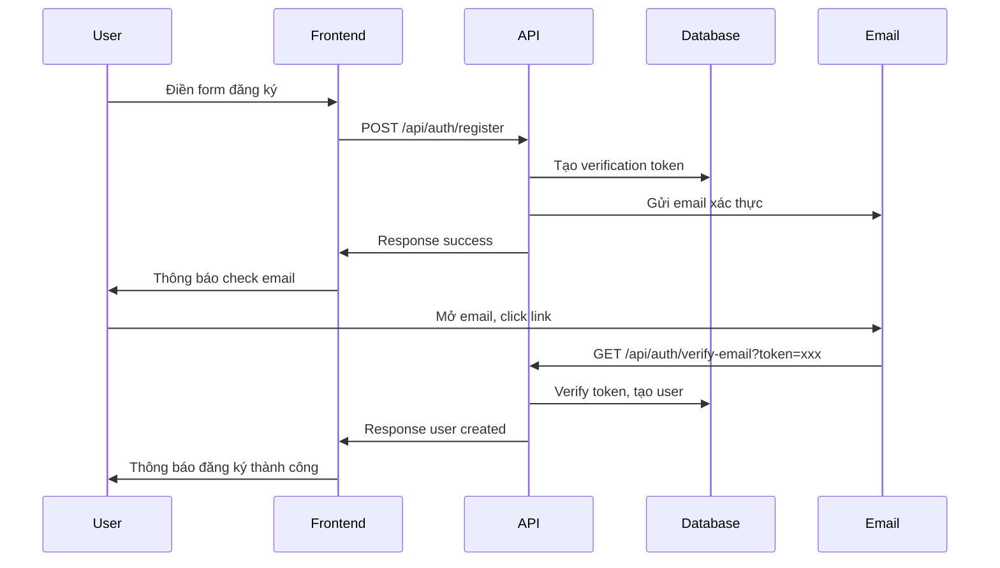

# Hướng Dẫn Sử Dụng Tính Năng Đăng Ký Tài Khoản

## Tổng Quan

Hệ thống đã được bổ sung tính năng đăng ký tài khoản mới với xác thực email cho guest users. Đây là giải pháp tối ưu cho hệ thống nhỏ với các đặc điểm:

- **Đăng ký 2 bước**: Tạo token verification → Xác thực email
- **Email verification**: Bắt buộc xác thực email trước khi tạo tài khoản
- **Token security**: SHA256 hash với thời gian hết hạn 1 giờ
- **Simple email**: Sử dụng Mail::raw để gửi email đơn giản
- **Auto cleanup**: Tự động dọn dẹp tokens hết hạn

---

## API Endpoints

### 1. Đăng Ký Tài Khoản
**Endpoint**: `POST /api/auth/register`

**Request Body**:
```json
{
    "name": "John Doe",
    "email": "john@example.com",
    "password": "password123",
    "password_confirmation": "password123"
}
```

**Response Success**:
```json
{
    "status": "success",
    "message": "Registration initiated. Please check your email to verify your account.",
    "data": {
        "email": "john@example.com",
        "expires_at": "2025-09-23T14:26:42.000000Z"
    }
}
```

### 2. Xác Thực Email
**Endpoint**: `GET /api/auth/verify-email?token={verification_token}`

**Response Success**:
```json
{
    "status": "success",
    "message": "Account created successfully. You can now login.",
    "data": {
        "user_id": "U12345678",
        "email": "john@example.com",
        "name": "John Doe"
    }
}
```

### 3. Gửi Lại Email Xác Thực
**Endpoint**: `POST /api/auth/resend-verification`

**Request Body**:
```json
{
    "email": "john@example.com"
}
```

---

## Quy Trình Đăng Ký



---

## Cấu Hình Email

Để hệ thống gửi email được, cần cấu hình trong `.env`:

### Option 1: Sử dụng Log Driver (Development)
```env
MAIL_MAILER=log
```
Email sẽ được ghi vào `storage/logs/laravel.log`

### Option 2: Sử dụng SMTP (Production)
```env
MAIL_MAILER=smtp
MAIL_HOST=smtp.gmail.com
MAIL_PORT=587
MAIL_USERNAME=your-email@gmail.com
MAIL_PASSWORD=your-app-password
MAIL_ENCRYPTION=tls
MAIL_FROM_ADDRESS=your-email@gmail.com
MAIL_FROM_NAME="Restaurant Management System"
```

### Option 3: Sử dụng MailHog (Local Testing)
```env
MAIL_MAILER=smtp
MAIL_HOST=127.0.0.1
MAIL_PORT=1025
MAIL_USERNAME=null
MAIL_PASSWORD=null
MAIL_ENCRYPTION=null
```

---

## Database Schema

### Bảng `email_verification_tokens`
```sql
CREATE TABLE email_verification_tokens (
    id VARCHAR(10) PRIMARY KEY,           -- Custom ID: EVT + 7 chars
    email VARCHAR(100) NOT NULL,          -- Email đăng ký
    token VARCHAR(64) UNIQUE NOT NULL,    -- SHA256 verification token
    expires_at TIMESTAMP NOT NULL,        -- Thời gian hết hạn (1 giờ)
    is_used BOOLEAN DEFAULT FALSE,        -- Đã sử dụng chưa
    ip_address VARCHAR(45),               -- IP address đăng ký
    user_agent TEXT,                      -- User agent
    temp_name VARCHAR(100) NOT NULL,      -- Tên tạm thời
    temp_password VARCHAR(255) NOT NULL,  -- Password đã hash
    created_at TIMESTAMP,
    updated_at TIMESTAMP,
    created_by VARCHAR(10),
    updated_by VARCHAR(10)
);
```

---

## Permissions

Đã thêm 3 permissions mới trong module `auth`:

- `auth.register` - Quyền đăng ký tài khoản
- `auth.verify_email` - Quyền xác thực email  
- `auth.resend_verification` - Quyền gửi lại email xác thực

**Guest role** đã được cập nhật với các permissions trên.

---

## Error Handling

### Các Lỗi Thường Gặp

1. **Email đã tồn tại**:
```json
{
    "status": "error",
    "message": "User with this email already exists",
    "errors": {"email": ["Email already registered"]}
}
```

2. **Token hết hạn**:
```json
{
    "status": "error", 
    "message": "Invalid or expired verification token",
    "errors": []
}
```

3. **Gửi lại email quá nhanh**:
```json
{
    "status": "error",
    "message": "Please wait at least 2 minutes before requesting another verification email",
    "errors": []
}
```

---

## Testing

### Manual Testing

1. **Test đăng ký**:
```bash
curl -X POST http://localhost:8000/api/auth/register \
  -H "Content-Type: application/json" \
  -d '{
    "name": "Test User",
    "email": "test@example.com", 
    "password": "password123",
    "password_confirmation": "password123"
  }'
```

2. **Check email log** (nếu dùng log driver):
```bash
tail -f storage/logs/laravel.log
```

3. **Test verify email**:
```bash
curl "http://localhost:8000/api/auth/verify-email?token=YOUR_TOKEN_HERE"
```

### Integration với Frontend

**JavaScript Example**:
```javascript
// Đăng ký
const registerResponse = await fetch('/api/auth/register', {
    method: 'POST',
    headers: {'Content-Type': 'application/json'},
    body: JSON.stringify({
        name: 'John Doe',
        email: 'john@example.com',
        password: 'password123',
        password_confirmation: 'password123'
    })
});

// Xác thực email (từ link trong email)
const verifyResponse = await fetch(`/api/auth/verify-email?token=${token}`);
```

---

## Maintenance

### Cleanup Expired Tokens

Tạo scheduled job để dọn dẹp tokens hết hạn:

```php
// In app/Console/Kernel.php
protected function schedule(Schedule $schedule)
{
    $schedule->call(function () {
        app(UserRegistrationService::class)->cleanupExpiredTokens();
    })->daily();
}
```

### Monitoring

Theo dõi các metrics:
- Số lượng đăng ký mỗi ngày
- Tỷ lệ verify email thành công  
- Tokens hết hạn chưa sử dụng

---

## Security Features

1. **Token Security**: 
   - SHA256 hash 64 characters
   - 1 giờ hết hạn
   - One-time use only

2. **Rate Limiting**: 
   - Không thể gửi lại email trong vòng 2 phút

3. **Data Protection**:
   - Password được hash ngay khi tạo token
   - IP và User-Agent tracking
   - Audit trail đầy đủ

4. **Validation**:
   - Email format validation
   - Password confirmation required
   - Name length validation

---

## Tối Ưu Cho Hệ Thống Nhỏ

1. **Simple Email**: Sử dụng `Mail::raw()` thay vì Mailable classes
2. **Minimal Dependencies**: Không cần package bổ sung
3. **SQLite Compatible**: Hoạt động tốt với SQLite cho dev
4. **Log-based Email**: Có thể test mà không cần SMTP server
5. **Auto Cleanup**: Tự động dọn dẹp, không cần quản lý thủ công

---

## Mở Rộng Tương Lai

Khi hệ thống phát triển, có thể nâng cấp:

1. **Email Templates**: Tạo Mailable classes với HTML templates
2. **SMS Verification**: Thêm option xác thực qua SMS
3. **Social Login**: OAuth với Google/Facebook
4. **Advanced Rate Limiting**: Redis-based rate limiting
5. **Email Queue**: Queue jobs cho việc gửi email
6. **Multi-language**: Email templates đa ngôn ngữ