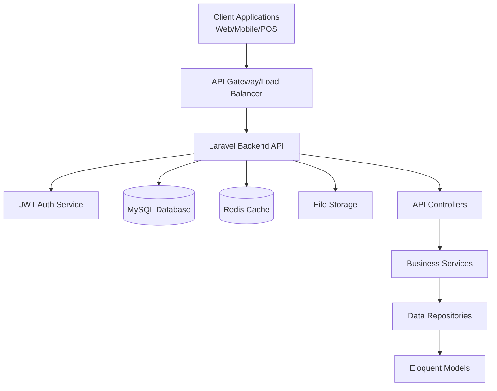
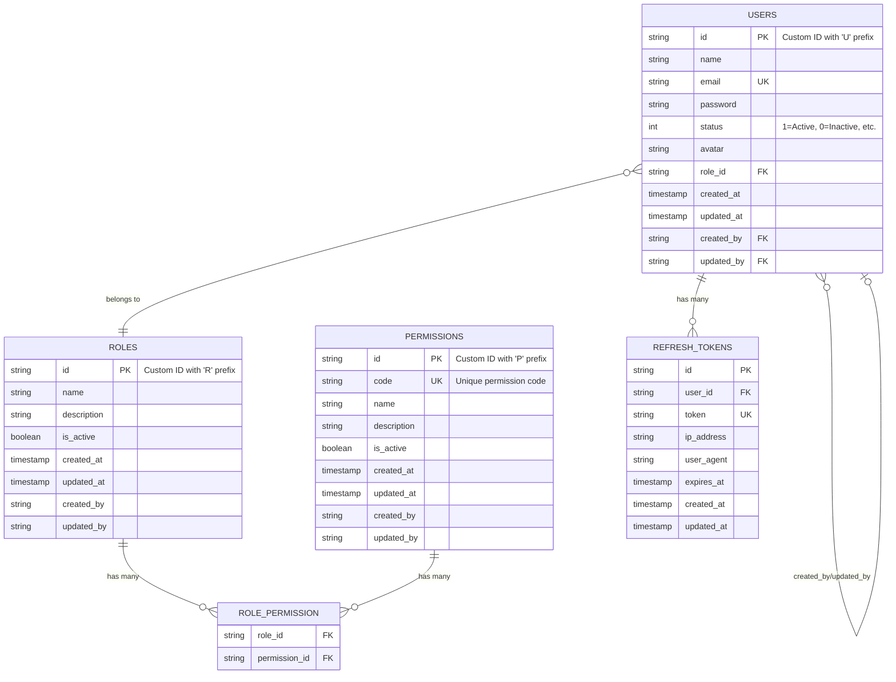

# Restaurant Management System - Complete System Analysis

## Table of Contents

1. [System Overview](#system-overview)
2. [Architecture Analysis](#architecture-analysis)
3. [Core Components](#core-components)
4. [Database Design](#database-design)
5. [API Structure](#api-structure)
6. [Authentication & Authorization](#authentication--authorization)
7. [Code Organization](#code-organization)
8. [Technology Stack](#technology-stack)
9. [Development Setup](#development-setup)
10. [Current Implementation Status](#current-implementation-status)
11. [Security Features](#security-features)
12. [Recommendations](#recommendations)

---

## System Overview

The Restaurant Management System is a **backend-only Laravel application** designed to provide RESTful API services for restaurant management operations. The system follows a microservices-oriented approach, focusing on providing robust API endpoints that can serve multiple client applications (web, mobile, POS systems).

### Key Characteristics:
- **API-First Design**: Pure backend system with no web frontend
- **JWT Authentication**: Stateless authentication using JSON Web Tokens
- **Role-Based Access Control**: Comprehensive permission system
- **Modern Laravel Architecture**: Utilizes Laravel 12 with PHP 8.2+
- **Documentation-Driven**: OpenAPI/Swagger integration for API documentation
- **Scalable Design**: Modular structure ready for horizontal scaling

---

## Architecture Analysis

### High-Level Architecture



### Request Flow Architecture

The system implements a clean layered architecture:

1. **Controller Layer**: Handles HTTP requests, validation, and responses
2. **Service Layer**: Contains business logic and orchestration
3. **Repository Layer**: Data access abstraction (implied through Eloquent)
4. **Model Layer**: Domain entities and database interaction

### Route Attributes Pattern

The system uses **Spatie Route Attributes** for route definition, allowing routes to be defined directly in controller classes using PHP attributes:

```php
#[Prefix('auth')]
#[Post('login')]
#[Middleware('auth:api')]
```

This approach provides better code organization and self-documenting routes.

---

## Core Components

### 1. Authentication System (`AuthController` + `JWTAuthService`)

**Purpose**: Handles user authentication, token management, and session control.

**Key Features**:
- JWT-based stateless authentication
- Refresh token mechanism for long-term sessions
- Session management and tracking
- Token revocation capabilities
- IP and User-Agent tracking for security

**Endpoints**:
- `POST /auth/login` - User authentication
- `POST /auth/refresh` - Token refresh
- `POST /auth/logout` - User logout
- `GET /auth/me` - Get current user
- `GET /auth/sessions` - List active sessions
- `DELETE /auth/revoke-token/{id}` - Revoke specific token

**Security Features**:
- Password hashing with Laravel's built-in hasher
- JWT token expiration (1 hour for access tokens)
- Refresh token expiration (30 days)
- Device/session tracking
- Token blacklisting capability

### 2. User Management System (`UserController` + `User` Model)

**Purpose**: Complete user lifecycle management with role-based permissions.

**Key Features**:
- CRUD operations for user management
- Role assignment and permission checking
- User status management (Active, Inactive, Pending, Banned, Deleted)
- Audit trail tracking (created_by, updated_by)
- Custom ID generation with prefix 'U'

**User Model Capabilities**:
- JWT Subject implementation
- Role relationship management
- Permission checking methods
- Status validation
- Audit field tracking

### 3. Role & Permission System

**Purpose**: Implements Role-Based Access Control (RBAC) for fine-grained authorization.

**Architecture**:
- **Roles**: Named permission groups (Admin, Manager, Staff, etc.)
- **Permissions**: Specific action rights with unique codes
- **Many-to-Many Relationship**: Roles can have multiple permissions

**Key Features**:
- Dynamic permission checking
- Role-permission synchronization
- Active/inactive states for both roles and permissions
- Custom ID generation (R- for roles, P- for permissions)

### 4. API Response System (`ApiResponseTrait`)

**Purpose**: Standardizes API responses across all controllers.

**Response Format**:
```json
{
    "status": "success|error",
    "message": "Human readable message",
    "data": {...} // or "errors": {...}
}
```

**Benefits**:
- Consistent response structure
- Proper HTTP status codes
- Clear error messaging
- Easy frontend integration

---

## Database Design

### Entity Relationship Overview



### Key Database Features

1. **Custom ID Generation**: All primary keys use custom string IDs with prefixes
2. **Audit Trail**: Every model tracks who created and last updated the record
3. **Soft Relationships**: Foreign keys with proper constraints and cascading
4. **Status Management**: Boolean and integer status fields for record lifecycle
5. **Token Security**: Refresh tokens with expiration and device tracking

### Migration Strategy

The system uses a careful migration strategy:
1. Initial Laravel migrations for basic structure
2. Role/Permission system setup
3. User table modification to add custom fields
4. Refresh token system for JWT

---

## API Structure

### API Versioning Strategy

All API endpoints are versioned under `/` prefix, allowing for future API evolution without breaking existing clients.

### Current API Modules

#### 1. Authentication Module (`/auth/`)
- Complete JWT authentication flow
- Session management
- Token lifecycle operations

#### 2. User Management Module (`/users/`)
- User CRUD operations
- Role assignment
- User status management

#### 3. Role Management Module (`/roles/`)
- Role CRUD operations
- Permission assignment to roles
- Role activation/deactivation

#### 4. Permission Management Module (`/permissions/`)
- Permission CRUD operations
- Permission status management

#### 5. Health Check (`/api/health`)
- System health monitoring
- Load balancer health checks

### Future API Modules (Planned)

Based on the system documentation, these modules are planned:

- `/categories/` - Menu category management
- `/products/` - Menu item management
- `/orders/` - Order processing
- `/tables/` - Table management
- `/reservations/` - Reservation system
- `/employees/` - Employee management
- `/inventory/` - Inventory tracking
- `/reports/` - Reporting and analytics

### OpenAPI Documentation

The system integrates **L5-Swagger** for automatic API documentation generation:
- Comprehensive endpoint documentation
- Request/response examples
- Authentication requirements
- Parameter validation rules

---

## Authentication & Authorization

### JWT Implementation

**Token Structure**:
- **Access Token**: Short-lived (1 hour), contains user claims
- **Refresh Token**: Long-lived (30 days), stored in database with metadata

**Custom Claims**:
```json
{
    "email": "user@example.com",
    "role_id": "R12345",
    "status": 1
}
```

**Security Features**:
- Token rotation on refresh
- Device/IP tracking
- Session management
- Token revocation
- Blacklisting capability

### Role-Based Access Control (RBAC)

The system implements a **comprehensive RBAC system** with the following architecture:

#### Permission Model
- **Hierarchical Structure**: Permissions use dot notation (e.g., 'users.create', 'orders.view')
- **Unique Codes**: Each permission has a unique code for easy reference
- **Active States**: Permissions can be enabled/disabled without deletion
- **Custom IDs**: String-based IDs with 'P' prefix for better security

#### Role Model
- **Permission Groups**: Roles group related permissions logically
- **Flexible Assignment**: Users are assigned a single role with multiple permissions
- **Caching**: Permission checking is cached for performance
- **Custom IDs**: String-based IDs with 'R' prefix

#### Permission System Features

**1. Permission Middleware**
```php
#[Get('/users', middleware: ['permission:users.view'])]
#[Post('/users', middleware: ['permission:users.create'])]
#[Put('/users/{id}', middleware: ['permission:users.edit'])]
#[Delete('/users/{id}', middleware: ['permission:users.delete'])]
```

**2. Permission Checking Methods**
```php
// In User model
$user->hasPermission('users.create')           // Check single permission
$user->hasAnyPermission(['users.view', 'users.edit'])  // Check any permission
$user->hasAllPermissions(['users.view', 'users.edit']) // Check all permissions
$user->getAllPermissions()                     // Get all user permissions
$user->getPermissions()                        // Get permission objects
```

**3. Role Management Methods**
```php
// In Role model
$role->hasPermission('users.create')          // Check if role has permission
$role->syncPermissions($permissionIds)        // Sync permissions to role
$role->addPermissions($permissionIds)         // Add permissions to role
$role->removePermissions($permissionIds)      // Remove permissions from role
$role->clearPermissionCache()                 // Clear permission cache
```

#### Predefined Roles and Permissions

**System Roles**:
1. **Super Administrator**: Full system access with all permissions
2. **Administrator**: Administrative access excluding super admin functions
3. **Manager**: Restaurant operations and staff management
4. **Staff**: Basic operational permissions
5. **Cashier**: POS and payment processing
6. **Kitchen Staff**: Order and inventory management
7. **Waiter/Server**: Order taking and table service

**Permission Categories**:
- **User Management**: users.view, users.create, users.edit, users.delete, users.manage_roles
- **Role Management**: roles.view, roles.create, roles.edit, roles.delete, roles.manage_permissions
- **Permission Management**: permissions.view, permissions.create, permissions.edit, permissions.delete
- **Restaurant Operations**: categories.*, products.*, orders.*, tables.*, reservations.*
- **Inventory Management**: inventory.view, inventory.create, inventory.edit, inventory.adjust, inventory.reports
- **Reporting**: reports.sales, reports.inventory, reports.financial, reports.customer, reports.export
- **System Administration**: system.settings, system.logs, system.backup, system.maintenance

#### Performance Optimizations

**1. Permission Caching**
- Role permissions are cached for 1 hour
- Cache is automatically cleared when permissions change
- Reduces database queries for frequent permission checks

**2. Efficient Database Structure**
- Optimized queries with proper indexing
- Eager loading of relationships to prevent N+1 queries
- Pivot table with proper foreign key constraints

#### Security Features

**1. Route Protection**
```php
// Automatic permission checking via middleware
Route::middleware(['auth:api', 'permission:users.create'])->post('/users', [UserController::class, 'store']);
```

**2. API Response Security**
- Clear error messages for permission denials
- No sensitive information leaked in permission errors
- Proper HTTP status codes (401 for auth, 403 for permissions)

**3. Audit Trail**
- All permission changes are tracked
- User role assignments are logged
- Permission grant/revoke operations are audited

#### Management Tools

**1. Artisan Commands**
```bash
# List all roles and their permissions
php artisan rbac:manage list-roles

# List all available permissions
php artisan rbac:manage list-permissions

# Assign role to user
php artisan rbac:manage assign-role --user=user@example.com --role="Manager"

# Check if user has specific permission
php artisan rbac:manage check-permission --user=user@example.com --permission=users.create
```

**2. Seeder System**
- Comprehensive role and permission seeding
- Default users with appropriate roles
- Easy setup for new installations

**3. Controller Helpers**
```php
// Available in controllers via HasPermissionHelpers trait
$this->userCan('users.create')                // Check current user permission
$this->userCanAny(['users.view', 'users.edit']) // Check any permission
$this->checkPermissionOrFail('users.delete')  // Check with automatic error response
```

#### Future Enhancements

**Planned RBAC Features**:
1. **Permission Groups**: Group related permissions for easier management
2. **Dynamic Permissions**: Runtime permission creation for modules
3. **Permission Dependencies**: Required permissions for certain actions
4. **Time-based Permissions**: Temporary permission grants
5. **Context-aware Permissions**: Location or resource-specific permissions

This RBAC implementation provides enterprise-level access control while remaining simple to use and maintain for small to medium restaurant operations.

---

## Code Organization

### Directory Structure Analysis

```
app/
├── Http/
│   ├── Controllers/
│   │   ├── Controller.php              # Base controller with OpenAPI docs
│   │   └── Api/                        # API controllers namespace
│   │       ├── AuthController.php      # Authentication endpoints
│   │       ├── UserController.php      # User management
│   │       ├── RoleController.php      # Role management
│   │       ├── PermissionController.php # Permission management
│   │       ├── HealthController.php    # Health checks
│   │       └── Traits/
│   │           └── ApiResponseTrait.php # Standardized responses
│   └── Middleware/                     # Custom middleware (empty currently)
├── Models/
│   ├── BaseModel.php                   # Abstract base with common functionality
│   ├── BaseAuthenticatable.php        # Base for authenticatable models
│   ├── User.php                        # User entity with JWT implementation
│   ├── Role.php                        # Role entity
│   ├── Permission.php                  # Permission entity
│   ├── RefreshToken.php                # Token management
│   └── Traits/
│       ├── HasCustomId.php             # Custom ID generation
│       └── HasAuditFields.php          # Audit trail functionality
├── Services/
│   └── JWTAuthService.php              # Authentication business logic
└── Providers/
    └── AppServiceProvider.php          # Service container bindings
```

### Design Patterns Used

1. **Repository Pattern** (Implied through Eloquent)
2. **Service Layer Pattern** (JWTAuthService)
3. **Factory Pattern** (Model factories)
4. **Observer Pattern** (Model events in traits)
5. **Strategy Pattern** (JWT authentication)
6. **Trait Pattern** (Code reusability)

### Code Quality Features

- **PHP 8.2+ Features**: Uses modern PHP syntax and features
- **Type Hints**: Comprehensive type hinting throughout
- **Documentation**: Extensive PHPDoc comments
- **Validation**: Request validation with proper error handling
- **Error Handling**: Standardized error responses
- **Testing Structure**: PHPUnit test setup (basic implementation)

---

## Technology Stack

### Core Framework
- **PHP 8.2+**: Modern PHP with improved performance and features
- **Laravel 12.0**: Latest Laravel framework with enhanced features
- **Composer**: Dependency management

### Authentication & Security
- **tymon/jwt-auth**: JWT implementation for Laravel
- **Laravel Sanctum**: API token authentication (installed but JWT preferred)

### API & Documentation
- **darkaonline/l5-swagger**: OpenAPI/Swagger documentation generation
- **spatie/laravel-route-attributes**: Route definition using PHP attributes

### Database & Storage
- **MySQL 8.0+**: Primary database (configurable)
- **SQLite**: Development/testing database support
- **Laravel Storage**: File management system

### Development Tools
- **Laravel Pail**: Log viewer
- **Laravel Sail**: Docker development environment
- **Laravel Pint**: Code style fixer
- **PHPUnit**: Testing framework
- **Faker**: Test data generation

### Production Considerations
- **Redis**: Caching and session storage (configurable)
- **Queue System**: Background job processing
- **File Storage**: Scalable file storage solutions

---

## Development Setup

### Environment Requirements
- PHP 8.2 or higher
- MySQL 8.0+ or SQLite
- Composer 2.0+
- Laragon (recommended for Windows)

### Installation Process
1. Clone repository
2. Run `composer install`
3. Configure `.env` file
4. Generate application key: `php artisan key:generate`
5. Run migrations: `php artisan migrate`
6. Generate JWT secret: `php artisan jwt:secret`
7. Generate API documentation: `composer swagger`

### Development Commands
- `composer dev`: Start development server
- `composer test`: Run test suite
- `composer swagger`: Generate API documentation
- `php artisan route:list`: View all registered routes

---

## Current Implementation Status

### ✅ Completed Features

1. **Core Authentication System**
   - JWT token generation and validation
   - Refresh token mechanism
   - Session management
   - User login/logout/me endpoints

2. **Complete RBAC System**
   - Role-based access control with comprehensive permissions
   - Permission middleware for route protection
   - Caching system for performance optimization
   - 7 predefined roles with appropriate permission sets
   - 40+ predefined permissions covering all system modules
   - Artisan commands for RBAC management

3. **User Management**
   - User CRUD operations with permission protection
   - Role assignment and validation
   - Status management
   - Custom ID generation
   - Enhanced permission checking methods

4. **Role & Permission System**
   - Complete RBAC implementation
   - Role-permission relationships with caching
   - Permission checking methods with performance optimization
   - Permission synchronization and management
   - Comprehensive seeder system

5. **API Infrastructure**
   - Standardized response format
   - OpenAPI documentation
   - Route attributes implementation
   - Health check endpoint
   - Permission-protected endpoints

6. **Database Architecture**
   - Complete migration system
   - Model relationships with optimizations
   - Audit trail implementation
   - Custom ID generation
   - Proper indexing and constraints

7. **Security Features**
   - JWT authentication with refresh tokens
   - Role-based access control
   - Permission-based route protection
   - Input validation and sanitization
   - Audit logging and tracking

### 🚧 Partially Implemented

1. **Testing System**
   - Basic test structure exists
   - Need comprehensive test coverage for RBAC system
   - API endpoint testing with permission scenarios required

2. **Documentation**
   - OpenAPI documentation structure in place
   - RBAC system fully documented with usage guides
   - Need complete endpoint documentation for all controllers

3. **IDE Support**
   - Type hinting implemented for RBAC methods
   - IDE helper for better autocomplete
   - May need `laravel-ide-helper` package for full IDE support

### ❌ Not Yet Implemented

Based on the system architecture document, these major modules are planned but not implemented:

1. **Restaurant Core Modules**
   - Menu/Category management
   - Product/Item management
   - Order processing system
   - Table management
   - Reservation system

2. **Operational Modules**
   - Inventory management
   - Employee management
   - Reporting and analytics
   - Payment processing

3. **Advanced Features**
   - Real-time notifications
   - File upload handling
   - Advanced reporting
   - Multi-restaurant support

---

## Security Features

### Current Security Implementation

1. **Authentication Security**
   - JWT tokens with expiration
   - Refresh token rotation
   - Password hashing with Laravel's built-in hasher
   - Session tracking by IP and User-Agent

2. **Authorization Security**
   - Role-based access control
   - Permission-based endpoint protection
   - User status validation
   - Token revocation capabilities

3. **Data Security**
   - Input validation and sanitization
   - Mass assignment protection
   - Database foreign key constraints
   - Audit trail for all modifications

4. **API Security**
   - HTTPS enforcement (configuration-dependent)
   - Rate limiting (configurable)
   - Standardized error handling
   - CORS configuration

### Security Best Practices Implemented

- Custom ID generation (prevents ID enumeration)
- Comprehensive input validation
- Hidden sensitive fields in API responses
- Audit logging for accountability
- Token-based stateless authentication
- Proper HTTP status codes

---

## Recommendations

### Immediate Improvements

1. **Testing Coverage**
   - Implement comprehensive API testing
   - Add unit tests for services and models
   - Create integration tests for authentication flow
   - Add feature tests for all endpoints

2. **Error Handling**
   - Implement global exception handler
   - Add detailed error logging
   - Create custom exception classes
   - Improve validation error messages

3. **Security Enhancements**
   - Add rate limiting middleware
   - Implement API versioning middleware
   - Add request logging for audit
   - Enhance token security with rotation policies

4. **Documentation**
   - Complete OpenAPI documentation for all endpoints
   - Add code examples for API usage
   - Create integration guides for clients
   - Document deployment procedures

### Medium-term Enhancements

1. **Performance Optimization**
   - Implement Redis caching
   - Add database query optimization
   - Implement API response caching
   - Add background job processing

2. **Monitoring & Logging**
   - Integrate application monitoring
   - Add performance metrics
   - Implement health check system
   - Create debugging tools

3. **Core Module Development**
   - Implement menu management system
   - Add order processing capabilities
   - Create inventory management
   - Build reporting system

### Long-term Strategic Goals

1. **Scalability**
   - Microservices architecture migration
   - Database sharding strategies
   - Load balancing implementation
   - Multi-tenant support

2. **Integration Capabilities**
   - Third-party payment gateway integration
   - POS system integration
   - Mobile app SDK development
   - Webhook system for real-time updates

3. **Advanced Features**
   - Machine learning for demand forecasting
   - Real-time analytics dashboard
   - Mobile notifications
   - Multi-language support

---

## Conclusion

The Restaurant Management System represents a well-architected, modern Laravel application with a solid foundation for growth. The current implementation provides a robust authentication and user management system with room for significant expansion.

**Strengths**:
- Modern technology stack
- Clean architecture
- Comprehensive documentation
- Security-focused design
- Scalable foundation

**Areas for Development**:
- Complete core restaurant modules
- Comprehensive testing
- Performance optimization
- Advanced integrations

The system is well-positioned to evolve into a comprehensive restaurant management platform while maintaining code quality and architectural integrity.