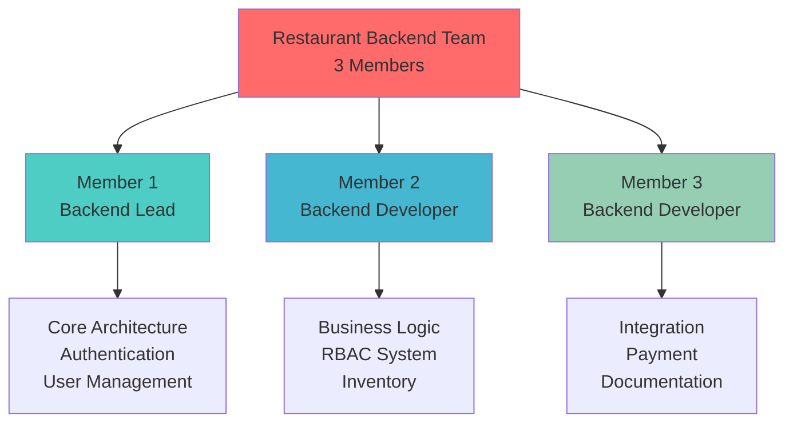
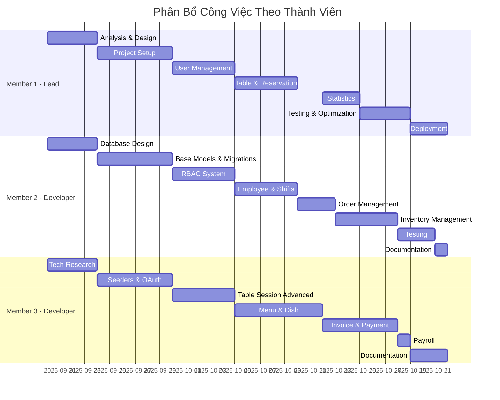
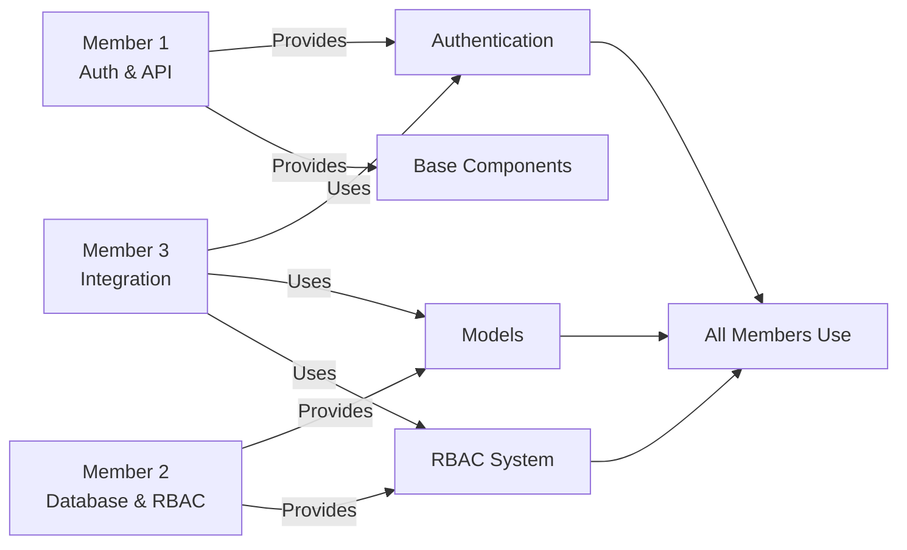

# 👥 Phân Công Công Việc Chi Tiết

> **Dự Án:** Restaurant Management System Backend API  
> **Thời Gian:** 20/09/2025 - 22/10/2025 (32 ngày)  
> **Số Thành Viên:** 3 người

---

## 📋 Cấu Trúc Team

### Team Composition

---

## 👤 Member 1 - Backend Lead

### 🎯 Vai Trò & Trách Nhiệm

**Vai trò chính:** Technical Lead & Core Architecture  
**Chuyên môn:** System architecture, authentication, core features  

### 📊 Phân Bổ Công Việc

#### **Giai Đoạn 1: Phân Tích & Thiết Kế** (20/09 - 24/09)

**Sprint 1.1: Phân tích yêu cầu** (20/09 - 22/09) - **3 ngày**

- [ ] **Thu thập yêu cầu nghiệp vụ** (1 ngày)
  - Phân tích quy trình quản lý nhà hàng
  - Xác định các actors và roles
  - Liệt kê use cases chính
  - Tài liệu hóa business requirements
  
- [ ] **Phân tích use cases** (1 ngày)
  - Vẽ use case diagrams
  - Mô tả chi tiết từng use case
  - Xác định priority cho các features
  - Lập timeline tổng thể

- [ ] **Review và tổng hợp** (1 ngày)
  - Review kết quả với team
  - Tổng hợp feedback
  - Finalize requirements document

**Deliverables:**
- ✅ Business requirements document
- ✅ Use case diagrams
- ✅ Feature priority list

---

**Sprint 1.2: Thiết kế API structure** (22/09 - 24/09) - **2 ngày**

- [ ] **Thiết kế API architecture** (1 ngày)
  - Định nghĩa API structure
  - RESTful conventions
  - Request/Response format
  - Error handling strategy
  - Versioning strategy

- [ ] **Thiết kế endpoints** (1 ngày)
  - List tất cả endpoints cần thiết
  - HTTP methods cho mỗi endpoint
  - Request/Response schemas
  - Authentication requirements

**Deliverables:**
- ✅ API architecture document
- ✅ Endpoint specifications (draft)

---

#### **Giai Đoạn 2: Foundation Setup** (24/09 - 30/09)

**Sprint 2.1: Project setup** (24/09 - 26/09) - **2.5 ngày**

- [ ] **Khởi tạo Laravel project** (0.5 ngày)
  - Install Laravel 12
  - Setup composer dependencies
  - Configure .env
  - Setup Git repository
  - Create README.md

- [ ] **Xây dựng base structure** (1 ngày)
  - Create folder structure
  - Setup namespaces
  - Configure route attributes
  - Setup middleware stack
  - Configure CORS

- [ ] **Base components** (1 ngày)
  - BaseController với standard responses
  - Custom ID generation system
  - Error handler setup
  - Response formatter

**Deliverables:**
- ✅ Laravel project initialized
- ✅ Base components created
- ✅ Project structure organized

---

**Sprint 2.2: JWT Authentication** (26/09 - 28/09) - **2.5 ngày**

- [ ] **JWT setup** (0.5 ngày)
  - Install tymon/jwt-auth
  - Configure JWT settings
  - Generate JWT secret
  - Setup auth guards

- [ ] **JWTAuthService** (1.5 ngày)
  - Login method
  - Token generation
  - Token validation
  - Refresh token logic
  - Device fingerprinting
  - Logout mechanism

- [ ] **Auth endpoints** (0.5 ngày)
  - POST /api/auth/login
  - POST /api/auth/logout
  - POST /api/auth/refresh
  - GET /api/auth/me

**Deliverables:**
- ✅ JWT authentication working
- ✅ JWTAuthService implemented
- ✅ Auth endpoints created

---

**Sprint 2.3: Auth middleware** (28/09 - 30/09) - **2 ngày**

- [ ] **Authentication middleware** (1 ngày)
  - Token validation middleware
  - User injection
  - Error handling
  - Blacklist checking

- [ ] **Testing authentication** (1 ngày)
  - Test login flow
  - Test token refresh
  - Test logout
  - Test protected endpoints
  - Write unit tests

**Deliverables:**
- ✅ Auth middleware implemented
- ✅ Authentication tested
- ✅ Unit tests written

---

#### **Giai Đoạn 3: User Management** (30/09 - 05/10)

**Sprint 3.1: User APIs** (30/09 - 02/10) - **2.5 ngày**

- [ ] **User model enhancement** (0.5 ngày)
  - Add necessary fields
  - Setup relationships
  - Add scopes and accessors
  - Validation rules

- [ ] **UserController** (1.5 ngày)
  - GET /api/users (list with pagination)
  - GET /api/users/{id} (details)
  - POST /api/users (create)
  - PUT /api/users/{id} (update)
  - DELETE /api/users/{id} (delete)
  - Search & filter functionality

- [ ] **Profile management** (0.5 ngày)
  - GET /api/profile
  - PUT /api/profile
  - PUT /api/profile/password
  - Avatar upload

**Deliverables:**
- ✅ User CRUD complete
- ✅ Profile management
- ✅ Search & filter working

---

**Sprint 3.2: Customer Management** (02/10 - 05/10) - **3 ngày**

- [ ] **Customer model & migration** (0.5 ngày)
  - Create Customer model
  - Migration with fields
  - Relationships with User
  - Loyalty points logic

- [ ] **CustomerController** (1.5 ngày)
  - GET /api/customers
  - GET /api/customers/{id}
  - POST /api/customers
  - PUT /api/customers/{id}
  - DELETE /api/customers/{id}
  - Loyalty points management

- [ ] **Customer features** (1 ngày)
  - Customer search by name/phone
  - Filter by loyalty points
  - Customer statistics
  - Integration với reservation

**Deliverables:**
- ✅ Customer management complete
- ✅ Loyalty points system
- ✅ Customer search working

---

#### **Giai Đoạn 4: Core Business - Part 1** (05/10 - 12/10)

**Sprint 4.1: Dining Tables** (05/10 - 06/10) - **1 ngày**

- [ ] **DiningTable model & API** (1 ngày)
  - Create model & migration
  - DiningTableController
  - CRUD endpoints
  - Table status tracking
  - Availability checking

**Deliverables:**
- ✅ Dining table management

---

**Sprint 4.2: Reservations** (06/10 - 08/10) - **2 ngày**

- [ ] **Reservation model** (0.5 ngày)
  - Create model & migration
  - Relationships
  - Status constants

- [ ] **ReservationController** (1 ngày)
  - CRUD endpoints
  - Availability validation
  - Status flow
  - Email notification integration

- [ ] **Reservation business logic** (0.5 ngày)
  - Conflict detection
  - Auto-confirm logic
  - No-show marking
  - Cancellation handling

**Deliverables:**
- ✅ Reservation system complete
- ✅ Email notifications
- ✅ Availability checking

---

**Sprint 4.3: Table Sessions (Part 1)** (08/10 - 10/10) - **2 ngày**

- [ ] **TableSession model** (0.5 ngày)
  - Create model & migration
  - Relationships setup
  - Status constants
  - Type constants

- [ ] **Basic session APIs** (1.5 ngày)
  - POST /api/table-sessions (create)
  - GET /api/table-sessions (list)
  - GET /api/table-sessions/{id}
  - PUT /api/table-sessions/{id}
  - POST /api/table-sessions/{id}/end
  - Session lifecycle management

**Deliverables:**
- ✅ Basic table session working
- ✅ Session lifecycle

---

#### **Giai Đoạn 5: Statistics & Reports** (12/10 - 15/10)

**Sprint 5.1: Statistics APIs** (12/10 - 15/10) - **3 ngày**

- [ ] **Revenue statistics** (1 ngày)
  - Daily revenue
  - Monthly revenue
  - Revenue by period
  - Revenue trends

- [ ] **Order statistics** (1 ngày)
  - Total orders
  - Orders by status
  - Average order value
  - Peak hours analysis

- [ ] **Table utilization** (1 ngày)
  - Table usage statistics
  - Popular tables
  - Average session duration
  - Utilization rate

**Deliverables:**
- ✅ Statistics endpoints
- ✅ Data aggregation working

---

#### **Giai Đoạn 6: Integration & Testing** (15/10 - 19/10)

**Sprint 6.1: Integration testing** (15/10 - 17/10) - **2 ngày**

- [ ] **End-to-end testing** (2 ngày)
  - Test complete user flows
  - Test authentication flows
  - Test table booking flow
  - Test order flow
  - Fix integration bugs

**Deliverables:**
- ✅ Integration tests
- ✅ Bugs fixed

---

**Sprint 6.2: Performance optimization** (17/10 - 19/10) - **2 ngày**

- [ ] **Query optimization** (1 ngày)
  - Optimize N+1 queries
  - Add database indexes
  - Eager loading
  - Query profiling

- [ ] **API optimization** (1 ngày)
  - Response caching
  - Pagination optimization
  - Rate limiting
  - API performance testing

**Deliverables:**
- ✅ Optimized queries
- ✅ Better performance

---

#### **Giai Đoạn 7: Documentation & Deployment** (19/10 - 22/10)

**Sprint 7.1: Swagger documentation** (19/10 - 20/10) - **1 ngày**

- [ ] **API documentation** (1 ngày)
  - Add Swagger annotations
  - Document all endpoints
  - Add examples
  - Generate documentation

**Deliverables:**
- ✅ Complete Swagger docs

---

**Sprint 7.2: Deployment** (21/10 - 22/10) - **1.5 ngày**

- [ ] **Production setup** (1 ngày)
  - Server configuration
  - Database migration
  - Environment setup
  - SSL certificate

- [ ] **Final testing** (0.5 ngày)
  - Production testing
  - Performance verification
  - Security check

**Deliverables:**
- ✅ Production deployment
- ✅ System verified

---

### 📊 Summary - Member 1

**Total Working Days:** ~27 ngày

**Key Responsibilities:**
- ✅ Project initialization & architecture
- ✅ JWT authentication system
- ✅ User & Customer management
- ✅ Dining tables & Reservations
- ✅ Statistics & reporting
- ✅ Performance optimization
- ✅ Deployment

**Skills Required:**
- Laravel expertise
- JWT & authentication
- System architecture
- Database design
- API design
- DevOps basics

---

## 👤 Member 2 - Backend Developer

### 🎯 Vai Trò & Trách Nhiệm

**Vai trò chính:** Business Logic & RBAC Specialist  
**Chuyên môn:** Database design, RBAC, business logic, inventory  

### 📊 Phân Bổ Công Việc

#### **Giai Đoạn 1: Phân Tích & Thiết Kế** (20/09 - 24/09)

**Sprint 1.1: Database design** (20/09 - 24/09) - **4 ngày**

- [ ] **ERD design** (2 ngày)
  - Thiết kế toàn bộ ERD
  - Xác định entities
  - Xác định relationships
  - Normalize database
  - Review với team

- [ ] **Schema design** (1.5 ngày)
  - Chi tiết schema cho từng table
  - Indexes design
  - Foreign keys
  - Constraints
  - Default values

- [ ] **Migration planning** (0.5 ngày)
  - Plan migration order
  - Identify dependencies
  - Seeder planning

**Deliverables:**
- ✅ Complete ERD
- ✅ Database schema document
- ✅ Migration plan

---

#### **Giai Đoạn 2: Foundation Setup** (24/09 - 30/09)

**Sprint 2.1: Base models & migrations** (24/09 - 27/09) - **3 ngày**

- [ ] **BaseModel và traits** (1 ngày)
  - Create BaseModel
  - HasCustomId trait
  - HasAuditFields trait
  - BaseAuthenticatable
  - Test custom ID generation

- [ ] **Core migrations** (2 ngày)
  - users migration
  - roles migration
  - permissions migration
  - role_permissions migration
  - refresh_tokens migration
  - email_verification_tokens migration
  - Run và test migrations

**Deliverables:**
- ✅ Base models created
- ✅ Core migrations ready
- ✅ Custom ID working

---

**Sprint 2.2: Email verification** (27/09 - 30/09) - **3 ngày**

- [ ] **Email service setup** (1 ngày)
  - Configure SMTP
  - Email templates
  - Mail testing
  - Error handling

- [ ] **UserRegistrationService** (1.5 ngày)
  - Registration logic
  - Email verification token
  - Send verification email
  - Verify email endpoint
  - Resend email logic

- [ ] **Testing email flow** (0.5 ngày)
  - Test registration
  - Test email sending
  - Test verification
  - Fix bugs

**Deliverables:**
- ✅ Email registration working
- ✅ Email verification complete

---

#### **Giai Đoạn 3: User Management** (30/09 - 05/10)

**Sprint 3.1: RBAC System** (30/09 - 05/10) - **5 ngày**

- [ ] **Role & Permission models** (1 ngày)
  - Create models
  - Relationships
  - Methods for permission checking
  - Constants

- [ ] **RBAC configuration** (1 ngày)
  - config/permissions.php
  - Define 16 permission modules
  - Define actions per module
  - Define 7 default roles
  - Permission mapping

- [ ] **Permission middleware** (1.5 ngày)
  - Create permission middleware
  - Dynamic permission checking
  - Wildcard support
  - Error messages
  - Testing

- [ ] **RBAC management APIs** (1.5 ngày)
  - RoleController (CRUD)
  - PermissionController (CRUD)
  - Assign permissions to role
  - Assign role to user
  - Check user permissions

**Deliverables:**
- ✅ RBAC system complete
- ✅ Permission middleware
- ✅ RBAC APIs

---

#### **Giai Đoạn 4: Employee & Shifts** (05/10 - 10/10)

**Sprint 4.1: Employee Management** (05/10 - 08/10) - **3 ngày**

- [ ] **Employee model** (0.5 ngày)
  - Create model & migration
  - Relationships với User
  - Employee fields
  - Status constants

- [ ] **EmployeeController** (1.5 ngày)
  - CRUD endpoints
  - Employee search
  - Filter by position
  - Filter by status
  - Employee statistics

- [ ] **Employee features** (1 ngày)
  - Hire employee
  - Terminate employee
  - Update salary
  - Upload image
  - Performance tracking

**Deliverables:**
- ✅ Employee management complete
- ✅ Employee CRUD working

---

**Sprint 4.2: Shift Management** (08/10 - 10/10) - **2 ngày**

- [ ] **Shift models** (0.5 ngày)
  - Shift model & migration
  - EmployeeShift model & migration
  - Relationships

- [ ] **ShiftController** (1 ngày)
  - Shift CRUD
  - Assign shift to employee
  - Check-in/Check-out
  - Work hours calculation

- [ ] **EmployeeShiftController** (0.5 ngày)
  - List employee shifts
  - Update shift status
  - Overtime calculation
  - Attendance report

**Deliverables:**
- ✅ Shift management
- ✅ Employee shift tracking

---

#### **Giai Đoạn 5: Order Management** (10/10 - 13/10)

**Sprint 5.1: Order system** (10/10 - 13/10) - **3 ngày**

- [ ] **Order models** (0.5 ngày)
  - Order model & migration
  - OrderItem model & migration
  - Relationships
  - Status constants

- [ ] **OrderController** (1.5 ngày)
  - Create order
  - Get orders (list, filter)
  - Get order details
  - Update order status
  - Add items to order
  - Calculate total

- [ ] **OrderItemController** (1 ngày)
  - Update item status
  - Kitchen workflow
  - Mark as ready
  - Mark as served
  - Cancel item
  - Item cancellation reasons

**Deliverables:**
- ✅ Order management complete
- ✅ Order item tracking
- ✅ Kitchen workflow

---

#### **Giai Đoạn 6: Inventory Management** (13/10 - 18/10)

**Sprint 6.1: Ingredients** (13/10 - 15/10) - **2 ngày**

- [ ] **Ingredient models** (0.5 ngày)
  - Ingredient model & migration
  - IngredientCategory model & migration
  - Relationships

- [ ] **IngredientController** (1 ngày)
  - CRUD endpoints
  - Stock level tracking
  - Reorder alerts
  - Search ingredients

- [ ] **IngredientCategoryController** (0.5 ngày)
  - Category CRUD
  - Category management

**Deliverables:**
- ✅ Ingredient management
- ✅ Stock tracking

---

**Sprint 6.2: Stock Operations** (15/10 - 18/10) - **3 ngày**

- [ ] **Stock models** (0.5 ngày)
  - StockImport, StockImportDetail
  - StockExport, StockExportDetail
  - StockLoss
  - Migrations

- [ ] **StockController** (2 ngày)
  - POST /api/stock/import
  - GET /api/stock/imports
  - POST /api/stock/export
  - GET /api/stock/exports
  - POST /api/stock/loss
  - Stock calculations
  - Quantity updates

- [ ] **Supplier management** (0.5 ngày)
  - Supplier model & migration
  - SupplierController
  - CRUD endpoints

**Deliverables:**
- ✅ Stock operations complete
- ✅ Supplier management

---

#### **Giai Đoạn 7: Testing & Bug Fixing** (18/10 - 21/10)

**Sprint 7.1: Unit testing** (18/10 - 20/10) - **2 ngày**

- [ ] **Service tests** (1 ngày)
  - Test RBAC logic
  - Test order calculations
  - Test stock calculations
  - Test email service

- [ ] **Model tests** (1 ngày)
  - Test relationships
  - Test scopes
  - Test custom methods
  - Test validations

**Deliverables:**
- ✅ Unit tests written
- ✅ Test coverage report

---

**Sprint 7.2: Bug fixing** (20/10 - 21/10) - **1 ngày**

- [ ] **Fix bugs** (1 ngày)
  - Fix reported bugs
  - Code refactoring
  - Improve error messages
  - Validation improvements

**Deliverables:**
- ✅ Bugs fixed
- ✅ Code refactored

---

#### **Giai Đoạn 8: Documentation** (21/10 - 22/10)

**Sprint 8.1: Architecture docs** (21/10 - 22/10) - **1 ngày**

- [ ] **Architecture documentation** (1 ngày)
  - System overview
  - Data model documentation
  - ERD diagrams (Mermaid)
  - Relationship documentation
  - Database schema guide

**Deliverables:**
- ✅ Architecture docs complete

---

### 📊 Summary - Member 2

**Total Working Days:** ~27 ngày

**Key Responsibilities:**
- ✅ Database design & ERD
- ✅ RBAC system implementation
- ✅ Employee & shift management
- ✅ Order management system
- ✅ Inventory management
- ✅ Unit testing
- ✅ Architecture documentation

**Skills Required:**
- Database design
- Laravel Eloquent
- RBAC concepts
- Business logic
- Testing
- Documentation

---

## 👤 Member 3 - Backend Developer

### 🎯 Vai Trò & Trách Nhiệm

**Vai trò chính:** Integration & Payment Specialist  
**Chuyên môn:** OAuth integration, payment processing, documentation  

### 📊 Phân Bổ Công Việc

#### **Giai Đoạn 1: Phân Tích & Thiết Kế** (20/09 - 24/09)

**Sprint 1.1: Tech research** (20/09 - 24/09) - **4 ngày**

- [ ] **Technology research** (2 ngày)
  - Research Laravel 12 features
  - Research JWT authentication
  - Research OAuth 2.0
  - Research payment gateways
  - Evaluate libraries

- [ ] **Technical proposal** (1.5 ngày)
  - Write technical proposal
  - Justify tech choices
  - List dependencies
  - Risk analysis
  - Timeline estimation

- [ ] **Business logic design** (0.5 ngày)
  - Design core business flows
  - Payment flow
  - Order flow
  - Invoice generation

**Deliverables:**
- ✅ Technology research report
- ✅ Technical proposal
- ✅ Business flow diagrams

---

#### **Giai Đoạn 2: Foundation Setup** (24/09 - 30/09)

**Sprint 2.1: Seeders & Initial Data** (24/09 - 27/09) - **3 ngày**

- [ ] **Database seeders** (2 ngày)
  - RoleSeeder (7 default roles)
  - PermissionSeeder (100+ permissions)
  - UserSeeder (sample users)
  - Dish & Menu seeders (sample data)
  - Test data seeders

- [ ] **Testing seeders** (1 ngày)
  - Test seed process
  - Verify data integrity
  - Document seed data
  - Create reset script

**Deliverables:**
- ✅ All seeders created
- ✅ Sample data available
- ✅ Seed documentation

---

**Sprint 2.2: Google OAuth** (27/09 - 30/09) - **3 ngày**

- [ ] **Socialite setup** (0.5 ngày)
  - Install Laravel Socialite
  - Configure Google OAuth
  - Setup credentials
  - Configure routes

- [ ] **SocialAuthService** (1.5 ngày)
  - Redirect to Google
  - Handle callback
  - User creation/linking
  - State validation
  - Error handling

- [ ] **OAuth endpoints** (1 ngày)
  - GET /api/auth/google
  - GET /api/auth/google/callback
  - Testing OAuth flow
  - Fix bugs

**Deliverables:**
- ✅ Google OAuth working
- ✅ SocialAuthService implemented
- ✅ OAuth documented

---

#### **Giai Đoạn 3: Table Session Advanced** (30/09 - 05/10)

**Sprint 3.1: Merge/Split Tables** (30/09 - 05/10) - **5 ngày**

- [ ] **TableSessionService** (1.5 ngày)
  - Create service class
  - Business logic methods
  - Validation methods
  - Helper methods

- [ ] **Merge functionality** (1.5 ngày)
  - POST /api/table-sessions/{id}/merge
  - Validate sessions
  - Create merged session
  - Link tables
  - Transfer orders
  - Update invoices

- [ ] **Split functionality** (1.5 ngày)
  - POST /api/table-sessions/{id}/split
  - Validate session
  - Create new sessions
  - Distribute tables
  - Distribute order items
  - Create separate invoices

- [ ] **Unmerge functionality** (0.5 ngày)
  - POST /api/table-sessions/{id}/unmerge
  - Restore original sessions
  - Revert changes
  - Testing

**Deliverables:**
- ✅ TableSessionService complete
- ✅ Merge/Split/Unmerge working
- ✅ Complex logic tested

---

#### **Giai Đoạn 4: Menu & Dish** (05/10 - 12/10)

**Sprint 4.1: Dish Management** (05/10 - 08/10) - **3 ngày**

- [ ] **Dish models** (0.5 ngày)
  - Dish model & migration
  - DishCategory model & migration
  - DishIngredient pivot
  - Relationships

- [ ] **DishController** (1.5 ngày)
  - CRUD endpoints
  - Image upload
  - Category filtering
  - Search dishes
  - Popular dishes

- [ ] **DishCategoryController** (1 ngày)
  - Category CRUD
  - Category dishes
  - Category management

**Deliverables:**
- ✅ Dish management complete
- ✅ Category management
- ✅ Image upload working

---

**Sprint 4.2: Menu System** (08/10 - 12/10) - **4 ngày**

- [ ] **Menu models** (0.5 ngày)
  - Menu model & migration
  - MenuItem pivot & migration
  - Versioning logic
  - Relationships

- [ ] **MenuController** (2 ngày)
  - CRUD endpoints
  - Add dishes to menu
  - Remove dishes from menu
  - Menu versioning
  - Activate/Deactivate menu
  - Get active menu

- [ ] **Menu features** (1.5 ngày)
  - Price override per menu
  - Menu availability
  - Menu scheduling
  - Menu statistics
  - Testing

**Deliverables:**
- ✅ Menu system complete
- ✅ Menu versioning
- ✅ Menu-Dish management

---

#### **Giai Đoạn 5: Invoice & Payment** (12/10 - 18/10)

**Sprint 5.1: Invoice System** (12/10 - 15/10) - **3 ngày**

- [ ] **Invoice model** (0.5 ngày)
  - Invoice model & migration
  - Relationships
  - Calculation methods
  - Status constants

- [ ] **InvoiceController** (1.5 ngày)
  - Generate invoice from session
  - Calculate totals
  - Apply tax
  - Apply discount
  - Merge invoices
  - Split invoices
  - Invoice status flow

- [ ] **Invoice features** (1 ngày)
  - Invoice PDF generation (optional)
  - Invoice history
  - Invoice search
  - Invoice statistics

**Deliverables:**
- ✅ Invoice generation working
- ✅ Invoice calculations correct
- ✅ Merge/Split invoice support

---

**Sprint 5.2: Promotion & Payment** (15/10 - 18/10) - **3 ngày**

- [ ] **Promotion system** (1.5 ngày)
  - Promotion model & migration
  - InvoicePromotion pivot
  - PromotionController
  - Promotion types
  - Validation logic
  - Auto-apply promotions
  - Usage tracking

- [ ] **Payment processing** (1.5 ngày)
  - Payment model & migration
  - InvoicePaymentController
  - Payment methods
  - Process payment
  - Payment status
  - Receipt generation
  - Complete session on payment

**Deliverables:**
- ✅ Promotion system complete
- ✅ Payment processing working
- ✅ Session completion

---

#### **Giai Đoạn 6: Payroll** (18/10 - 19/10)

**Sprint 6.1: Payroll System** (18/10 - 19/10) - **1.5 ngày**

- [ ] **Payroll models** (0.5 ngày)
  - Payroll model & migration
  - PayrollItem model & migration
  - Relationships

- [ ] **PayrollController** (1 ngày)
  - Calculate payroll
  - Payroll items (salary, bonus, deduction)
  - Process payroll
  - Payroll history
  - Payroll reports

**Deliverables:**
- ✅ Payroll system complete

---

#### **Giai Đoạn 7: Documentation** (19/10 - 22/10)

**Sprint 7.1: Development guides** (19/10 - 21/10) - **2 ngày**

- [ ] **Setup guides** (1 ngày)
  - Installation guide
  - Environment setup
  - Email setup guide
  - Google OAuth setup
  - Troubleshooting guide

- [ ] **Development guides** (1 ngày)
  - Development guide
  - RBAC guide
  - API usage guide
  - Testing guide
  - Deployment guide

**Deliverables:**
- ✅ Setup guides complete
- ✅ Development guides complete

---

**Sprint 7.2: README & Final docs** (21/10 - 22/10) - **1 ngày**

- [ ] **README.md** (0.5 ngày)
  - Complete README
  - Quick start guide
  - API overview
  - Troubleshooting
  - Links to guides

- [ ] **Final documentation** (0.5 ngày)
  - Review all docs
  - Update versions
  - Fix typos
  - Add examples
  - Final polish

**Deliverables:**
- ✅ README complete
- ✅ All documentation finalized

---

### 📊 Summary - Member 3

**Total Working Days:** ~26 ngày

**Key Responsibilities:**
- ✅ Technology research
- ✅ Google OAuth integration
- ✅ Table session advanced features
- ✅ Menu & Dish management
- ✅ Invoice & Payment system
- ✅ Promotion system
- ✅ Payroll system
- ✅ Documentation (guides)

**Skills Required:**
- OAuth 2.0
- Payment processing
- Complex business logic
- API integration
- Technical writing
- Documentation

---

## 📊 Workload Distribution

### Thời Gian Làm Việc

### So Sánh Workload

| Thành Viên | Tổng Ngày | Giai Đoạn Chính | Focus Areas |
|------------|-----------|-----------------|-------------|
| **Member 1** | ~27 ngày | Setup → User → Table → Stats → Deploy | Core Architecture, Auth, API |
| **Member 2** | ~27 ngày | Database → RBAC → Employee → Order → Inventory | Database, Business Logic, RBAC |
| **Member 3** | ~26 ngày | Research → OAuth → Menu → Payment → Docs | Integration, Payment, Documentation |

---

## 🔄 Collaboration Points

### Daily Sync Points

**Mỗi ngày:**
- Morning standup (15 phút)
  - Báo cáo tiến độ
  - Discuss blockers
  - Plan for the day

- Evening sync (10 phút)
  - Update progress
  - Preview tomorrow
  - Share learnings

### Weekly Reviews

**Cuối mỗi tuần:**
- Sprint review (30 phút)
- Demo completed features
- Retrospective
- Plan next week

### Integration Points

**Key Integration Moments:**

1. **Week 1:** Sau khi Member 1 hoàn thành base components
   - Member 2 & 3 sử dụng base models
   - All members align on structure

2. **Week 2:** Sau khi Member 1 hoàn thành authentication
   - Member 2 & 3 implement protected endpoints
   - Test authentication flow together

3. **Week 2:** Sau khi Member 2 hoàn thành RBAC
   - All members add permission checking
   - Test permissions together

4. **Week 3-4:** Continuous integration
   - Integrate table sessions với orders
   - Integrate orders với invoices
   - Integrate invoices với payments

5. **Week 4:** Final integration
   - End-to-end testing
   - Bug fixing together
   - Documentation review

---

## ✅ Checklist Theo Tuần

### Tuần 1 (20/09 - 27/09)

**Member 1:**
- [ ] Complete requirements analysis
- [ ] Design API structure
- [ ] Setup Laravel project
- [ ] Implement JWT authentication

**Member 2:**
- [ ] Complete ERD design
- [ ] Create base models & traits
- [ ] Write core migrations
- [ ] Setup email verification

**Member 3:**
- [ ] Complete tech research
- [ ] Write technical proposal
- [ ] Create all seeders
- [ ] Implement Google OAuth

---

### Tuần 2 (28/09 - 04/10)

**Member 1:**
- [ ] Complete auth middleware
- [ ] Implement User APIs
- [ ] Implement Customer management
- [ ] Start Dining Tables

**Member 2:**
- [ ] Complete RBAC models
- [ ] Implement permission middleware
- [ ] Complete RBAC APIs
- [ ] Start Employee management

**Member 3:**
- [ ] Complete OAuth testing
- [ ] Start TableSessionService
- [ ] Implement merge functionality
- [ ] Implement split functionality

---

### Tuần 3 (05/10 - 11/10)

**Member 1:**
- [ ] Complete Reservations
- [ ] Complete basic Table Sessions
- [ ] Start Statistics APIs

**Member 2:**
- [ ] Complete Employee management
- [ ] Complete Shift management
- [ ] Start Order management

**Member 3:**
- [ ] Complete table session advanced features
- [ ] Complete Dish management
- [ ] Start Menu system

---

### Tuần 4 (12/10 - 18/10)

**Member 1:**
- [ ] Complete Statistics
- [ ] Performance optimization
- [ ] Integration testing

**Member 2:**
- [ ] Complete Order management
- [ ] Complete Inventory management
- [ ] Unit testing

**Member 3:**
- [ ] Complete Menu system
- [ ] Complete Invoice system
- [ ] Complete Payment system
- [ ] Complete Payroll

---

### Tuần 5 (19/10 - 22/10)

**Member 1:**
- [ ] Final testing
- [ ] Swagger documentation
- [ ] Production deployment

**Member 2:**
- [ ] Bug fixing
- [ ] Architecture documentation
- [ ] Final testing

**Member 3:**
- [ ] Complete all guides
- [ ] Complete README
- [ ] Final documentation review

---

## 🎯 Success Criteria

### Individual Success Metrics

**Member 1:**
- ✅ All auth endpoints working
- ✅ All user/customer APIs complete
- ✅ Statistics APIs accurate
- ✅ Production deployment successful
- ✅ Swagger docs complete

**Member 2:**
- ✅ Database structure solid
- ✅ RBAC system working perfectly
- ✅ All business logic correct
- ✅ Tests passing
- ✅ Architecture docs complete

**Member 3:**
- ✅ OAuth working seamlessly
- ✅ Payment processing accurate
- ✅ Complex features working
- ✅ All guides helpful
- ✅ Documentation complete

### Team Success Metrics

- ✅ 100+ API endpoints working
- ✅ All 16+ modules implemented
- ✅ RBAC with 100+ permissions
- ✅ Complete documentation
- ✅ Production-ready code
- ✅ On-time delivery

---

**📅 Document Created:** October 21, 2025  
**👤 Author:** Development Team Lead  
**📧 Contact:** development@restaurant-system.com

**Note:** Phân công này là gợi ý chi tiết. Các thành viên có thể điều chỉnh linh hoạt dựa trên năng lực và tiến độ thực tế. Quan trọng là communication và collaboration!
