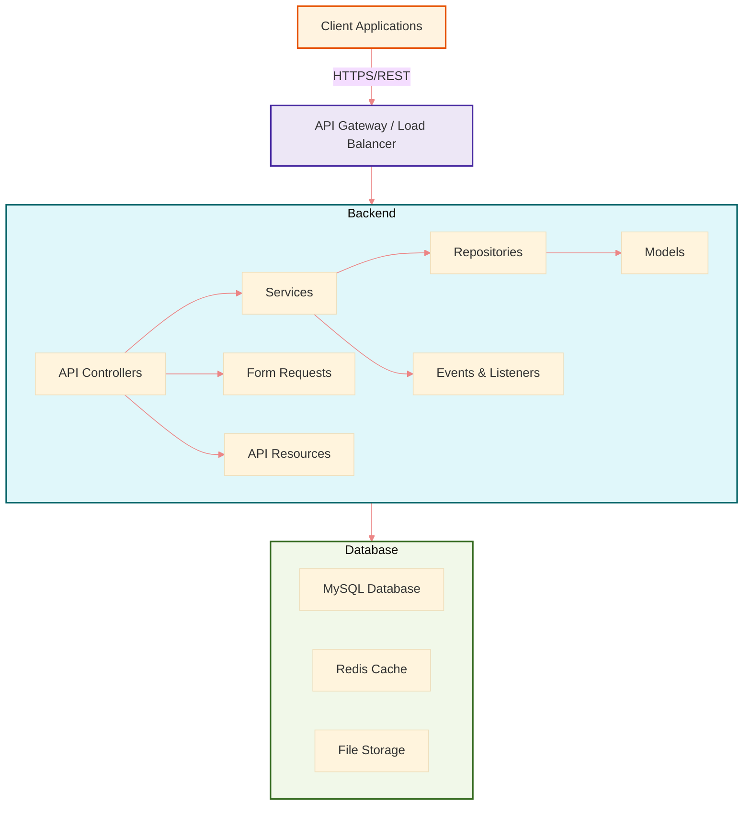

# Restaurant Management System - Backend Architecture

## 1. Introduction

Restaurant Management System (RMS) là một hệ thống quản lý toàn diện giúp nhà hàng và các cơ sở kinh doanh thực phẩm quản lý hiệu quả các hoạt động hàng ngày. Hệ thống được xây dựng với kiến trúc Backend đơn độc (Backend-only), tập trung vào việc cung cấp RESTful API để các ứng dụng client (mobile, web) có thể tích hợp và sử dụng.

Tài liệu này mô tả chi tiết về kiến trúc Backend của hệ thống, cung cấp thông tin về các thành phần, mô-đun, và công nghệ được sử dụng.

### Mục tiêu kiến trúc:
- **Khả năng mở rộng**: Dễ dàng thêm mới các tính năng và mô-đun
- **Khả năng bảo trì**: Code dễ đọc, dễ hiểu và dễ sửa chữa
- **Hiệu suất cao**: Tối ưu thời gian phản hồi và xử lý dữ liệu
- **Bảo mật**: Đảm bảo dữ liệu được bảo vệ và chỉ người dùng được ủy quyền mới có thể truy cập
- **Làm việc nhóm hiệu quả**: Kiến trúc giúp các thành viên trong nhóm làm việc độc lập và song song

## 2. High-level Architecture Diagram

Hệ thống Restaurant Management System được thiết kế theo kiến trúc nhiều tầng, tách biệt giữa client applications, backend API, và data storage. Ba file diagram sau đây mô tả chi tiết về kiến trúc hệ thống:

1. **Kiến trúc tổng thể:** File [`images/architecture_diagram.dot`](images/architecture_diagram.dot) mô tả cấu trúc tổng thể của hệ thống, các thành phần và mối quan hệ giữa chúng. Để xem diagram, bạn có thể sử dụng các công cụ như Graphviz hoặc online DOT viewers.

2. **Mô hình class:** File [`images/class_diagram.mermaid`](images/class_diagram.mermaid) biểu diễn các class chính và mối quan hệ giữa chúng. Để xem diagram này, bạn có thể sử dụng Mermaid Live Editor hoặc các plugin Mermaid cho VSCode, GitHub, etc.

3. **Luồng xử lý request:** File [`images/request_flow.mermaid`](images/request_flow.mermaid) mô tả sequence diagram của quá trình xử lý request từ client đến backend và response trả về. Diagram này cũng có thể xem bằng các công cụ hỗ trợ Mermaid.

### Tóm tắt kiến trúc tổng thể



### 2.1 Các thành phần chính

1. **Client Applications**
   - Các ứng dụng khách khác nhau có thể truy cập vào hệ thống thông qua RESTful API
   - Mobile App: Ứng dụng cho nhân viên phục vụ và khách hàng
   - Web Admin: Giao diện quản lý dành cho chủ nhà hàng và quản lý
   - POS App: Ứng dụng Point of Sale cho thu ngân

2. **API Gateway / Load Balancer**
   - Quản lý và điều phối các request đến các backend servers
   - Xử lý SSL/TLS
   - Áp dụng rate limiting và security policies

3. **Laravel Backend API**
   - Core của hệ thống, nơi xử lý logic kinh doanh
   - Cung cấp RESTful API endpoints
   - Xử lý authentication, authorization, và validation

4. **Database Layer**
   - MySQL: Lưu trữ dữ liệu chính của hệ thống
   - Redis: Cache và session storage
   - File Storage: Lưu trữ hình ảnh và tài liệu

### 2.2 Cách các thành phần giao tiếp với nhau

1. **Client → Backend**
   - Giao tiếp thông qua RESTful API calls qua HTTPS
   - Dữ liệu được truyền tải dưới định dạng JSON
   - Authentication thông qua JWT tokens

2. **Backend → Database**
   - Laravel Eloquent ORM để tương tác với MySQL
   - Redis cho caching và queued jobs
   - File system operations cho file storage

3. **Internal Backend Communication**
   - API Controllers → Services → Repositories → Models
   - Dependency Injection để liên kết các components
   - Events & Listeners cho async operations

## 3. Modules / Components

### 3.1 Core Modules

1. **Authentication Module**
   - Xử lý đăng nhập, đăng ký, và quản lý session
   - JWT token generation và validation
   - Password reset và email verification
   - Two-factor authentication

2. **User Management Module**
   - Quản lý nhân viên, vai trò và phân quyền
   - User profiles và permissions
   - Activity logging

3. **Menu Management Module**
   - Quản lý danh mục và món ăn
   - Pricing và availability
   - Special offers và promotions

4. **Order Processing Module**
   - Order creation và tracking
   - Kitchen order management
   - Order status updates
   - Payment processing

5. **Inventory Management Module**
   - Stock tracking
   - Low stock alerts
   - Vendor management
   - Purchase orders

6. **Reporting & Analytics Module**
   - Sales reports
   - Inventory reports
   - Financial reports
   - Customer analytics

7. **Reservation Module**
   - Table reservations
   - Reservation management
   - Notification system

### 3.2 Supporting Components

1. **API Layer**
   - Controllers: Xử lý HTTP requests và responses
   - Resources: Biến đổi data models thành JSON responses
   - Requests: Validation và sanitization của input data

2. **Service Layer**
   - Business logic implementation
   - Orchestration của các operations phức tạp
   - Transaction management

3. **Repository Layer**
   - Data access abstraction
   - Database operations
   - Query optimization

4. **Model Layer**
   - Eloquent models
   - Relationships
   - Attribute accessors & mutators

5. **Event System**
   - Event broadcasting
   - Listeners và handlers
   - Real-time notifications

6. **Job & Queue System**
   - Background processing
   - Scheduled tasks
   - Email sending

## 4. Data Flow

### 4.1 Request Lifecycle

1. **Client Request**
   - Client gửi HTTP request đến API endpoint
   - Request chứa JWT token trong Authorization header

2. **Middleware Processing**
   - Authentication middleware xác thực JWT token
   - Authorization middleware kiểm tra permissions
   - Rate limiting middleware kiểm soát số lượng requests

3. **Controller Action**
   - Validate input data thông qua Form Request
   - Gọi đến appropriate Service

4. **Service Execution**
   - Implement business rules và logic
   - Gọi đến một hoặc nhiều Repositories
   - Quản lý transactions

5. **Repository Data Access**
   - Tương tác với Models để lấy hoặc cập nhật dữ liệu
   - Execute optimized database queries

6. **Response Formation**
   - Data được transform qua Resource classes
   - Response được cấu trúc theo chuẩn API
   - Status code và headers được set

### 4.2 Example Data Flow: Creating an Order

```
1. Client gửi POST request đến /api/v1/orders với order details
   ↓
2. AuthMiddleware xác thực JWT token và lấy user information
   ↓
3. OrderRequest validates input data (items, quantities, customer info)
   ↓
4. OrderController gọi OrderService::createOrder()
   ↓
5. OrderService:
   - Kiểm tra item availability thông qua InventoryRepository
   - Tính toán pricing thông qua PricingRepository
   - Khởi tạo order thông qua OrderRepository::create()
   - Giảm inventory thông qua InventoryRepository::updateStock()
   - Dispatch OrderCreatedEvent
   ↓
6. OrderRepository tương tác với Order model và related models
   ↓
7. OrderCreatedEvent:
   - Sends notification to kitchen
   - Updates analytics data
   ↓
8. OrderResource transforms Order model thành JSON response
   ↓
9. JSON response được trả về cho client với status code 201 Created
```

## 5. Technology Stack

### 5.1 Core Framework & Language
- **PHP 8.2+**: Ngôn ngữ lập trình server-side
- **Laravel 12.0**: PHP framework cho web application development
- **Composer**: PHP dependency management

### 5.2 Database & Storage
- **MySQL 8.0+**: Relational database
- **Redis**: In-memory data structure store for caching & queues
- **Laravel Storage**: File management system

### 5.3 API & Communication
- **RESTful API**: JSON-based API architecture
- **Laravel Sanctum**: API authentication system
- **JWT**: JSON Web Tokens cho stateless authentication

### 5.4 Background Processing
- **Laravel Queue**: Job queuing system
- **Laravel Scheduler**: Cron job management
- **Laravel Events**: Event broadcasting system

### 5.5 Development & Deployment Tools
- **Git**: Version control
- **Laravel Sail**: Docker development environment
- **PHPUnit**: Testing framework
- **Laravel Pint**: Code style fixer
- **GitHub Actions/GitLab CI**: Continuous Integration/Deployment

### 5.6 Monitoring & Logging
- **Laravel Pail**: Log viewer
- **Laravel Telescope**: Development debugging tool (if installed)
- **Application log files**: Structured logging

## 6. Security

### 6.1 Authentication
- **JWT (JSON Web Tokens)**
  - Stateless authentication mechanism
  - Tokens có expiration time
  - Token rotation và refresh strategies
  - Blacklisting của invalid tokens

- **Optional: OAuth2**
  - Có thể implement cho third-party integrations
  - Authorization code flow cho web clients
  - Password grant cho trusted clients

### 6.2 Authorization
- **Role-Based Access Control (RBAC)**
  - Pre-defined roles (Admin, Manager, Staff, Customer)
  - Role assignment và hierarchies
  - Permission inheritance

- **Permission-Based Access**
  - Granular permissions cho specific actions
  - Permission checking ở middleware level
  - Permission caching để tối ưu performance

### 6.3 API Protection
- **Rate Limiting**
  - Giới hạn số lượng requests per IP/user
  - Throttling dựa trên endpoint và method
  - Graduated response (warning → temporary ban → permanent ban)

- **HTTPS**
  - Tất cả communications được encrypted
  - TLS 1.2+ required
  - HSTS headers

- **CORS (Cross-Origin Resource Sharing)**
  - Strict origin policies
  - Whitelisting của trusted domains
  - Preventing CSRF attacks

### 6.4 Data Protection
- **Input Validation**
  - Strict validation của tất cả user inputs
  - Sanitization để prevent injection attacks
  - Type checking và constraint validation

- **Output Encoding**
  - Proper encoding để prevent XSS
  - Content security policies
  - Safe JSON serialization

- **Database Security**
  - Parameterized queries
  - Least privilege database users
  - Data encryption for sensitive information

### 6.5 Audit & Logging
- **Security Logging**
  - Authentication attempts (success/failure)
  - Authorization decisions
  - Sensitive data access

- **Audit Trail**
  - Tracking của tất cả changes
  - User accountability
  - Non-repudiation của actions

## 7. Deployment & Scaling

### 7.1 Deployment Architecture
- **Multi-Environment Setup**
  - Development, Staging, Production
  - Environment-specific configurations
  - Automated deployment pipelines

- **Container-Based Deployment**
  - Docker containers cho consistency
  - Orchestration với Kubernetes hoặc Docker Swarm
  - Horizontal scaling capabilities

### 7.2 Scaling Strategies
- **Horizontal Scaling**
  - Load balancing multiple API servers
  - Stateless design cho easy scaling
  - Session management qua Redis

- **Database Scaling**
  - Read replicas cho query distribution
  - Sharding cho high-volume data
  - Connection pooling

- **Caching Strategy**
  - Multi-level cache (application, database, HTTP)
  - Cache invalidation policies
  - Cache warming

### 7.3 Performance Optimization
- **Database Optimization**
  - Indexing strategy
  - Query optimization
  - Eager loading để prevent N+1 problems

- **API Response Optimization**
  - Compression (gzip)
  - Pagination của large result sets
  - Sparse fieldsets

- **Background Processing**
  - Offloading heavy tasks to queues
  - Scheduled tasks cho maintenance operations
  - Asynchronous processing for non-critical operations

## 8. Kiến trúc phát triển và làm việc nhóm

### 8.1 Coding Standards
- PSR-12 code style
- Laravel best practices
- Consistent documentation

### 8.2 Development Workflow
- Feature branch workflow
- Pull/Merge requests
- Code reviews
- Automated testing before merging

### 8.3 Documentation
- API documentation với Swagger/OpenAPI
- Inline code documentation
- Architecture & design documentation
- Onboarding guides cho team members mới

## 9. Kết luận

Kiến trúc được đề xuất cho Restaurant Management System Backend này được thiết kế với mục tiêu đảm bảo tính mở rộng, dễ bảo trì và hiệu suất cao. Bằng cách áp dụng các pattern như Repository Pattern, Service Layer, và RESTful API principles, hệ thống có thể dễ dàng phát triển và mở rộng theo thời gian.

Cấu trúc modular cho phép các thành viên trong nhóm làm việc đồng thời trên các phần khác nhau của hệ thống mà không gây xung đột. Security được đặt lên hàng đầu với nhiều lớp bảo vệ, từ authentication, authorization đến data validation và protection.

Với kiến trúc này, Restaurant Management System có thể phát triển từ một nhà hàng đơn lẻ đến một hệ thống multi-tenant phục vụ nhiều nhà hàng hoặc chuỗi nhà hàng, đồng thời đảm bảo tính ổn định và bảo mật.